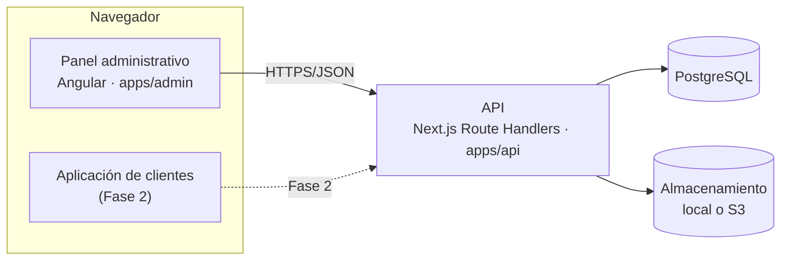

# Ruta Mochilera

Sistema interno de gestión para una agencia de viajes de mochileros: panel
administrativo para operar viajes, presupuestos y roles, API que expone esas
operaciones, y (a partir de la Fase 2) la aplicación con la que los clientes
verán y reservarán viajes.

Fase 1 — «Cimientos y panel administrativo» — cubre la autenticación, el
control de acceso por roles, el ciclo de vida de un viaje, su costeo y precio
por vacante, y el panel administrativo que opera todo eso. Las reservas, los
pagos, las notificaciones y la aplicación de clientes llegan en fases
posteriores.

## Las tres aplicaciones



- **`apps/api`** — Next.js usado únicamente como backend HTTP (Route
  Handlers bajo `/api/v1/**`, sin páginas de cara al público). Contiene la
  única capa que conoce HTTP: autentica, verifica permisos, valida con Zod y
  llama a `libs/domain`.
- **`apps/admin`** — panel administrativo en Angular. Consume la API a
  través de un cliente tipado generado desde el propio contrato de la API
  (`libs/api-client`), nunca llama a Prisma ni decide permisos por su cuenta.
- **Aplicación de clientes** — Fase 2. Hasta entonces, la raíz del sitio
  redirige al panel administrativo (ver `infra/nginx/nginx.conf`).

`libs/domain` contiene toda la lógica de negocio (viajes, costeo, RBAC,
identidad, personal, auditoría) y no importa nada de Next.js ni de Angular:
recibe un cliente de Prisma inyectado y devuelve `Result<T>`. Ver `CLAUDE.md`
para la arquitectura completa.

## Requisitos

- Node.js 24 (fijado en `.nvmrc`)
- pnpm (vía `corepack enable`)
- PostgreSQL 16 — nativo en desarrollo, o en contenedor con `infra/compose/`
- Docker, sólo para construir/ejecutar las imágenes de `infra/docker/` y para
  `compose.test.yml` si no se usa un PostgreSQL nativo

## Arranque en cinco comandos

```bash
pnpm install               # instala dependencias y genera el cliente Prisma
pnpm db:migrate             # aplica las migraciones a la base de datos de desarrollo
pnpm db:seed                # siembra el catálogo de permisos, un rol y un usuario inicial
pnpm nx dev api             # sirve la API en http://localhost:3000
pnpm nx serve admin         # sirve el panel en http://localhost:4200 (otra terminal)
```

`DATABASE_URL` y el resto de variables se leen de `.env` (ver `.env.example`).
En esta máquina, PostgreSQL corre nativo en `localhost:5432`; ver la sección
«Postgres en esta máquina» de `CLAUDE.md` para el detalle y para
`infra/compose/compose.dev.yml` / `compose.test.yml` como alternativa en
Docker.

## Scripts

| Comando | Qué hace |
|---|---|
| `pnpm db:generate` | Regenera el cliente de Prisma (`libs/db/src/generated`, ignorado por git) |
| `pnpm db:migrate` | Aplica migraciones nuevas a la base de desarrollo (`prisma migrate dev`) |
| `pnpm db:deploy` | Aplica migraciones ya existentes sin generar una nueva (para CI/producción) |
| `pnpm db:reset` | Reinicia la base de desarrollo desde cero |
| `pnpm db:seed` | Siembra permisos, un rol y un usuario administrador inicial |
| `pnpm api:types` | Regenera `libs/api-client/src/lib/schema.d.ts` desde el contrato Zod/OpenAPI de la API — nunca se edita a mano |
| `pnpm nx dev api` | Sirve la API en modo desarrollo |
| `pnpm nx serve admin` | Sirve el panel administrativo en modo desarrollo |
| `pnpm nx run-many -t typecheck lint test build` | Verifica los 16 proyectos del workspace |
| `pnpm nx test <proyecto>` | Corre las pruebas de un solo proyecto (p. ej. `shared-utils`) |

## Documentación

- Diseño de la Fase 1: `docs/superpowers/specs/2026-09-28-agencia-viajes-diseno.md`
- Plan de implementación: `docs/superpowers/plans/2026-09-28-fase-1-cimientos-panel-admin.md`
- Reglas de negocio: `docs/business-rules/`
- Diagramas de flujo: `docs/diagrams/`

## Reglas de negocio: documentación obligatoria

Toda tarea que añada o modifique una regla de negocio en el backend queda
**incompleta** hasta que el archivo correspondiente de
[`docs/business-rules/`](docs/business-rules/) esté actualizado **en el mismo
commit** — y, para viajes, costeo y reservas, también su diagrama en
[`docs/diagrams/`](docs/diagrams/). La tabla completa de qué módulo mapea a
qué archivo vive en `CLAUDE.md`. `.github/workflows/docs-guard.yml` hace
cumplir esta regla en cada pull request y señala exactamente qué archivo
falta.

## Despliegue

`infra/docker/Dockerfile.api` e `infra/docker/Dockerfile.web` construyen,
respectivamente, la API y el panel administrativo servido por Nginx;
`infra/compose/compose.prod.yml` levanta ambos junto con PostgreSQL para qa y
producción (EC2, `amd64`). El desarrollo corre en una Raspberry Pi (`arm64`);
ambas imágenes se construyen multi-arquitectura desde el mismo Dockerfile.
