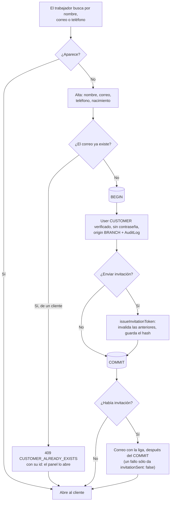
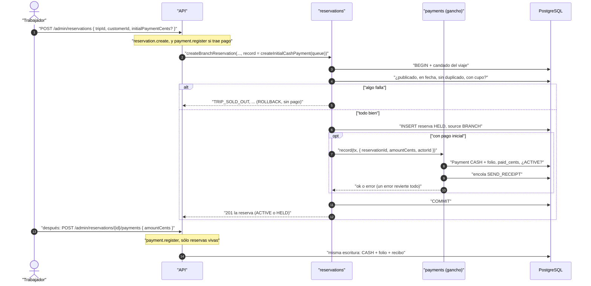
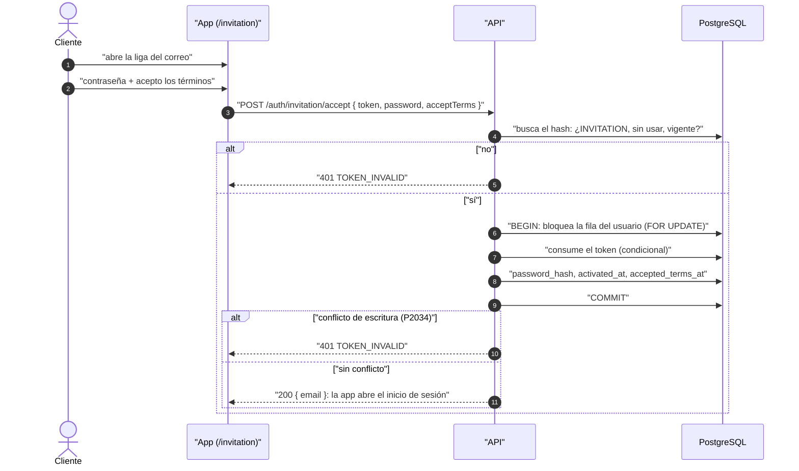

# Venta en mostrador

Reglas: `docs/business-rules/customers.md` (clientes e invitación) y
`docs/business-rules/reservations.md` / `payments.md` (reserva y cobro).

## Encontrar o dar de alta al cliente

## Reservar y cobrar en el mostrador

## Activar la cuenta desde la invitación

El restablecimiento de contraseña bloquea la misma fila de usuario **antes**
de tocar los tokens, igual que la aceptación: un solo orden de bloqueos, así
que ambas operaciones a la vez no se interbloquean. Si el cliente de mostrador
fija su contraseña con «olvidé mi contraseña», queda activado (`activated_at`),
sin sellar `accepted_terms_at`.
