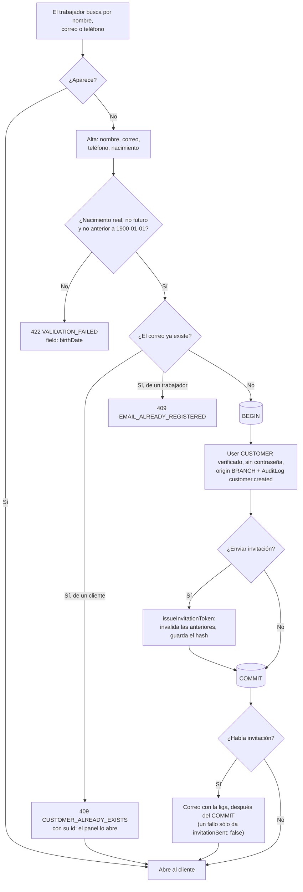
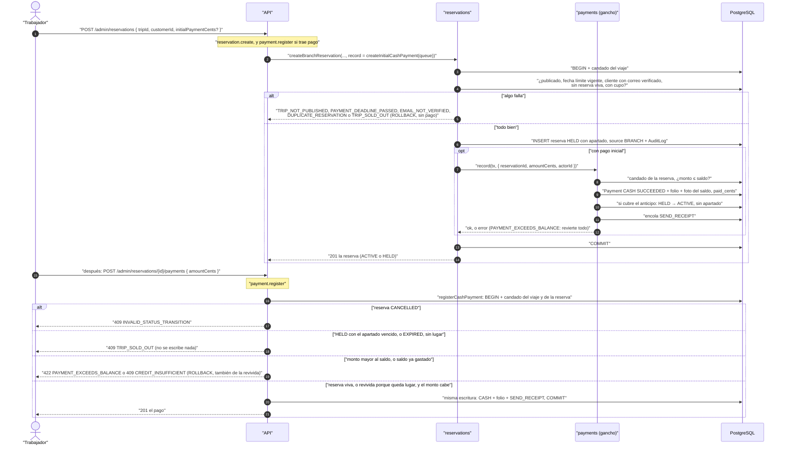
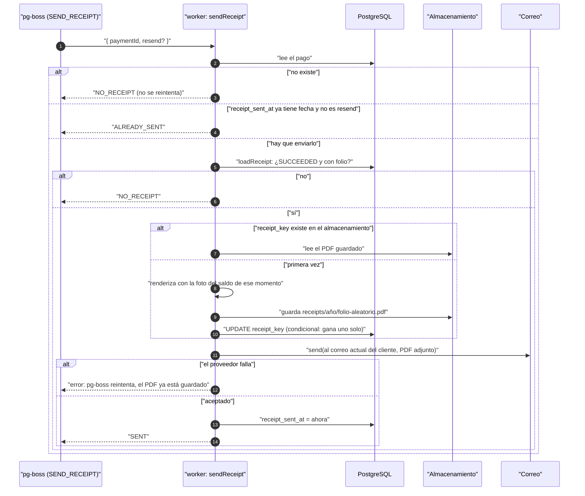
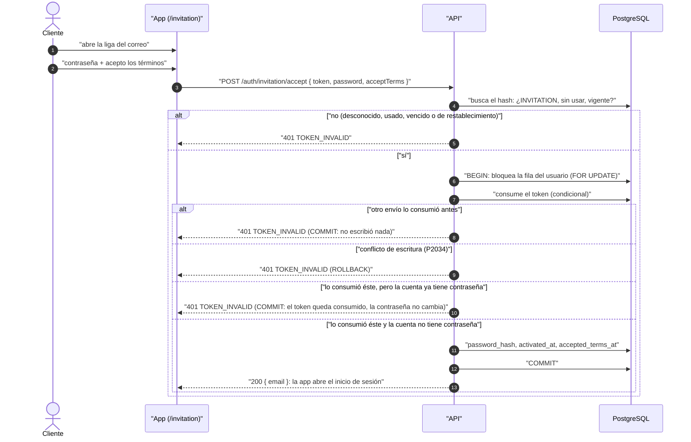
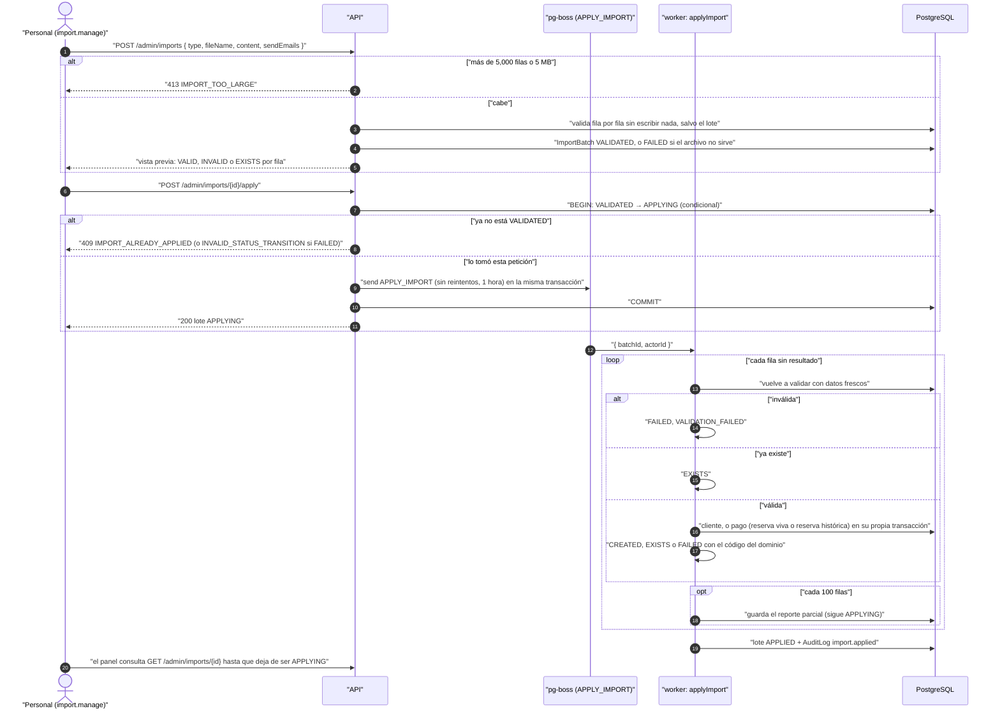

# Venta en mostrador

Reglas: `docs/business-rules/customers.md` (clientes e invitación),
`docs/business-rules/reservations.md` / `payments.md` (reserva, cobro y
recibo) e `docs/business-rules/imports.md` (carga desde CSV).

## Encontrar o dar de alta al cliente

La fecha de nacimiento se valida primero, con «hoy» en la zona de la
organización, y es la misma regla del autorregistro y la importación
(`customers.md`, «Fecha de nacimiento»). La comprobación del correo ocurre
antes del `BEGIN`. Si dos altas del mismo
correo llegan a la vez, ambas la pasan y la segunda choca con el índice único
(`users_email_key`): responde también `CUSTOMER_ALREADY_EXISTS`, con el id de
la primera.

## Reservar y cobrar en el mostrador

Sin `initialPaymentCents` la reserva queda `HELD` con el apartado normal del
viaje y se cobra después.

## Del cobro al recibo

El job `SEND_RECEIPT` se encola en la misma transacción que deja el pago en
`SUCCEEDED`: si el pago se revierte, el job no existe. Lo corre `apps/worker`.

El PDF se genera una vez y nunca se regenera: lo que dice el recibo no cambia
aunque la reserva cambie después. Es privado: la ruta pública de archivos
rechaza `receipts/` y sólo se sirve por rutas que verifican quién pregunta
(`/payments/{id}/receipt` del dueño, `/admin/payments/{id}/receipt` con
`payment.view`).

## Activar la cuenta desde la invitación

El restablecimiento de contraseña bloquea la misma fila de usuario **antes**
de tocar los tokens, igual que la aceptación: un solo orden de bloqueos, así
que ambas operaciones a la vez no se interbloquean. Si el cliente de mostrador
fija su contraseña con «olvidé mi contraseña», queda activado (`activated_at`),
sin sellar `accepted_terms_at`. Una invitación todavía vigente tampoco pisa
esa contraseña: si la cuenta ya tiene una, aceptarla es `TOKEN_INVALID` y la
contraseña queda intacta (regla en `customers.md`, cubierta por prueba).

## Importar clientes y pagos desde CSV

Si el worker se cae a medias, el lote se queda `APPLYING` con su reporte
parcial: **no se reintenta solo**, porque una fila de pago sin `external_ref` no
se distingue de una segunda copia de sí misma.
