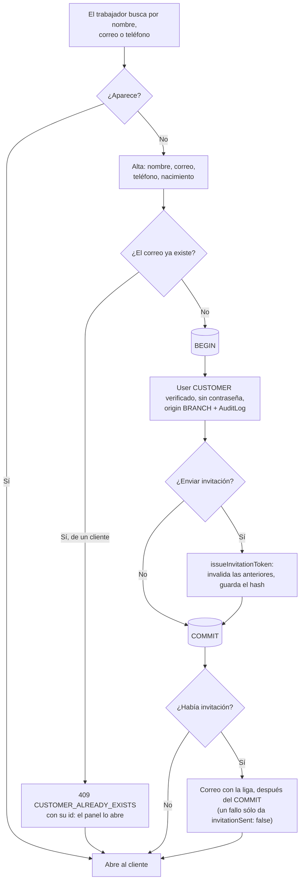
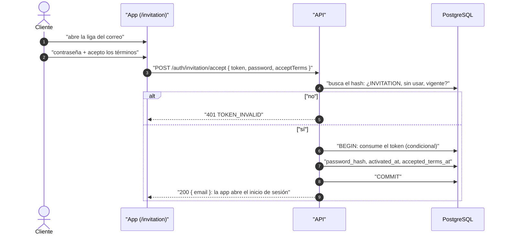

# Venta en mostrador

Reglas: `docs/business-rules/customers.md` (clientes e invitación) y
`docs/business-rules/reservations.md` / `payments.md` (reserva y cobro).

## Encontrar o dar de alta al cliente

## Activar la cuenta desde la invitación

