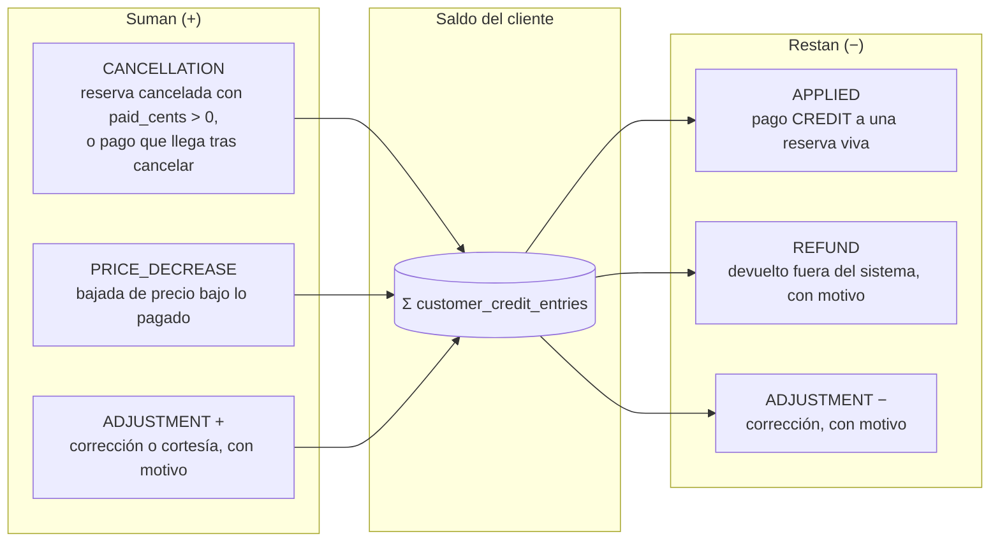
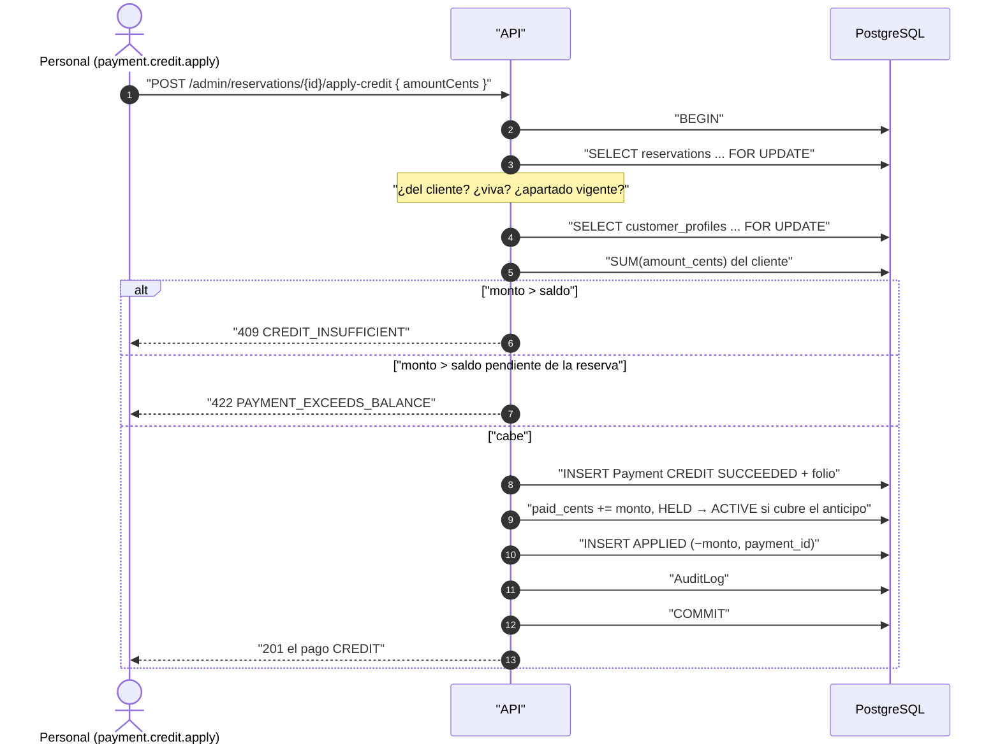
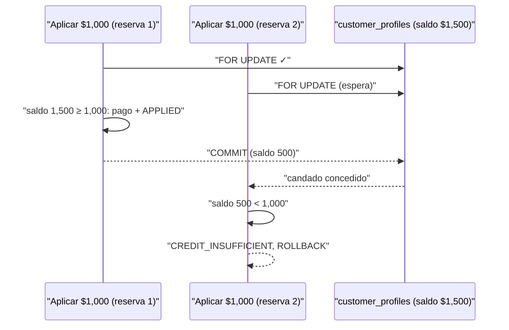

# Saldo a favor

Reglas: `docs/business-rules/payments.md`, «Saldo a favor». El saldo de un
cliente es la suma de sus movimientos en `customer_credit_entries`; nunca es
una columna editable y nunca es negativo.

## De dónde sale y a dónde va

## Aplicar saldo a una reserva

## Dos aplicaciones a la vez

El bloqueo de la fila del cliente ordena a los dos escritores: el segundo
lee el saldo que dejó el primero.

