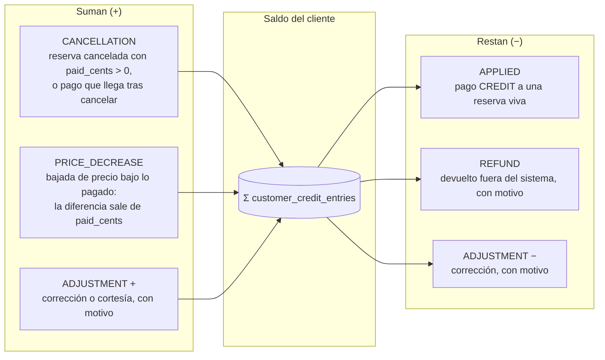
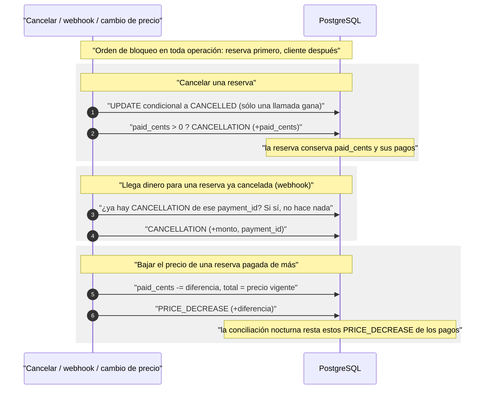
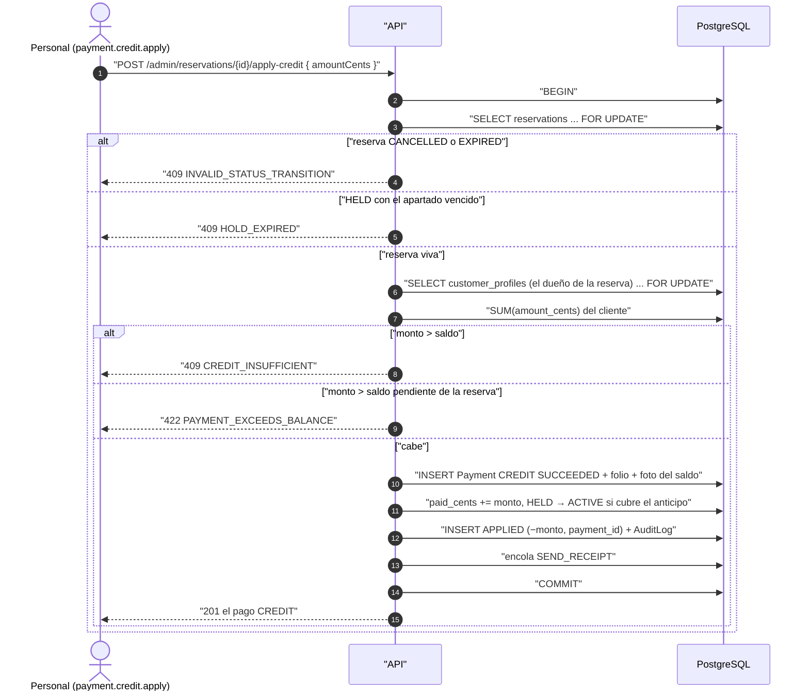
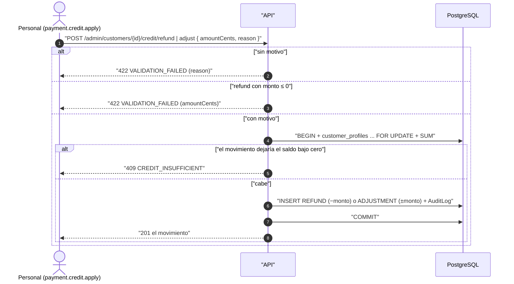
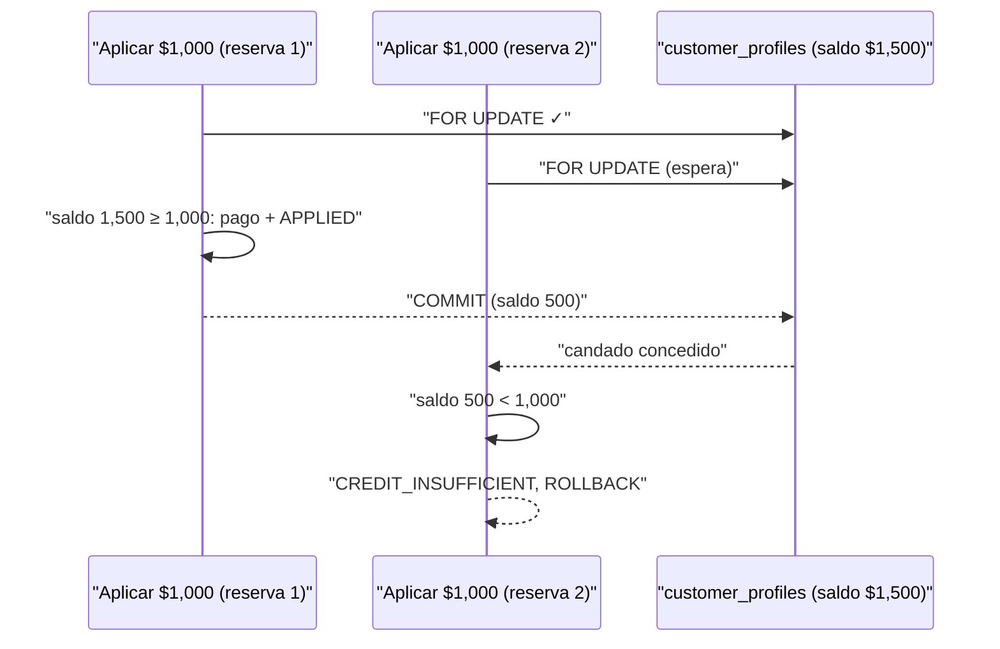

# Saldo a favor

Reglas: `docs/business-rules/payments.md`, «Saldo a favor». El saldo de un
cliente es la suma de sus movimientos en `customer_credit_entries`; nunca es
una columna editable y nunca es negativo.

## De dónde sale y a dónde va

Las dos entradas automáticas (`CANCELLATION` y `PRICE_DECREASE`) las escriben
funciones de `@rm/domain-payments` que las operaciones de reservas reciben
**inyectadas**, dentro de su propia transacción: los dos dominios no se
importan entre sí. `REFUND`, `ADJUSTMENT` y `APPLIED` los dispara siempre una
persona con `payment.credit.apply`.

## Cómo nace el saldo

## Aplicar saldo a una reserva

El saldo que se gasta es siempre el del dueño de la reserva: la ruta del
panel no recibe un cliente aparte. Un rechazo de `recordPayment` ocurre antes
de que escriba nada, así que no queda nada que revertir.

## Devolver o ajustar

`REFUND` no mueve dinero: sólo registra que la agencia ya devolvió el dinero
**fuera del sistema** (efectivo, transferencia). El motivo es lo único que
dice a dónde fue.

## Dos aplicaciones a la vez

El bloqueo de la fila del cliente ordena a los dos escritores: el segundo
lee el saldo que dejó el primero.

