# Flujo de pago asíncrono

Diagramas de `libs/domain/payments` y del webhook
`apps/api/src/app/api/v1/webhooks/stripe`. Las reglas en prosa están en
`docs/business-rules/payments.md`. Las specs correspondientes son §5.3, §5.5 y
§7 de `docs/superpowers/specs/2026-10-03-fase-2a-reservas-y-pagos-diseno.md`
(Fase 2A) y §4.2 y §5.3 a §5.7 de
`docs/superpowers/specs/2026-10-07-fase-2b-mostrador-diseno.md` (Fase 2B:
efectivo, recibos, saldo a favor y captura histórica).

Todo el dinero de este flujo es `Int` en centavos MXN.

## El recorrido completo: intento, ficha y confirmación por webhook

Nada de esto es síncrono. El backend crea el Payment Intent y escribe una fila
`Payment` en `PENDING`; **esa fila no mueve el saldo**. El dinero sólo existe
cuando Stripe lo confirma, y Stripe lo confirma por un canal distinto —el
webhook— que puede llegar segundos después (tarjeta) o días después (ficha de
OXXO).

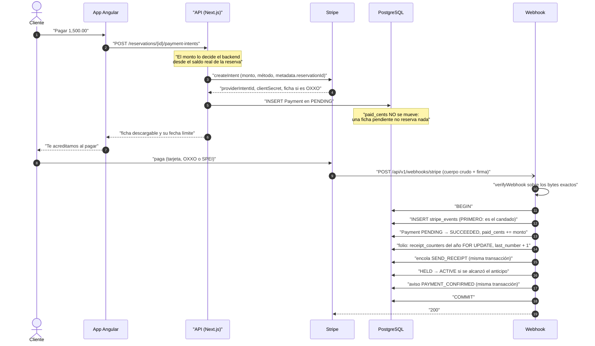

## El folio del recibo (Fase 2B)

Todo pago que queda en `SUCCEEDED` recibe su folio **en la misma transacción**
que lo confirma, sin importar el método (efectivo, tarjeta, OXXO, saldo a
favor o histórico). El contador es una fila por año que se bloquea hasta el
`COMMIT`: si la transacción se revierte, el número vuelve con ella.

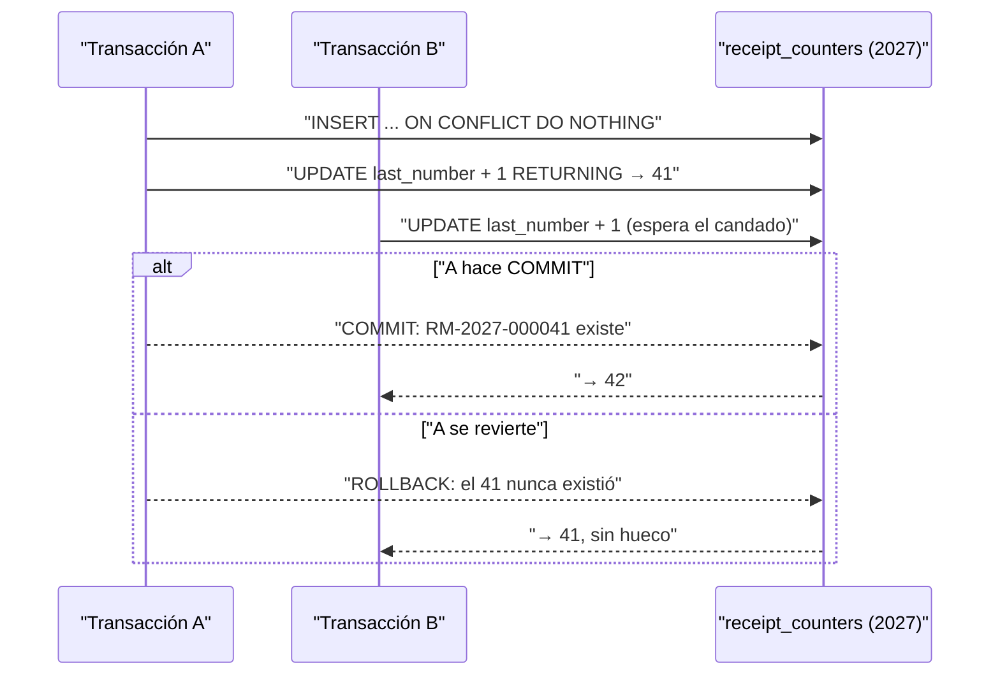

## El envío del recibo (Fase 2B)

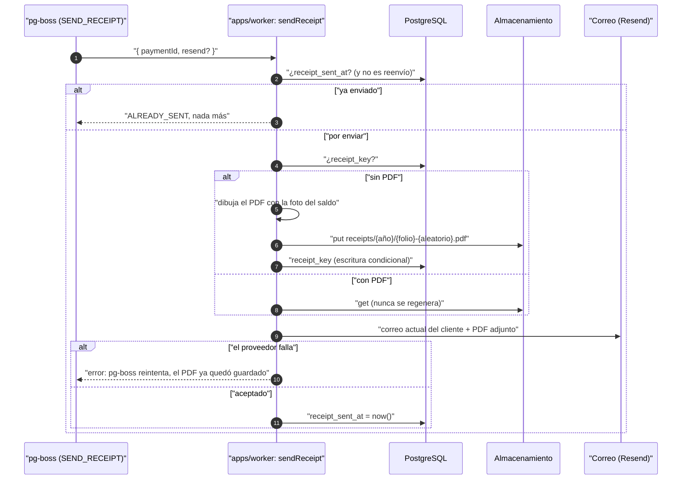

## Pagos históricos (Fase 2B)

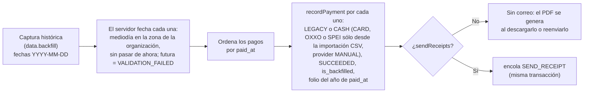

La importación CSV de pagos (`imports.md`) entra por este mismo camino, con
`external_ref` único para no importar dos veces el mismo pago.

Los pagos de una misma captura entran **todos o ninguno** (una sola
transacción), y sobre una reserva ya existente sólo si está viva: sobre una
`CANCELLED` o `EXPIRED` es `INVALID_STATUS_TRANSITION`. Un `paid_at` en el
futuro es `VALIDATION_FAILED`.

**El folio sigue el año de `paid_at`, no el orden de captura.** Un pago de
2025 capturado hoy toma el siguiente número del contador de 2025, que ya estaba
cerrado: queda fuera del orden de fechas de ese año. Ver
`docs/decisiones-fase-2b.md`, «por confirmar».

## Efectivo en el mostrador y saldo a favor (Fase 2B)

Son los dos caminos de pago que **no pasan por Stripe**: no hay intento, ni
ficha, ni webhook. Los confirma la propia acción del personal, que escribe el
pago ya en `SUCCEEDED` dentro de su transacción (la regla «la verdad del pago
llega por webhook» es de los pagos en línea). Los dos recorren el mismo
`recordPayment` que usa el webhook: mismo candado de la reserva, misma
validación del saldo, mismo folio, misma activación.

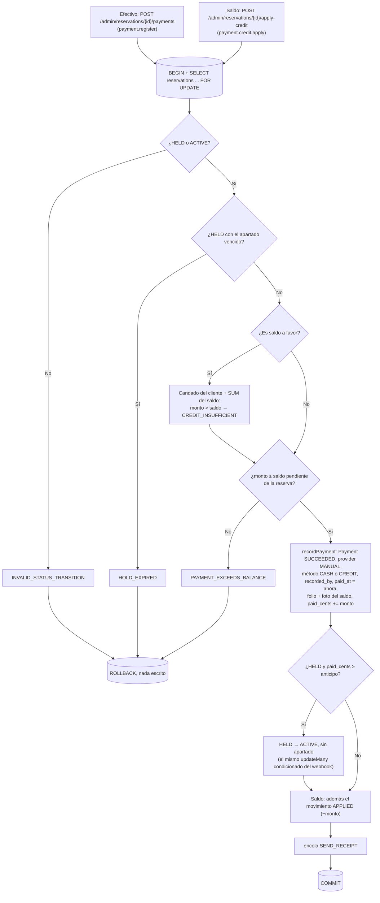

Un pago `CREDIT` es un **traslado**, no dinero nuevo: el dinero ya entró cuando
se pagó la reserva que se canceló. Los reportes de ingresos de la Fase 3 deben
excluirlo para no contarlo dos veces. Ver `customer-credit.md`.

## La conciliación nocturna y el cambio de precio (Fase 2B)

`paid_cents` es desnormalizado a propósito; `reconcilePaidCents` lo compara
con la verdad. Desde la 2B esa verdad descuenta lo que una bajada de precio
sacó de la reserva para volverlo saldo a favor.

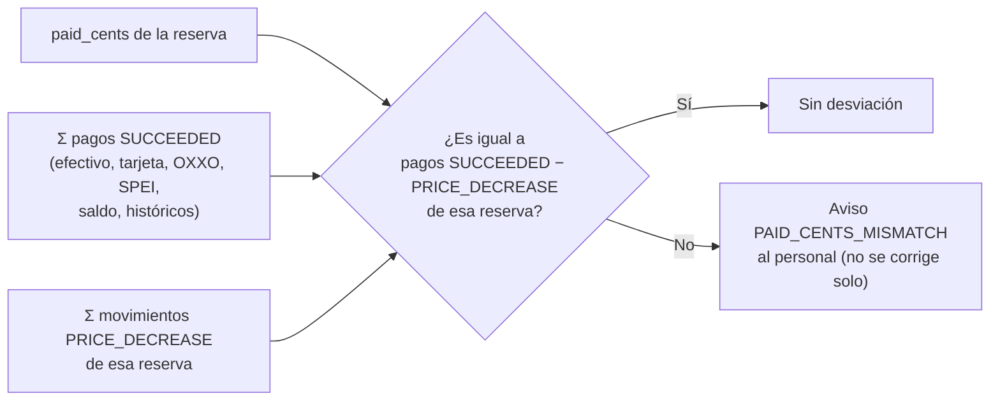

## Tres métodos, tres tiempos (Tarea 20)

Los tres métodos terminan igual —la verdad del pago llega **sólo** por el
webhook, nunca por lo que diga la app— pero tardan distinto y fallan distinto.

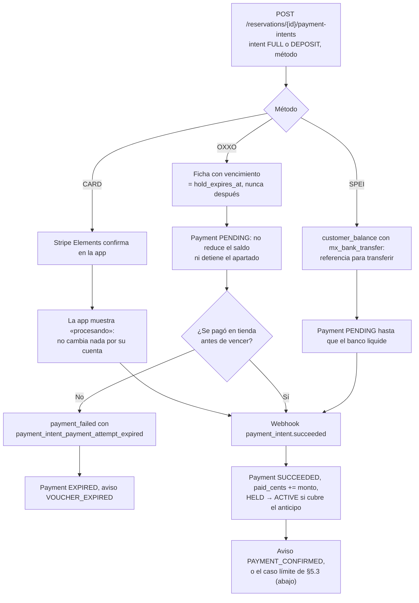

**SPEI está en la API y en el adaptador, pero no en la app.** `payment-intents`
acepta `SPEI` y `StripePaymentProvider` lo traduce a `customer_balance` con
`mx_bank_transfer`, sin verificar todavía contra una cuenta real de Stripe
(ver `libs/payments-stripe/README.md`). La pantalla de pago del cliente sólo
ofrece tarjeta y OXXO; añadir SPEI ahí es trabajo pendiente, no una omisión
de este diagrama.

## El candado: por qué la fila de `stripe_events` va primero

Stripe reenvía, duplica y reordena entregas. La inserción de `stripe_events`
—cuya clave primaria es el id del evento de Stripe— es lo que hace que una
entrega repetida no tenga efecto, y **va antes que cualquier efecto**.

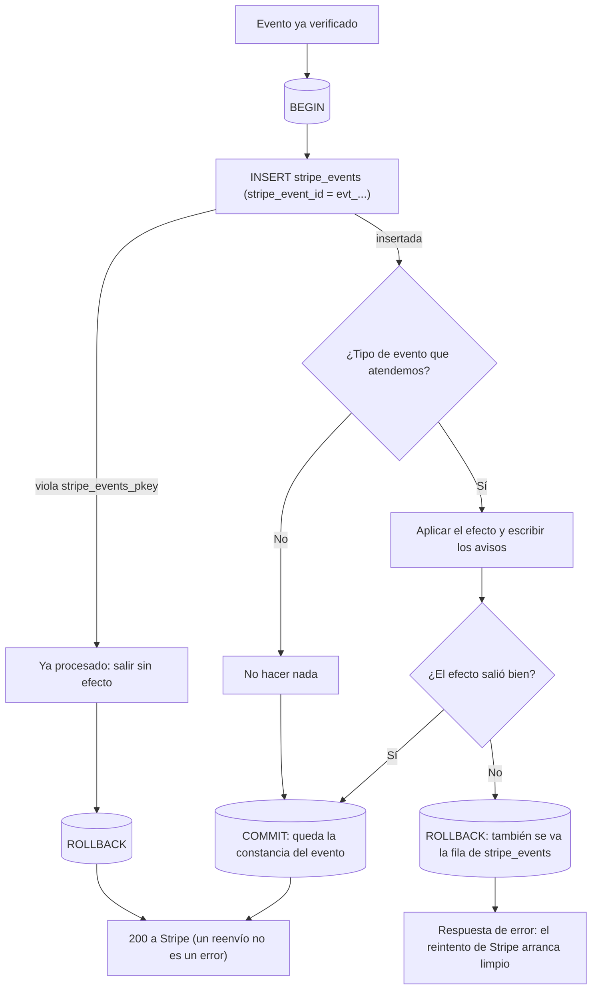

Dos entregas simultáneas del mismo evento, que es lo que esta forma existe
para resolver:

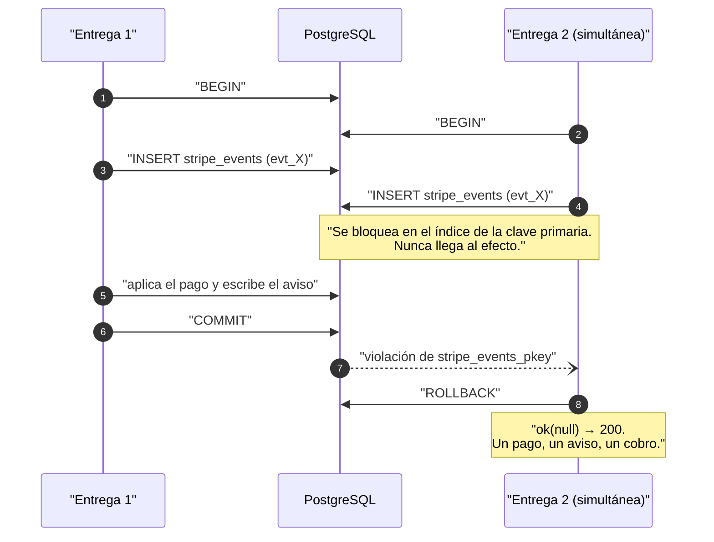

## Las ramas de fallo y de expiración

Las tres salidas que no son "el dinero llegó". Ninguna toca el saldo: un pago
`PENDING` nunca contó, así que no hay nada que restar.

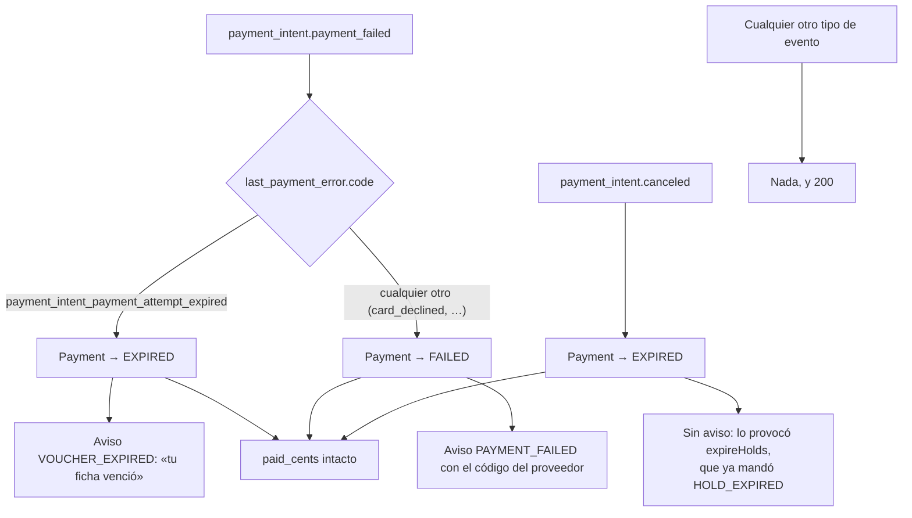

## El caso límite de §5.3: el dinero llegó tarde

Una ficha de OXXO pagada después de que el apartado venciera. El job cancela
el voucher, pero la carrera existe. Las tres consecuencias son independientes
y se prueban por separado.

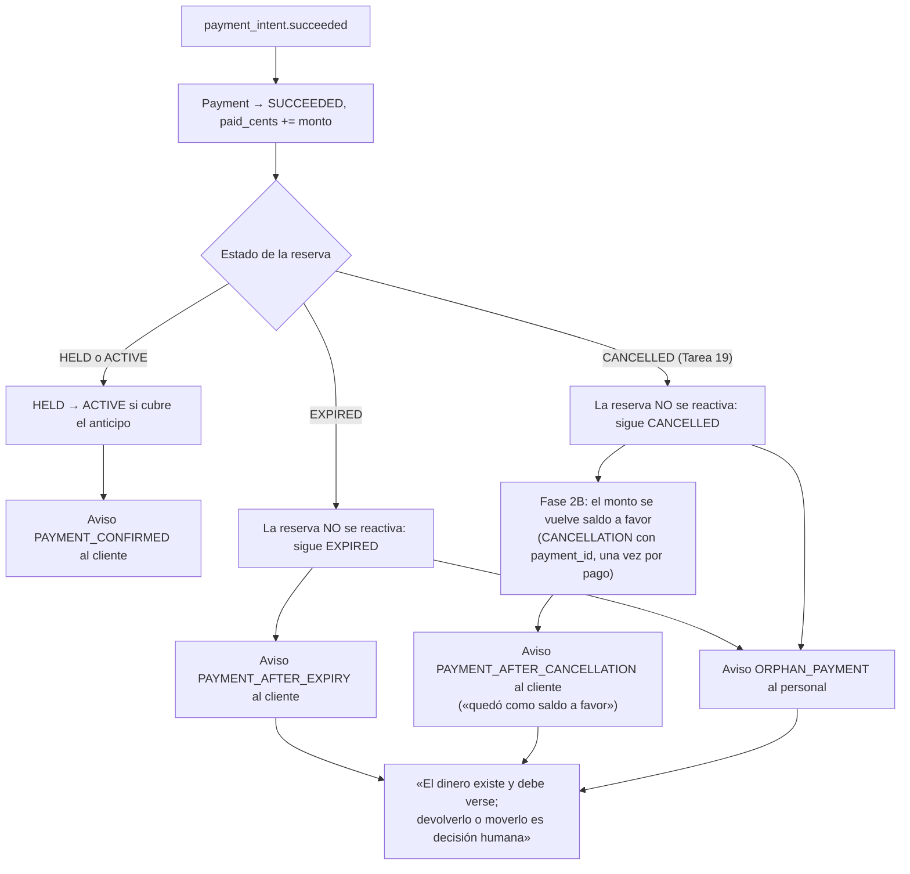

Una reserva `CANCELLED` sigue el mismo camino desde la Tarea 19: el panel
cancela en el proveedor las fichas pendientes al cancelar, pero una pagada en
ese mismo minuto puede llegar igual. Desde la Fase 2B ese dinero no queda en
el limbo: se acredita como saldo a favor del cliente en la misma transacción
del webhook (ver `customer-credit.md`). El de una reserva `EXPIRED` sigue
siendo decisión humana.

Y el caso en que no hay siquiera reserva a la que atar el dinero —un intento
creado fuera de la app, sin `metadata.reservationId` o con uno que ni siquiera
es un UUID—: no se puede escribir un `Payment` sin reserva, así que se avisa a
una persona y se responde 200, porque un error sólo haría que Stripe
reenviara para siempre algo que nadie puede aplicar automáticamente.

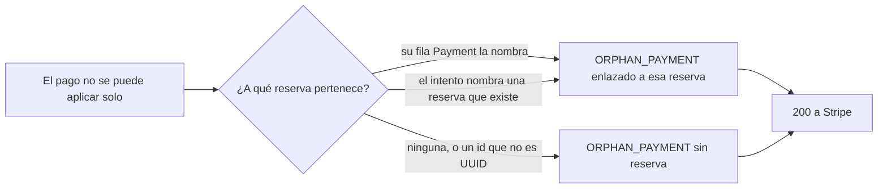

El aviso al personal va **enlazado a la reserva** siempre que se sabe cuál es
(un segundo pago que excede el saldo, un pago que llegó sobre uno ya dado por
perdido): es justo cuando alguien tiene que actuar a mano. Antes el aviso
salía sin enlace aunque el intento la nombrara.

## El dinero de un apartado que vence (decisión 16)

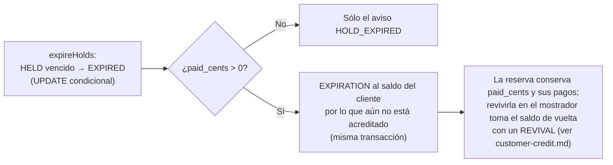
