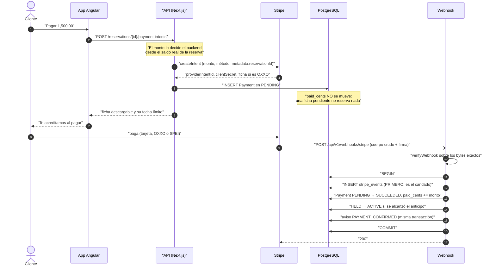
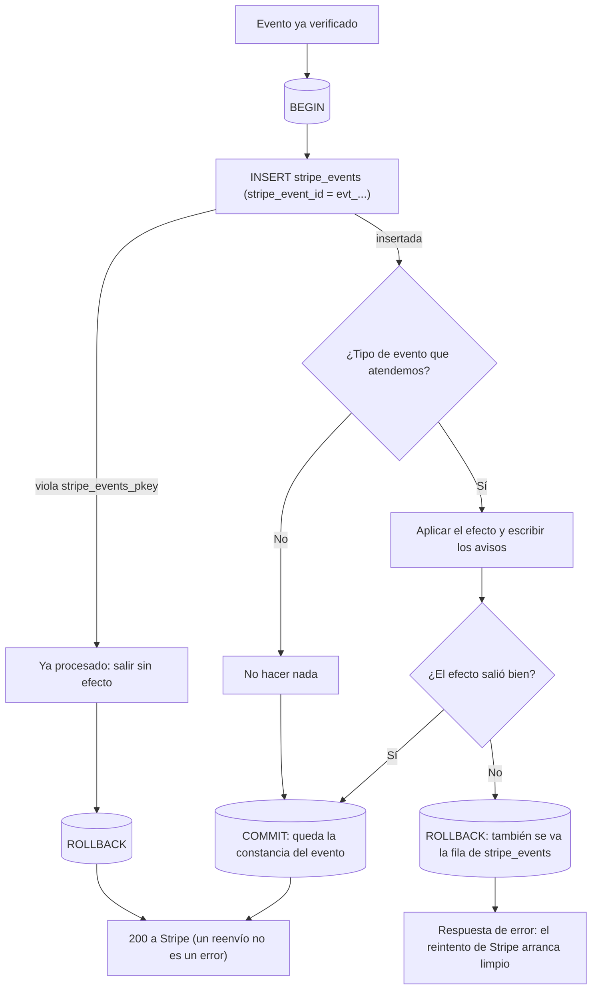
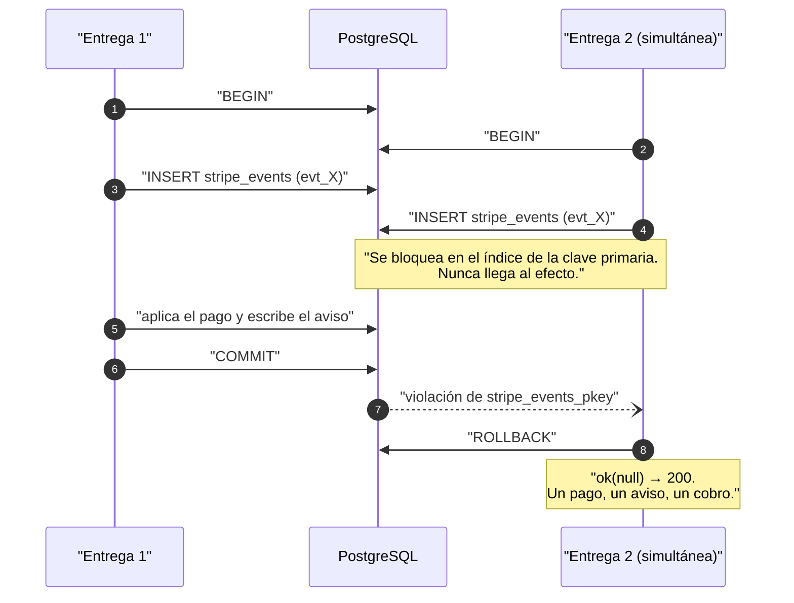
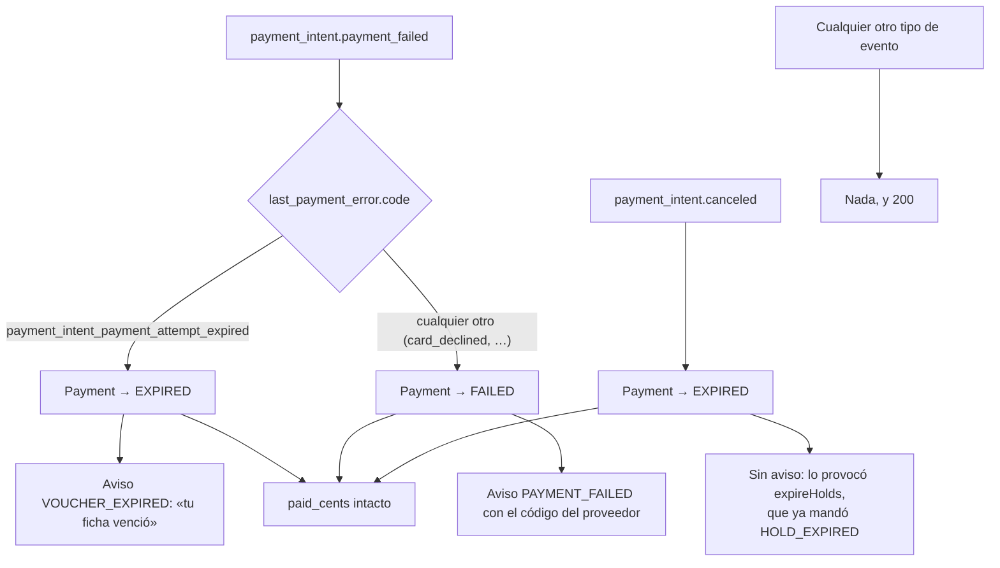
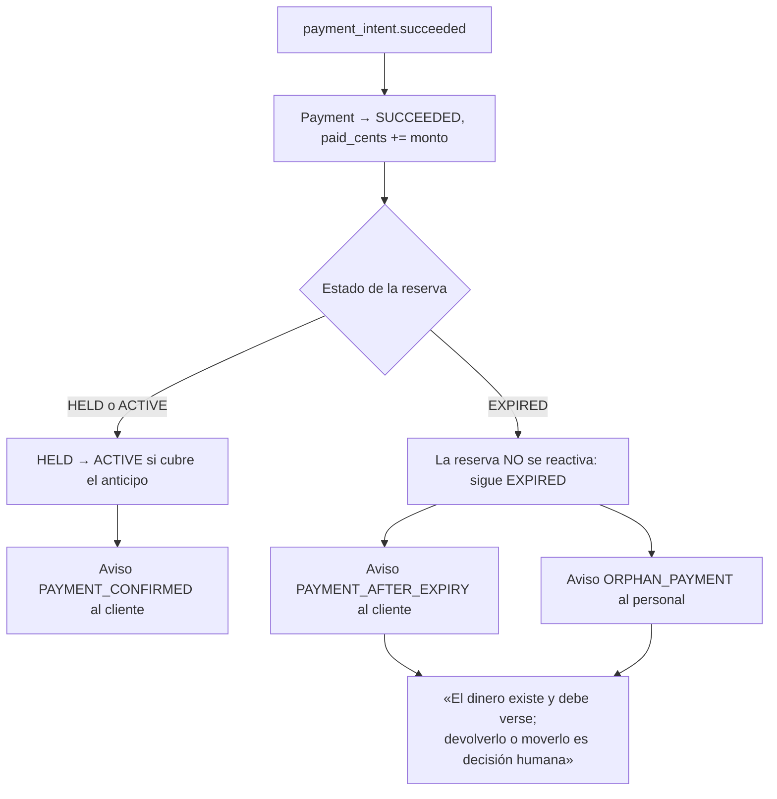

# Flujo de pago asíncrono

Diagramas de `libs/domain/payments` y del webhook
`apps/api/src/app/api/v1/webhooks/stripe`. Las reglas en prosa están en
`docs/business-rules/payments.md`; la spec correspondiente es §5.3, §5.5 y §7
de `docs/superpowers/specs/2026-10-03-fase-2a-reservas-y-pagos-diseno.md`.

Todo el dinero de este flujo es `Int` en centavos MXN.

## El recorrido completo: intento, ficha y confirmación por webhook

Nada de esto es síncrono. El backend crea el Payment Intent y escribe una fila
`Payment` en `PENDING`; **esa fila no mueve el saldo**. El dinero sólo existe
cuando Stripe lo confirma, y Stripe lo confirma por un canal distinto —el
webhook— que puede llegar segundos después (tarjeta) o días después (ficha de
OXXO).

## El candado: por qué la fila de `stripe_events` va primero

Stripe reenvía, duplica y reordena entregas. La inserción de `stripe_events`
—cuya clave primaria es el id del evento de Stripe— es lo que hace que una
entrega repetida no tenga efecto, y **va antes que cualquier efecto**.

Dos entregas simultáneas del mismo evento, que es lo que esta forma existe
para resolver:

## Las ramas de fallo y de expiración

Las tres salidas que no son "el dinero llegó". Ninguna toca el saldo: un pago
`PENDING` nunca contó, así que no hay nada que restar.

## El caso límite de §5.3: el dinero llegó tarde

Una ficha de OXXO pagada después de que el apartado venciera. El job cancela
el voucher, pero la carrera existe. Las tres consecuencias son independientes
y se prueban por separado.

Y el caso en que no hay siquiera reserva a la que atar el dinero —un intento
creado fuera de la app, sin `metadata.reservationId`—: no se puede escribir un
`Payment` sin reserva, así que se avisa a una persona y se responde 200, porque
un error sólo haría que Stripe reenviara para siempre algo que nadie puede
aplicar automáticamente.
