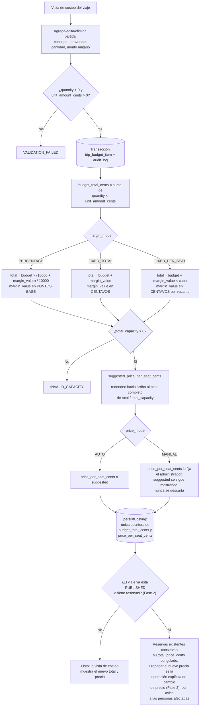

# Flujo de costeo y precio por vacante

## Notas de lectura

- Los tres caminos de `margin_mode` (`H`, `I`, `J`) convergen en el mismo nodo
  `K`: la validación de cupo y el redondeo hacia arriba son idénticos sin
  importar cómo se calculó `total_with_margin`.
- El nodo `P` es deliberadamente el único punto de escritura de
  `budget_total_cents` y `price_per_seat_cents` en todo el diagrama —
  corresponde a `persistCosting` en `budget-service.ts`. Cualquier flecha
  que terminara escribiendo esas columnas por otro camino sería un defecto.
- El nodo `Q`/`S` documenta una regla que todavía no tiene código que la
  ejecute: la Fase 1 no tiene modelo `Reservation`, así que hoy esa rama nunca
  se toma con datos reales. Queda fijada aquí para que la Fase 2 la respete
  desde el primer commit que introduzca reservas.
- `persistCosting` tiene un segundo punto de entrada desde la Tarea 14:
  `repriceTrip`, que `updateTrip` (`libs/domain/trips`, ver
  `trip-creation.md`) llama dentro de su propia transacción cuando cambia
  `total_capacity`. No aparece como una rama nueva en este diagrama porque no
  agrega ninguna decisión de negocio propia — sólo un segundo llamador del
  mismo nodo `P`.
