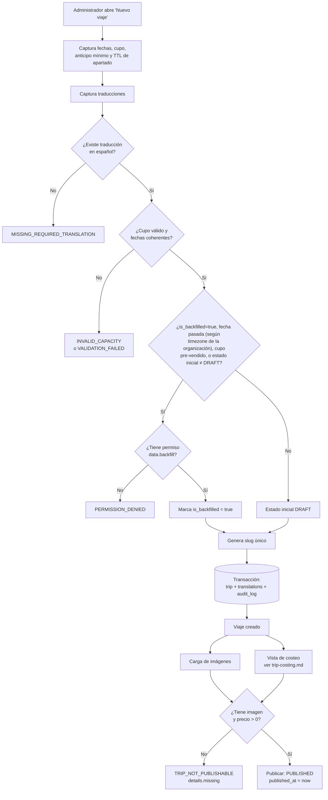
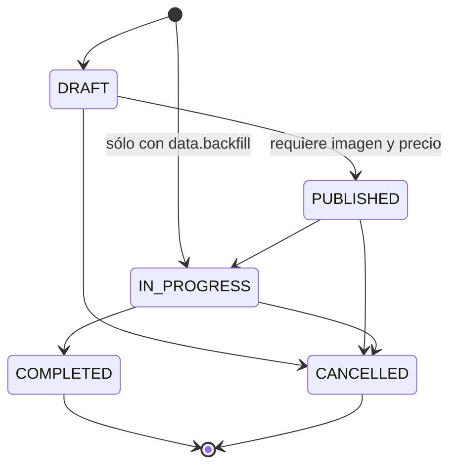
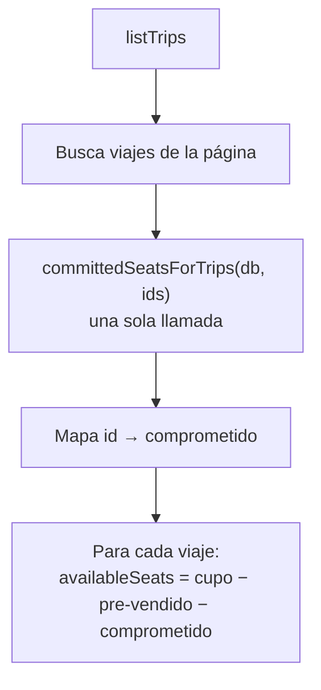
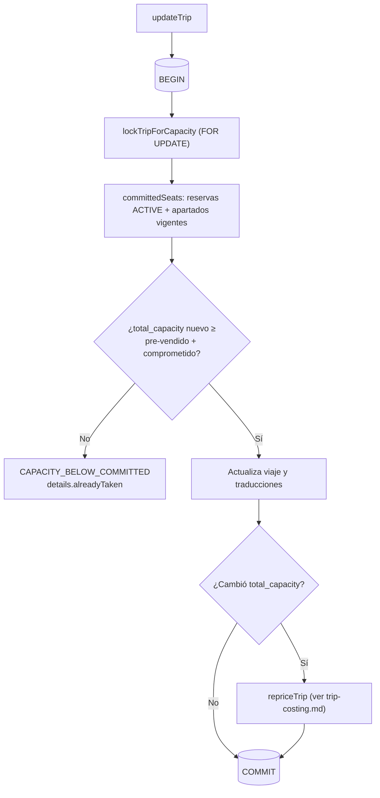
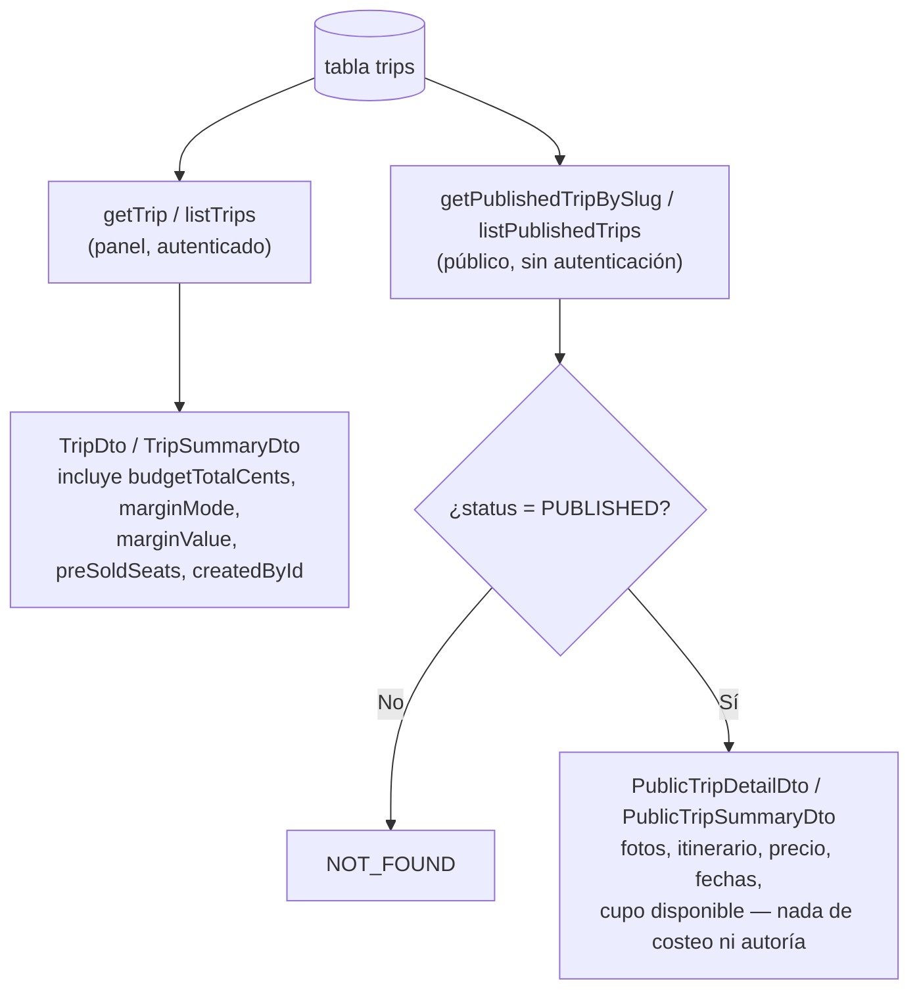

# Flujo de creación de viaje

## Estados

## Cupo en el listado de viajes

`listTrips` no recalcula el cupo disponible viaje por viaje: junta todos los
ids de la página y los resuelve en una sola llamada a
`committedSeatsForTrips`, la variante agrupada de `committedSeats` (ver
`docs/business-rules/trips.md`, sección «Cupo disponible»). El detalle de un
viaje sigue usando la variante de un solo id. Ambas delegan en
`libs/domain/reservations`, que es también de donde `trip-service.ts` importa
`availableSeats`, la resta que aparece en el último nodo del diagrama; el
conteo real se documenta en `docs/diagrams/trip-reservation.md`.

Medido: 3 consultas para un viaje y 3 para cinco. Un conteo por viaje daría 7
para cinco.

La «timezone de la organización» del nodo H se lee con `organizationTimeZone`
(`@rm/domain-settings`) — antes copiada aquí, en `reservations` y en
`payments`; sin cambio de regla.

## Editar el cupo bloquea la fila del viaje

## Catálogo público: dos DTOs distintos, no el mismo `TripDto` recortado

Ver `docs/business-rules/trips.md`, sección "El catálogo público", para la
regla completa. El diagrama es sólo la bifurcación: la misma tabla `trips`,
dos lecturas con formas de salida que nunca convergen.

