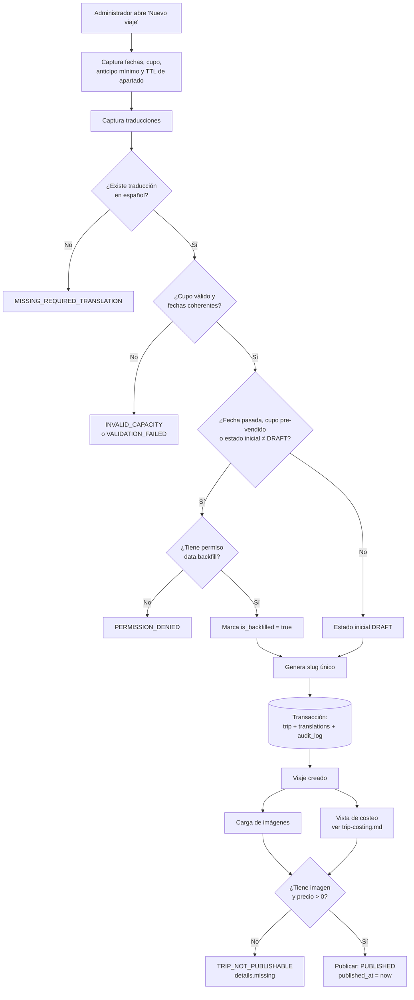
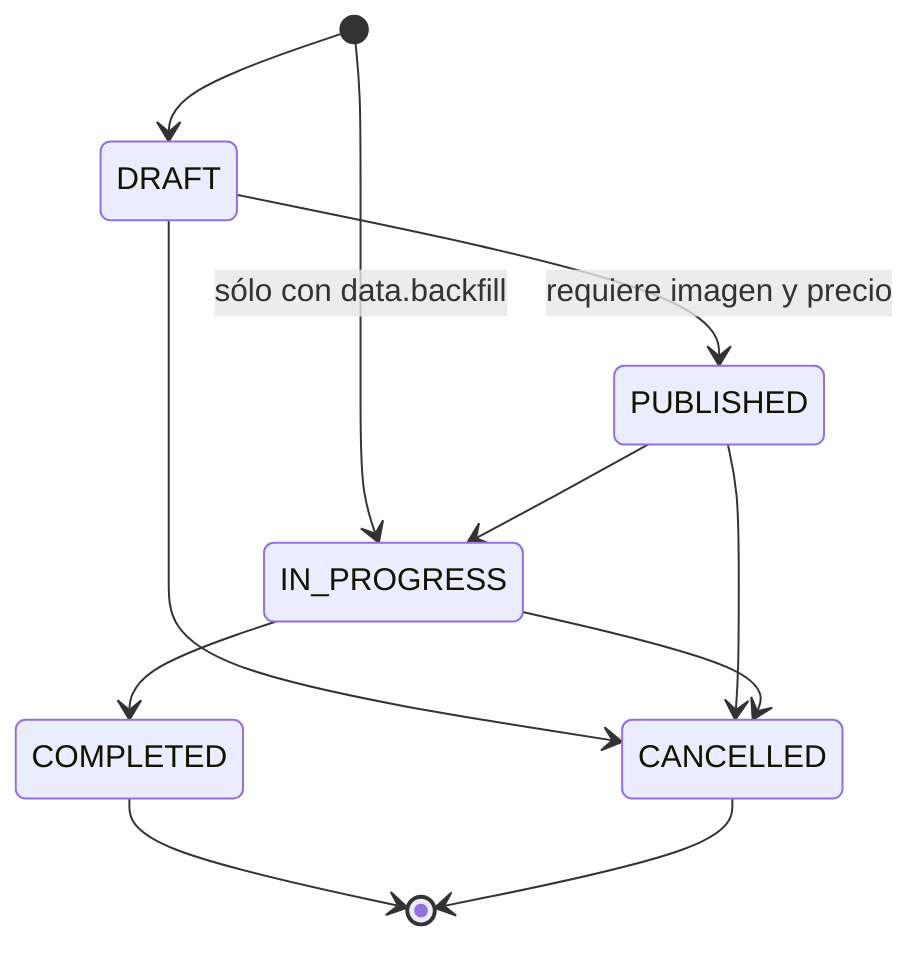

# Flujo de creación de viaje

```mermaid
flowchart TD
    A[Administrador abre 'Nuevo viaje'] --> B[Captura fechas, cupo,<br/>anticipo mínimo y TTL de apartado]
    B --> C[Captura traducciones]
    C --> D{¿Existe traducción<br/>en español?}
    D -- No --> E[MISSING_REQUIRED_TRANSLATION]
    D -- Sí --> F{¿Cupo válido y<br/>fechas coherentes?}
    F -- No --> G[INVALID_CAPACITY<br/>o VALIDATION_FAILED]
    F -- Sí --> H{¿Fecha pasada, cupo pre-vendido<br/>o estado inicial ≠ DRAFT?}
    H -- Sí --> I{¿Tiene permiso<br/>data.backfill?}
    I -- No --> J[PERMISSION_DENIED]
    I -- Sí --> K[Marca is_backfilled = true]
    H -- No --> L[Estado inicial DRAFT]
    K --> M[Genera slug único]
    L --> M
    M --> N[(Transacción:<br/>trip + translations + audit_log)]
    N --> O[Viaje creado]
    O --> P[Carga de imágenes]
    O --> Q[Vista de costeo<br/>ver trip-costing.md]
    P --> R{¿Tiene imagen<br/>y precio > 0?}
    Q --> R
    R -- No --> S[TRIP_NOT_PUBLISHABLE<br/>details.missing]
    R -- Sí --> T[Publicar: PUBLISHED<br/>published_at = now]
```

## Estados

```mermaid
stateDiagram-v2
    [*] --> DRAFT
    [*] --> IN_PROGRESS: sólo con data.backfill
    DRAFT --> PUBLISHED: requiere imagen y precio
    DRAFT --> CANCELLED
    PUBLISHED --> IN_PROGRESS
    PUBLISHED --> CANCELLED
    IN_PROGRESS --> COMPLETED
    IN_PROGRESS --> CANCELLED
    COMPLETED --> [*]
    CANCELLED --> [*]
```
