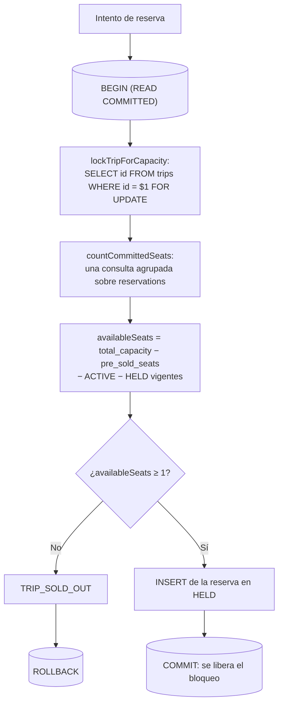
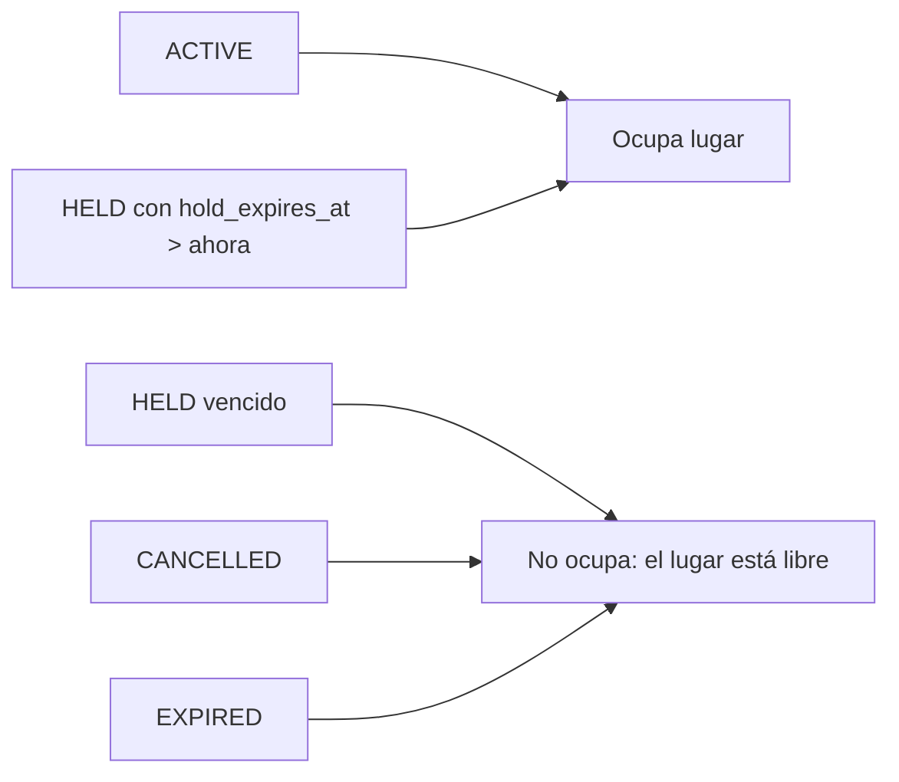
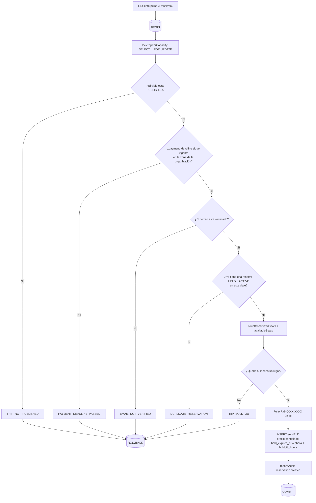
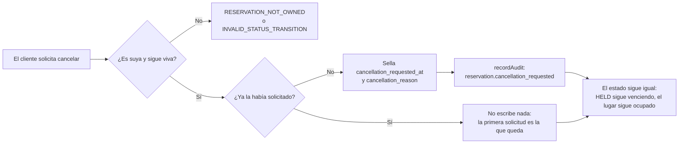

# Cupo de un viaje y bloqueo de fila

Diagramas de `libs/domain/reservations`. Las reglas en prosa están en
`docs/business-rules/reservations.md`.

## Tomar un lugar bajo bloqueo

El orden importa: **primero** el bloqueo, después el conteo, después la
decisión y al final la escritura. Contar antes de bloquear deja exactamente la
ventana que produce la sobreventa.

Los tres pasos centrales —`lockTripForCapacity`, `countCommittedSeats` y
`availableSeats`— viven todos en
`libs/domain/reservations/src/lib/capacity.ts` desde la Tarea 4 (ver
`docs/business-rules/reservations.md`, «Por qué la fórmula vive aquí y no en
viajes»).



## Dos clientes y un solo lugar

Lo que el bloqueo decide. B no lee un conteo viejo: espera a que A termine y
entonces cuenta, y ya ve el lugar tomado.

```mermaid
sequenceDiagram
    participant A as "Cliente A"
    participant DB as PostgreSQL
    participant B as "Cliente B"

    A->>DB: "BEGIN; SELECT ... FOR UPDATE (viaje X)"
    DB-->>A: "bloqueo concedido"
    B->>DB: "BEGIN; SELECT ... FOR UPDATE (viaje X)"
    Note over B,DB: "B queda esperando: A tiene la fila"
    A->>DB: "conteo = 0 comprometidos, queda 1 lugar"
    A->>DB: "INSERT reserva; COMMIT"
    DB-->>B: "bloqueo concedido (A ya hizo COMMIT)"
    B->>DB: "conteo = 1 comprometido, quedan 0 lugares"
    B-->>B: "TRIP_SOLD_OUT; ROLLBACK"
```

Sin el `FOR UPDATE`, B no espera: cuenta cero al mismo tiempo que A, inserta
igual y el viaje queda sobrevendido. La prueba
`lets exactly one of two concurrent reservations take the last seat` fija ese
comportamiento; quitar el bloqueo la pone en rojo con dos éxitos.

El bloqueo es de **fila**: una reserva al viaje Y no espera por el bloqueo del
viaje X.

## Qué ocupa lugar y qué no



Ningún estado terminal requiere tocar un contador para devolver el lugar: el
cupo se deriva de estas filas en cada lectura y nunca se almacena.

La rama «HELD vencido» depende de que todo `HELD` **tenga** fecha de
vencimiento: con `hold_expires_at` nulo la comparación no es cierta y la fila
caería en «no ocupa» estando viva. El `CHECK`
`reservations_held_requires_hold_expiry` impide esa fila, así que el diagrama
no tiene un cuarto caso (ver `docs/business-rules/reservations.md`).

## Del botón «Reservar» a `HELD`

Las cinco bifurcaciones de rechazo, en el orden en que `createReservation` las
evalúa, todas dentro de la misma transacción y todas después del bloqueo.
`NOT_FOUND` (viaje o cliente inexistente) no aparece como bifurcación de
negocio: es la ausencia del dato sobre el que se decide.



El folio tiene dos redes: el bucle que descarta candidatos ya tomados y el
índice único `reservations_code_key`, que es el que de verdad decide. Una
violación de ese índice reintenta la transacción completa una vez; una
violación de `reservations_live_trip_customer_key` se traduce a
`DUPLICATE_RESERVATION`, que es la carrera que la comprobación previa no
puede cerrar sola.

La «zona de la organización» del nodo E se lee con `organizationTimeZone`
(`@rm/domain-settings`) — antes copiada aquí, en `trips` y en `payments`; sin
cambio de regla.

## Solicitar la cancelación no cambia el estado



Cancelar de verdad —liberar el lugar y mover dinero— es una decisión humana
con el permiso `reservation.cancel`, no un efecto de esta solicitud.
