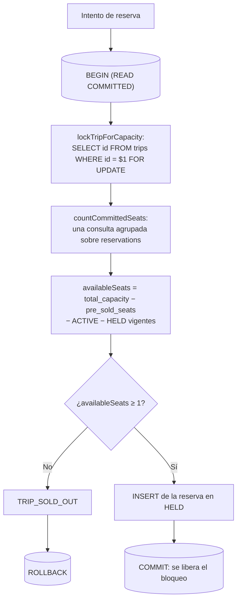
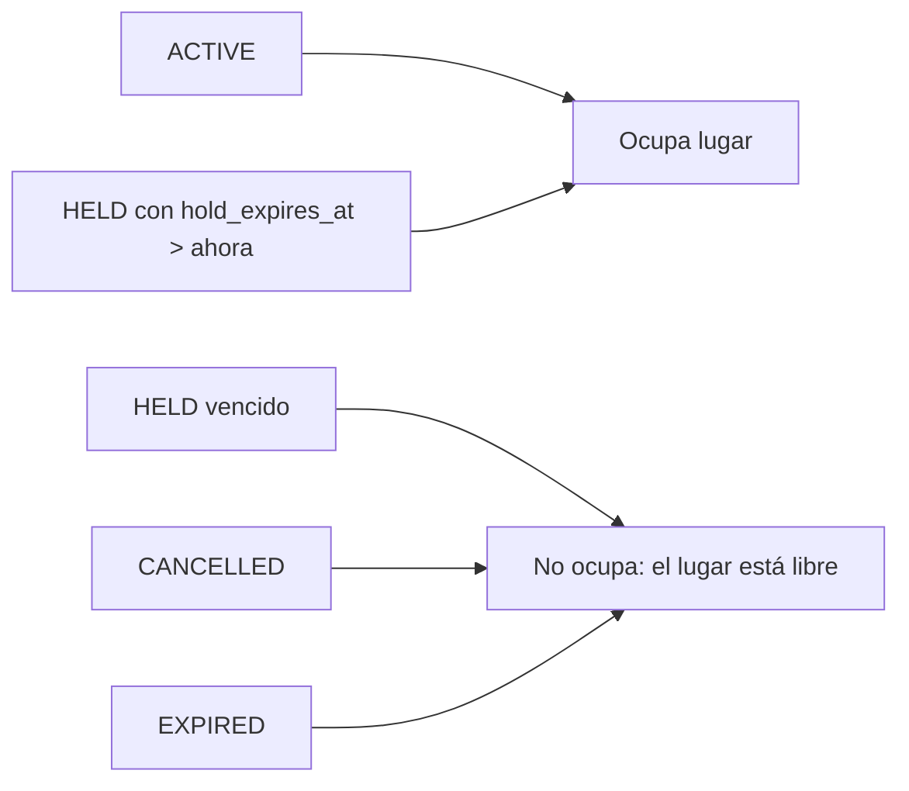

# Cupo de un viaje y bloqueo de fila

Diagramas de `libs/domain/reservations`. Las reglas en prosa están en
`docs/business-rules/reservations.md`.

## Tomar un lugar bajo bloqueo

El orden importa: **primero** el bloqueo, después el conteo, después la
decisión y al final la escritura. Contar antes de bloquear deja exactamente la
ventana que produce la sobreventa.



## Dos clientes y un solo lugar

Lo que el bloqueo decide. B no lee un conteo viejo: espera a que A termine y
entonces cuenta, y ya ve el lugar tomado.

```mermaid
sequenceDiagram
    participant A as "Cliente A"
    participant DB as PostgreSQL
    participant B as "Cliente B"

    A->>DB: "BEGIN; SELECT ... FOR UPDATE (viaje X)"
    DB-->>A: "bloqueo concedido"
    B->>DB: "BEGIN; SELECT ... FOR UPDATE (viaje X)"
    Note over B,DB: "B queda esperando: A tiene la fila"
    A->>DB: "conteo = 0 comprometidos, queda 1 lugar"
    A->>DB: "INSERT reserva; COMMIT"
    DB-->>B: "bloqueo concedido (A ya hizo COMMIT)"
    B->>DB: "conteo = 1 comprometido, quedan 0 lugares"
    B-->>B: "TRIP_SOLD_OUT; ROLLBACK"
```

Sin el `FOR UPDATE`, B no espera: cuenta cero al mismo tiempo que A, inserta
igual y el viaje queda sobrevendido. La prueba
`lets exactly one of two concurrent reservations take the last seat` fija ese
comportamiento; quitar el bloqueo la pone en rojo con dos éxitos.

El bloqueo es de **fila**: una reserva al viaje Y no espera por el bloqueo del
viaje X.

## Qué ocupa lugar y qué no



Ningún estado terminal requiere tocar un contador para devolver el lugar: el
cupo se deriva de estas filas en cada lectura y nunca se almacena.
