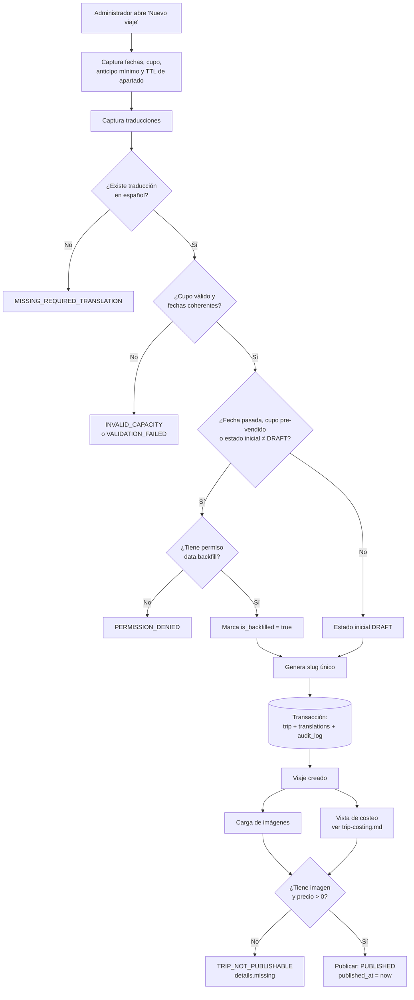
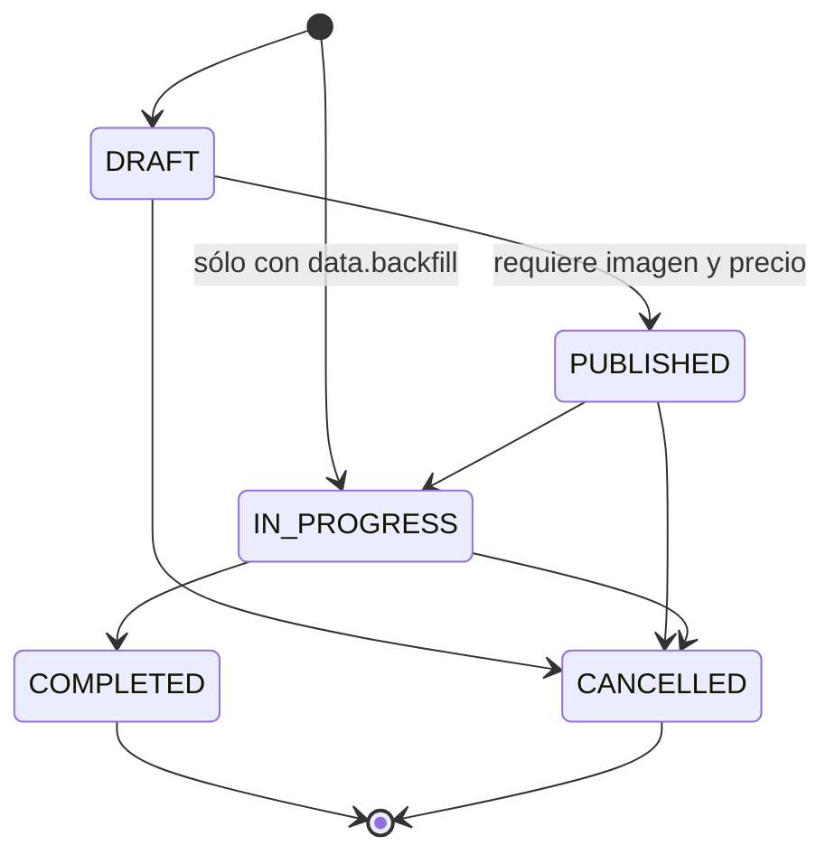
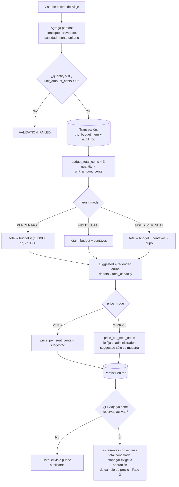

# Fase 1 — Cimientos y panel administrativo · Plan de implementación

> **For agentic workers:** REQUIRED SUB-SKILL: Use superpowers:subagent-driven-development (recommended) or superpowers:executing-plans to implement this plan task-by-task. Steps use checkbox (`- [ ]`) syntax for tracking.

**Goal:** Dejar operativo el panel administrativo para que la agencia pueda capturar sus viajes reales —incluidos los que ya van a medio vender— con costeo, precio de venta calculado, control de acceso por permisos y documentación de reglas de negocio viva.

**Architecture:** Monorepo Nx con una API Next.js (App Router) cuyos Route Handlers son delgados y delegan toda la lógica a `libs/domain`, que no conoce HTTP. PostgreSQL vía Prisma. El panel es una aplicación Angular independiente que consume la API a través de un cliente tipado generado desde OpenAPI. Los esquemas Zod de `libs/contracts` son la única fuente de verdad del contrato.

**Tech Stack:** Nx · pnpm · Node 22 LTS · Next.js (App Router) · Prisma · PostgreSQL 16 · Zod · jose (JWT) · @node-rs/argon2 · Luxon · Angular (última estable) · Angular Material · ngx-translate · Vitest · Playwright · Docker Compose · GitHub Actions

**Spec:** `docs/superpowers/specs/2026-09-28-agencia-viajes-diseno.md`

---

## Global Constraints

Estas reglas aplican a **todas** las tareas. No se repiten en cada una.

- **Todo el código en inglés, sin excepción**: nombres de variables, funciones, clases, archivos, tablas, columnas, ramas, mensajes de commit y comentarios. Sólo `docs/**` va en español.
- **Nomenclatura**: `PascalCase` en modelos Prisma, `snake_case` en PostgreSQL (usar `@@map` y `@map`), `camelCase` en TypeScript, `kebab-case` en nombres de archivo.
- **Dinero**: siempre `Int` en centavos MXN. Jamás `Float`, `Number` decimal ni `Decimal` para montos.
- **Fechas**: se persisten en UTC (`timestamptz`). Toda regla de calendario se evalúa en `America/Mexico_City`, leída de `SystemSetting.organization.timezone`, nunca hardcodeada en la lógica.
- **`libs/domain` no importa nada de Next.js, Angular ni `next/server`.** Recibe un cliente Prisma inyectado. Un `import` de HTTP en `libs/domain` es un error de revisión.
- **Los servicios de dominio devuelven `Result<T>`** para fallos esperables. Las excepciones se reservan para lo inesperado.
- **El backend nunca envía texto destinado a mostrarse a una persona.** Devuelve códigos de error estables; Angular los traduce.
- **Toda verificación de permiso ocurre en la API.** Ocultar un botón en Angular es comodidad visual, nunca seguridad.
- **TDD obligatorio**: la prueba se escribe y se ve fallar antes de la implementación.
- **Regla de documentación viva** (§7 de la spec): toda tarea que añada o modifique una regla de negocio en el backend queda **incompleta** hasta que el archivo correspondiente de `docs/business-rules/` esté actualizado **en el mismo commit**. Si toca creación de viaje, costeo o reserva, también su diagrama en `docs/diagrams/`.
- **Commits frecuentes**, en formato Conventional Commits, en inglés.

### Versiones

Usar la última versión estable de cada herramienta al momento de ejecutar. Resolverlas así y **anotar las versiones resueltas en el commit de la Tarea 1**:

```bash
npm view nx version
npm view @angular/core version
npm view next version
npm view prisma version
```

---

## Estructura de archivos

Qué se crea y de qué responde cada pieza. El detalle por tarea está más abajo.

```
apps/
  api/                          Next.js — Route Handlers delgados + generación de OpenAPI
    src/app/api/v1/**           endpoints por módulo
    src/lib/http/               route(), problemResponse(), extracción de actor
    src/lib/openapi/            construcción del documento OpenAPI
  admin/                        Angular — panel administrativo
    src/app/features/{auth,roles,staff,trips}/
    src/app/layout/

libs/
  shared-utils/                 Money, Result, DomainError, calendario con zona horaria
  db/                           esquema Prisma, migraciones, seeds, helpers de pruebas
  contracts/                    esquemas Zod por módulo — fuente de verdad del contrato
  storage/                      StorageProvider: LocalFileStorage | S3Storage
  domain/
    identity/                   hashing, JWT, sesiones, login, refresh rotativo
    rbac/                       catálogo de permisos, roles, verificación de acceso
    staff/                      alta y gestión de usuarios administradores
    trips/                      CRUD, traducciones, imágenes, estados, cupo
    costing/                    partidas de presupuesto, márgenes, precio por vacante
    audit/                      escritura de AuditLog
  api-client/                   tipos generados desde OpenAPI + servicios sobre HttpClient
  auth-web/                     AuthService, interceptor con refresh, guards, directiva de permisos
  i18n/                         ngx-translate, catálogos es/en, sincronización con el perfil
  ui/                           tema Material y componentes compartidos

infra/
  docker/                       Dockerfile.api, Dockerfile.web
  compose/                      compose.dev.yml, compose.test.yml
  nginx/                        nginx.conf

docs/
  business-rules/               reglas de negocio en prosa
  diagrams/                     diagramas Mermaid
```

**Fuera del alcance de la Fase 1** (van en fases posteriores): `apps/client`, `apps/worker`, `libs/domain/{reservations,payments,notifications,expenses,reporting}`.

---

## Tarea 1: Monorepo, herramientas y documentación base

**Files:**
- Create: `package.json`, `pnpm-workspace.yaml`, `nx.json`, `tsconfig.base.json`
- Create: `apps/api/**` (generador Next.js), `apps/admin/**` (generador Angular)
- Create: `CLAUDE.md`
- Create: `docs/business-rules/README.md`
- Create: `.github/pull_request_template.md`
- Create: `.editorconfig`, `.gitignore`, `.nvmrc`

**Interfaces:**
- Consumes: nada.
- Produces: alias de importación `@rm/shared-utils`, `@rm/db`, `@rm/contracts`, `@rm/domain-*`, `@rm/api-client`, `@rm/auth-web`, `@rm/i18n`, `@rm/ui`, `@rm/storage` en `tsconfig.base.json`. Comandos `pnpm nx run-many -t lint test build`.

- [ ] **Step 1: Inicializar repositorio y workspace**

```bash
cd /Users/egarsev/Desktop/Stuff/code/ruta_mochilera
git init -b main
echo "22" > .nvmrc
npx create-nx-workspace@latest . --preset=apps --packageManager=pnpm --nxCloud=skip --name=ruta-mochilera
```

Si el directorio no está vacío (ya contiene `docs/`), crear el workspace en un temporal y mover su contenido:

```bash
npx create-nx-workspace@latest /tmp/rm-ws --preset=apps --packageManager=pnpm --nxCloud=skip --name=ruta-mochilera
rsync -a --exclude='.git' /tmp/rm-ws/ ./
rm -rf /tmp/rm-ws
```

- [ ] **Step 2: Generar las dos aplicaciones**

```bash
pnpm add -D @nx/next @nx/angular @nx/js @nx/vite
pnpm nx g @nx/next:application apps/api --style=none --appDir=true --src=true --unitTestRunner=vitest --e2eTestRunner=none
pnpm nx g @nx/angular:application apps/admin --style=scss --routing=true --standalone=true --unitTestRunner=vitest --e2eTestRunner=none --prefix=rm
```

- [ ] **Step 3: Generar las librerías vacías**

```bash
for lib in shared-utils db contracts storage api-client auth-web i18n; do
  pnpm nx g @nx/js:library libs/$lib --bundler=none --unitTestRunner=vitest --importPath=@rm/$lib
done
for d in identity rbac staff trips costing audit; do
  pnpm nx g @nx/js:library libs/domain/$d --bundler=none --unitTestRunner=vitest --importPath=@rm/domain-$d
done
pnpm nx g @nx/angular:library libs/ui --standalone=true --unitTestRunner=vitest --importPath=@rm/ui --prefix=rm
```

- [ ] **Step 4: Escribir `CLAUDE.md`**

Crear `CLAUDE.md` en la raíz con exactamente este contenido:

```markdown
# Ruta Mochilera — Guía para agentes

## Idioma

**Todo el código se escribe en inglés**, sin excepción: nombres de variables,
funciones, clases, archivos, tablas, columnas, ramas, mensajes de commit y
comentarios. Únicamente `docs/**` se escribe en español.

## Reglas de negocio: documentación obligatoria

Toda tarea que **añada o modifique una regla de negocio en el backend** queda
**incompleta** hasta que el archivo correspondiente de `docs/business-rules/`
esté actualizado **en el mismo commit**.

| Si tocas… | Actualiza… |
|---|---|
| `libs/domain/trips/**` | `docs/business-rules/trips.md` y `docs/diagrams/trip-creation.md` |
| `libs/domain/costing/**` | `docs/business-rules/costing.md` y `docs/diagrams/trip-costing.md` |
| `libs/domain/reservations/**` | `docs/business-rules/reservations.md` y `docs/diagrams/trip-reservation.md` |
| `libs/domain/payments/**` | `docs/business-rules/payments.md` |
| `libs/domain/notifications/**` | `docs/business-rules/notifications.md` |
| `libs/domain/rbac/**` | `docs/business-rules/rbac.md` |

Los diagramas se escriben en **Mermaid dentro de archivos Markdown**, nunca como
imágenes: se versionan como texto y un diff muestra qué cambió en la regla.

## Arquitectura: la regla que no se rompe

`libs/domain` **no sabe que existe HTTP**. No importa nada de `next/*`, de
Angular ni de `@nx/*`. Recibe un cliente Prisma inyectado y devuelve `Result<T>`.

Un Route Handler hace cuatro cosas y nada más:
1. Autenticar
2. Verificar permiso
3. Validar la entrada con Zod
4. Llamar al servicio de dominio

Consecuencia buscada: registrar un pago desde el mostrador, desde un webhook de
Stripe o desde una importación CSV recorre el mismo código.

## Convenciones

- Dinero: `Int` en centavos MXN. Nunca `Float`.
- Fechas: `timestamptz` en UTC. Las reglas de calendario se evalúan en la zona
  horaria de `SystemSetting.organization.timezone`, nunca hardcodeada.
- Prisma: modelos en `PascalCase`, tablas y columnas en `snake_case` vía `@@map` / `@map`.
- Errores: el backend devuelve códigos estables (`TRIP_SOLD_OUT`, …).
  **Nunca** texto para mostrar a una persona; Angular lo traduce.
- Permisos: se verifican **siempre** en la API. Ocultar un botón en Angular es
  comodidad visual, nunca seguridad.

## Comandos

```bash
pnpm nx run-many -t lint test build   # todo el workspace
pnpm nx test shared-utils             # una librería
docker compose -f infra/compose/compose.dev.yml up -d    # Postgres local
pnpm db:migrate                       # aplicar migraciones
pnpm db:seed                          # sembrar permisos, rol y usuario inicial
```

## Spec y planes

- Diseño: `docs/superpowers/specs/2026-09-28-agencia-viajes-diseno.md`
- Planes: `docs/superpowers/plans/`
```

- [ ] **Step 5: Crear el índice de reglas de negocio**

Crear `docs/business-rules/README.md`:

```markdown
# Reglas de negocio

Cada archivo describe las reglas de un módulo del dominio en prosa, con los
valores y fórmulas exactos que implementa `libs/domain`.

| Archivo | Módulo | Código fuente |
|---|---|---|
| `trips.md` | Viajes: estados, cupo, publicación | `libs/domain/trips` |
| `costing.md` | Presupuesto, margen, precio por vacante | `libs/domain/costing` |
| `reservations.md` | Apartado, expiración, cambio de precio | `libs/domain/reservations` |
| `payments.md` | Métodos, recibos, saldo a favor, retroactivos | `libs/domain/payments` |
| `notifications.md` | Audiencias, variables, calendarización | `libs/domain/notifications` |
| `rbac.md` | Catálogo de permisos y roles | `libs/domain/rbac` |

## Convenciones

- Toda fórmula se escribe con los nombres de campo reales de la base de datos.
- Todo umbral configurable indica su clave en `SystemSetting`.
- Cuando una regla cambia, este archivo y su diagrama se actualizan **en el mismo
  commit** que el código. Ver `CLAUDE.md`.
```

- [ ] **Step 6: Plantilla de pull request**

Crear `.github/pull_request_template.md`:

```markdown
## Qué cambia

## Reglas de negocio

- [ ] No toqué reglas de negocio del backend
- [ ] Toqué reglas de negocio y actualicé `docs/business-rules/` en este mismo PR
- [ ] La regla afecta creación de viaje, costeo o reserva, y actualicé su diagrama en `docs/diagrams/`

## Verificación

- [ ] `pnpm nx run-many -t lint test build` pasa localmente
- [ ] Las pruebas nuevas fallaban antes de la implementación
```

- [ ] **Step 7: Verificar que el workspace compila**

Run: `pnpm nx run-many -t lint test build`
Expected: todos los proyectos en verde (las librerías recién generadas traen una prueba de ejemplo que pasa).

- [ ] **Step 8: Commit**

```bash
git add -A
git commit -m "chore: scaffold nx monorepo with api, admin and domain libraries"
```

---

## Tarea 2: PostgreSQL local, configuración de entorno y Docker

**Files:**
- Create: `infra/compose/compose.dev.yml`
- Create: `infra/compose/compose.test.yml`
- Create: `.env.example`
- Create: `libs/shared-utils/src/lib/env.ts`
- Test: `libs/shared-utils/src/lib/env.spec.ts`

**Interfaces:**
- Produces: `loadEnv(source: Record<string, string | undefined>): AppEnv` y el tipo `AppEnv` con `databaseUrl`, `jwtSecret`, `accessTokenTtlSeconds`, `refreshTokenTtlDays`, `storageDriver`, `storageLocalRoot`, `appBaseUrl`, `nodeEnv`.

- [ ] **Step 1: Escribir la prueba que falla**

Crear `libs/shared-utils/src/lib/env.spec.ts`:

```ts
import { describe, expect, it } from 'vitest';
import { loadEnv } from './env';

const valid = {
  NODE_ENV: 'test',
  DATABASE_URL: 'postgresql://rm:rm@localhost:5432/rm_dev',
  JWT_SECRET: 'x'.repeat(32),
  APP_BASE_URL: 'http://localhost:3000',
  STORAGE_DRIVER: 'local',
  STORAGE_LOCAL_ROOT: './storage',
};

describe('loadEnv', () => {
  it('parses a valid environment and applies defaults', () => {
    const env = loadEnv(valid);
    expect(env.databaseUrl).toBe(valid.DATABASE_URL);
    expect(env.accessTokenTtlSeconds).toBe(900);
    expect(env.refreshTokenTtlDays).toBe(30);
    expect(env.storageDriver).toBe('local');
  });

  it('rejects a JWT secret shorter than 32 characters', () => {
    expect(() => loadEnv({ ...valid, JWT_SECRET: 'too-short' })).toThrow(/JWT_SECRET/);
  });

  it('requires STORAGE_S3_BUCKET when the driver is s3', () => {
    expect(() =>
      loadEnv({ ...valid, STORAGE_DRIVER: 's3', STORAGE_LOCAL_ROOT: undefined })
    ).toThrow(/STORAGE_S3_BUCKET/);
  });
});
```

- [ ] **Step 2: Verificar que falla**

Run: `pnpm nx test shared-utils`
Expected: FAIL — `Cannot find module './env'`.

- [ ] **Step 3: Implementar**

Crear `libs/shared-utils/src/lib/env.ts`:

```ts
import { z } from 'zod';

const schema = z
  .object({
    NODE_ENV: z.enum(['development', 'test', 'production']).default('development'),
    DATABASE_URL: z.string().url(),
    JWT_SECRET: z.string().min(32, 'JWT_SECRET must be at least 32 characters'),
    ACCESS_TOKEN_TTL_SECONDS: z.coerce.number().int().positive().default(900),
    REFRESH_TOKEN_TTL_DAYS: z.coerce.number().int().positive().default(30),
    APP_BASE_URL: z.string().url(),
    STORAGE_DRIVER: z.enum(['local', 's3']).default('local'),
    STORAGE_LOCAL_ROOT: z.string().optional(),
    STORAGE_S3_BUCKET: z.string().optional(),
    STORAGE_S3_REGION: z.string().optional(),
  })
  .superRefine((value, ctx) => {
    if (value.STORAGE_DRIVER === 'local' && !value.STORAGE_LOCAL_ROOT) {
      ctx.addIssue({ code: 'custom', message: 'STORAGE_LOCAL_ROOT is required when STORAGE_DRIVER is local' });
    }
    if (value.STORAGE_DRIVER === 's3' && (!value.STORAGE_S3_BUCKET || !value.STORAGE_S3_REGION)) {
      ctx.addIssue({ code: 'custom', message: 'STORAGE_S3_BUCKET and STORAGE_S3_REGION are required when STORAGE_DRIVER is s3' });
    }
  });

export interface AppEnv {
  nodeEnv: 'development' | 'test' | 'production';
  databaseUrl: string;
  jwtSecret: string;
  accessTokenTtlSeconds: number;
  refreshTokenTtlDays: number;
  appBaseUrl: string;
  storageDriver: 'local' | 's3';
  storageLocalRoot?: string;
  storageS3Bucket?: string;
  storageS3Region?: string;
}

export function loadEnv(source: Record<string, string | undefined>): AppEnv {
  const parsed = schema.safeParse(source);
  if (!parsed.success) {
    const message = parsed.error.issues.map((issue) => issue.message).join('; ');
    throw new Error(`Invalid environment configuration: ${message}`);
  }
  const value = parsed.data;
  return {
    nodeEnv: value.NODE_ENV,
    databaseUrl: value.DATABASE_URL,
    jwtSecret: value.JWT_SECRET,
    accessTokenTtlSeconds: value.ACCESS_TOKEN_TTL_SECONDS,
    refreshTokenTtlDays: value.REFRESH_TOKEN_TTL_DAYS,
    appBaseUrl: value.APP_BASE_URL,
    storageDriver: value.STORAGE_DRIVER,
    storageLocalRoot: value.STORAGE_LOCAL_ROOT,
    storageS3Bucket: value.STORAGE_S3_BUCKET,
    storageS3Region: value.STORAGE_S3_REGION,
  };
}
```

Instalar Zod y exportar desde el índice de la librería:

```bash
pnpm add zod
```

Añadir a `libs/shared-utils/src/index.ts`:

```ts
export * from './lib/env';
```

- [ ] **Step 4: Verificar que pasa**

Run: `pnpm nx test shared-utils`
Expected: PASS, 3 pruebas.

- [ ] **Step 5: Docker Compose para desarrollo y pruebas**

Crear `infra/compose/compose.dev.yml`:

```yaml
services:
  postgres:
    image: postgres:16-alpine
    container_name: rm-postgres-dev
    environment:
      POSTGRES_USER: rm
      POSTGRES_PASSWORD: rm
      POSTGRES_DB: rm_dev
    ports:
      - '5432:5432'
    volumes:
      - rm-pgdata-dev:/var/lib/postgresql/data
    healthcheck:
      test: ['CMD-SHELL', 'pg_isready -U rm -d rm_dev']
      interval: 5s
      timeout: 5s
      retries: 10

volumes:
  rm-pgdata-dev:
```

Crear `infra/compose/compose.test.yml`:

```yaml
services:
  postgres-test:
    image: postgres:16-alpine
    container_name: rm-postgres-test
    environment:
      POSTGRES_USER: rm
      POSTGRES_PASSWORD: rm
      POSTGRES_DB: rm_test
    ports:
      - '5433:5432'
    tmpfs:
      - /var/lib/postgresql/data
    healthcheck:
      test: ['CMD-SHELL', 'pg_isready -U rm -d rm_test']
      interval: 5s
      timeout: 5s
      retries: 10
```

La base de pruebas usa `tmpfs`: vive en memoria, arranca limpia y es rápida incluso en la Raspberry Pi.

- [ ] **Step 6: Archivo de ejemplo de entorno**

Crear `.env.example`:

```bash
NODE_ENV=development
DATABASE_URL=postgresql://rm:rm@localhost:5432/rm_dev
JWT_SECRET=change-me-to-at-least-32-characters-long
ACCESS_TOKEN_TTL_SECONDS=900
REFRESH_TOKEN_TTL_DAYS=30
APP_BASE_URL=http://localhost:3000
STORAGE_DRIVER=local
STORAGE_LOCAL_ROOT=./storage
# Sólo con STORAGE_DRIVER=s3
# STORAGE_S3_BUCKET=
# STORAGE_S3_REGION=
```

Añadir a `.gitignore`: `.env`, `storage/`.

- [ ] **Step 7: Verificar que Postgres levanta**

```bash
docker compose -f infra/compose/compose.dev.yml up -d
docker compose -f infra/compose/compose.dev.yml ps
```

Expected: el servicio `postgres` en estado `healthy`.

- [ ] **Step 8: Commit**

```bash
git add -A
git commit -m "chore: add postgres compose files and validated environment loader"
```

---

## Tarea 3: Utilidades compartidas — dinero, Result y calendario

**Files:**
- Create: `libs/shared-utils/src/lib/money.ts`
- Create: `libs/shared-utils/src/lib/result.ts`
- Create: `libs/shared-utils/src/lib/calendar.ts`
- Test: `libs/shared-utils/src/lib/money.spec.ts`, `result.spec.ts`, `calendar.spec.ts`
- Modify: `libs/shared-utils/src/index.ts`

**Interfaces:**
- Produces:
  - `type Cents = number`
  - `roundUpToPeso(cents: Cents): Cents`
  - `formatMoney(cents: Cents, locale: 'es' | 'en'): string`
  - `type Result<T> = { ok: true; value: T } | { ok: false; error: DomainError }`
  - `ok<T>(value: T): Result<T>`
  - `fail(code: DomainErrorCode, details?: Record<string, unknown>): Result<never>`
  - `type DomainErrorCode` (unión de literales)
  - `monthStartsBetween(from: Date, to: Date, timeZone: string): number`

- [ ] **Step 1: Escribir las pruebas que fallan**

Crear `libs/shared-utils/src/lib/money.spec.ts`:

```ts
import { describe, expect, it } from 'vitest';
import { formatMoney, roundUpToPeso } from './money';

describe('roundUpToPeso', () => {
  it('leaves exact pesos untouched', () => {
    expect(roundUpToPeso(12500)).toBe(12500);
  });

  it('rounds any fraction of a peso upwards', () => {
    expect(roundUpToPeso(12501)).toBe(12600);
    expect(roundUpToPeso(12599)).toBe(12600);
  });

  it('handles zero', () => {
    expect(roundUpToPeso(0)).toBe(0);
  });
});

describe('formatMoney', () => {
  it('formats Spanish amounts with the MXN suffix', () => {
    expect(formatMoney(1250000, 'es')).toBe('$12,500.00 MXN');
  });

  it('formats English amounts with the MXN suffix', () => {
    expect(formatMoney(1250000, 'en')).toBe('$12,500.00 MXN');
  });

  it('formats cents that are not whole pesos', () => {
    expect(formatMoney(1250050, 'es')).toBe('$12,500.50 MXN');
  });
});
```

Crear `libs/shared-utils/src/lib/result.spec.ts`:

```ts
import { describe, expect, it } from 'vitest';
import { fail, ok } from './result';

describe('Result', () => {
  it('wraps a success value', () => {
    const result = ok(42);
    expect(result.ok).toBe(true);
    if (result.ok) expect(result.value).toBe(42);
  });

  it('wraps a failure with a stable code and details', () => {
    const result = fail('TRIP_SOLD_OUT', { tripId: 'abc' });
    expect(result.ok).toBe(false);
    if (!result.ok) {
      expect(result.error.code).toBe('TRIP_SOLD_OUT');
      expect(result.error.details).toEqual({ tripId: 'abc' });
    }
  });
});
```

Crear `libs/shared-utils/src/lib/calendar.spec.ts`:

```ts
import { describe, expect, it } from 'vitest';
import { monthStartsBetween } from './calendar';

const TZ = 'America/Mexico_City';
const at = (iso: string) => new Date(iso);

describe('monthStartsBetween', () => {
  it('counts every first-of-month strictly after `from` and on or before `to`', () => {
    // 15 ene 2026 → 10 jun 2026: feb 1, mar 1, abr 1, may 1, jun 1
    expect(monthStartsBetween(at('2026-01-15T12:00:00Z'), at('2026-06-10T12:00:00Z'), TZ)).toBe(5);
  });

  it('excludes today even when today is the first of the month', () => {
    // 1 mar 2026 → 15 may 2026: abr 1, may 1
    expect(monthStartsBetween(at('2026-03-01T12:00:00Z'), at('2026-05-15T12:00:00Z'), TZ)).toBe(2);
  });

  it('includes the deadline when the deadline is itself a first of month', () => {
    // 10 mar 2026 → 1 may 2026: abr 1, may 1
    expect(monthStartsBetween(at('2026-03-10T12:00:00Z'), at('2026-05-01T12:00:00Z'), TZ)).toBe(2);
  });

  it('returns zero when the deadline is not after today', () => {
    expect(monthStartsBetween(at('2026-03-10T12:00:00Z'), at('2026-03-10T12:00:00Z'), TZ)).toBe(0);
    expect(monthStartsBetween(at('2026-03-10T12:00:00Z'), at('2026-03-01T12:00:00Z'), TZ)).toBe(0);
  });

  it('returns zero when no first-of-month falls inside the window', () => {
    expect(monthStartsBetween(at('2026-03-05T12:00:00Z'), at('2026-03-20T12:00:00Z'), TZ)).toBe(0);
  });

  it('uses the given timezone, not UTC', () => {
    // 2026-04-01T02:00Z sigue siendo 31 mar 20:00 en Ciudad de México,
    // así que el 1 de abril todavía cuenta como pendiente.
    expect(monthStartsBetween(at('2026-04-01T02:00:00Z'), at('2026-04-05T12:00:00Z'), TZ)).toBe(1);
  });
});
```

- [ ] **Step 2: Verificar que fallan**

Run: `pnpm nx test shared-utils`
Expected: FAIL — no existen `./money`, `./result` ni `./calendar`.

- [ ] **Step 3: Implementar `money.ts`**

```ts
/** A monetary amount in MXN cents. Never use floating point for money. */
export type Cents = number;

const CENTS_PER_PESO = 100;

/** Rounds an amount up to the next whole peso. */
export function roundUpToPeso(cents: Cents): Cents {
  return Math.ceil(cents / CENTS_PER_PESO) * CENTS_PER_PESO;
}

/** Formats cents for display, e.g. "$12,500.00 MXN". */
export function formatMoney(cents: Cents, locale: 'es' | 'en'): string {
  const formatted = new Intl.NumberFormat(locale === 'es' ? 'es-MX' : 'en-US', {
    style: 'currency',
    currency: 'MXN',
    currencyDisplay: 'symbol',
    minimumFractionDigits: 2,
    maximumFractionDigits: 2,
  }).format(cents / CENTS_PER_PESO);

  // Intl emite "MX$12,500.00" en algunos ICU; normalizamos a "$12,500.00 MXN".
  return `${formatted.replace(/^MX\$/, '$').replace(/\s?MXN$/, '')} MXN`;
}
```

- [ ] **Step 4: Implementar `result.ts`**

```ts
export type DomainErrorCode =
  // Autenticación e identidad
  | 'INVALID_CREDENTIALS'
  | 'TOKEN_INVALID'
  | 'TOKEN_REUSED'
  | 'EMAIL_NOT_VERIFIED'
  | 'EMAIL_ALREADY_REGISTERED'
  | 'ACCOUNT_DISABLED'
  | 'RATE_LIMITED'
  // Autorización
  | 'PERMISSION_DENIED'
  | 'SYSTEM_ROLE_IMMUTABLE'
  | 'ROLE_IN_USE'
  // Genéricos
  | 'NOT_FOUND'
  | 'VALIDATION_FAILED'
  | 'CONFLICT'
  // Viajes y costeo
  | 'INVALID_CAPACITY'
  | 'CAPACITY_BELOW_COMMITTED'
  | 'TRIP_NOT_PUBLISHABLE'
  | 'INVALID_STATUS_TRANSITION'
  | 'TRIP_SOLD_OUT'
  | 'MISSING_REQUIRED_TRANSLATION'
  // Reservas y pagos (Fase 2)
  | 'DUPLICATE_RESERVATION'
  | 'HOLD_EXPIRED'
  | 'PAYMENT_EXCEEDS_BALANCE'
  | 'DEPOSIT_BELOW_MINIMUM';

export interface DomainError {
  code: DomainErrorCode;
  details?: Record<string, unknown>;
}

export type Result<T> = { ok: true; value: T } | { ok: false; error: DomainError };

export function ok<T>(value: T): Result<T> {
  return { ok: true, value };
}

export function fail(code: DomainErrorCode, details?: Record<string, unknown>): Result<never> {
  return { ok: false, error: { code, details } };
}

/** Narrowing helper for call sites that only care about the failure branch. */
export function isFailure<T>(result: Result<T>): result is { ok: false; error: DomainError } {
  return !result.ok;
}
```

- [ ] **Step 5: Implementar `calendar.ts`**

```bash
pnpm add luxon && pnpm add -D @types/luxon
```

```ts
import { DateTime } from 'luxon';

/**
 * Counts how many first-of-month days fall strictly after `from` and on or
 * before `to`, evaluated in the given IANA timezone.
 *
 * This is the basis of the suggested monthly instalment: payments are made on
 * the 1st of each month, so this is the number of opportunities the customer
 * has left before the payment deadline. Purely informative — the system never
 * enforces a minimum monthly amount.
 */
export function monthStartsBetween(from: Date, to: Date, timeZone: string): number {
  const start = DateTime.fromJSDate(from, { zone: timeZone }).startOf('day');
  const end = DateTime.fromJSDate(to, { zone: timeZone }).startOf('day');
  if (end <= start) return 0;

  let cursor = start.startOf('month');
  if (cursor <= start) cursor = cursor.plus({ months: 1 });

  let count = 0;
  while (cursor <= end) {
    count += 1;
    cursor = cursor.plus({ months: 1 });
  }
  return count;
}
```

- [ ] **Step 6: Exportar desde el índice**

`libs/shared-utils/src/index.ts`:

```ts
export * from './lib/calendar';
export * from './lib/env';
export * from './lib/money';
export * from './lib/result';
```

- [ ] **Step 7: Verificar que pasan**

Run: `pnpm nx test shared-utils`
Expected: PASS, todas las pruebas de los tres archivos.

- [ ] **Step 8: Commit**

```bash
git add -A
git commit -m "feat: add money, result and timezone-aware calendar utilities"
```

---

## Tarea 4: Esquema Prisma, migración inicial y helpers de pruebas

**Files:**
- Create: `libs/db/prisma/schema.prisma`
- Create: `libs/db/src/lib/client.ts`
- Create: `libs/db/src/testing/test-db.ts`
- Test: `libs/db/src/lib/schema.spec.ts`
- Modify: `libs/db/src/index.ts`, `package.json` (scripts)

**Interfaces:**
- Consumes: `loadEnv` de `@rm/shared-utils`.
- Produces:
  - `createPrismaClient(databaseUrl: string): PrismaClient`
  - `type Db = PrismaClient` (reexportado como `@rm/db`)
  - `resetDatabase(db: Db): Promise<void>` desde `@rm/db/testing`
  - `withTestDb(): Db` — cliente contra `rm_test`, usado por todas las pruebas de integración.

> **Nota sobre la spec:** este esquema añade `RefreshToken.session_id`, que la spec §4.1 no enumeraba. Es necesario para revocar toda la cadena de tokens de una sesión al detectar reuso (spec §10). Documentar en `docs/business-rules/rbac.md`.

- [ ] **Step 1: Instalar Prisma y crear el esquema**

```bash
pnpm add -D prisma
pnpm add @prisma/client
```

Crear `libs/db/prisma/schema.prisma`:

```prisma
generator client {
  provider = "prisma-client-js"
  output   = "../../../node_modules/.prisma/client"
}

datasource db {
  provider = "postgresql"
  url      = env("DATABASE_URL")
}

enum UserType {
  STAFF
  CUSTOMER
}

enum UserStatus {
  ACTIVE
  DISABLED
}

enum Locale {
  es
  en
}

enum AuthProvider {
  PASSWORD
  GOOGLE
  APPLE
}

enum CustomerOrigin {
  SELF_SIGNUP
  BRANCH
  IMPORT
}

enum TripStatus {
  DRAFT
  PUBLISHED
  IN_PROGRESS
  COMPLETED
  CANCELLED
}

enum MarginMode {
  PERCENTAGE
  FIXED_TOTAL
  FIXED_PER_SEAT
}

enum PriceMode {
  AUTO
  MANUAL
}

model User {
  id              String     @id @default(uuid()) @db.Uuid
  email           String     @unique
  passwordHash    String?    @map("password_hash")
  emailVerifiedAt DateTime?  @map("email_verified_at") @db.Timestamptz
  locale          Locale     @default(es)
  type            UserType
  status          UserStatus @default(ACTIVE)
  createdAt       DateTime   @default(now()) @map("created_at") @db.Timestamptz
  updatedAt       DateTime   @updatedAt @map("updated_at") @db.Timestamptz

  staffProfile     StaffProfile?
  customerProfile  CustomerProfile?
  authIdentities   AuthIdentity[]
  refreshTokens    RefreshToken[]
  roles            UserRole[]
  createdTrips     Trip[]           @relation("TripCreatedBy")

  @@map("users")
}

model StaffProfile {
  userId       String  @id @map("user_id") @db.Uuid
  fullName     String  @map("full_name")
  employeeCode String? @map("employee_code")

  user User @relation(fields: [userId], references: [id], onDelete: Cascade)

  @@map("staff_profiles")
}

model CustomerProfile {
  userId      String         @id @map("user_id") @db.Uuid
  fullName    String         @map("full_name")
  phone       String
  birthDate   DateTime       @map("birth_date") @db.Date
  photoKey    String?        @map("photo_key")
  origin      CustomerOrigin
  invitedAt   DateTime?      @map("invited_at") @db.Timestamptz
  activatedAt DateTime?      @map("activated_at") @db.Timestamptz

  user User @relation(fields: [userId], references: [id], onDelete: Cascade)

  @@index([phone])
  @@map("customer_profiles")
}

model AuthIdentity {
  id             String       @id @default(uuid()) @db.Uuid
  userId         String       @map("user_id") @db.Uuid
  provider       AuthProvider
  providerUserId String       @map("provider_user_id")
  createdAt      DateTime     @default(now()) @map("created_at") @db.Timestamptz

  user User @relation(fields: [userId], references: [id], onDelete: Cascade)

  @@unique([provider, providerUserId])
  @@map("auth_identities")
}

model RefreshToken {
  id        String    @id @default(uuid()) @db.Uuid
  userId    String    @map("user_id") @db.Uuid
  sessionId String    @map("session_id") @db.Uuid
  tokenHash String    @unique @map("token_hash")
  deviceId  String?   @map("device_id")
  userAgent String?   @map("user_agent")
  expiresAt DateTime  @map("expires_at") @db.Timestamptz
  revokedAt DateTime? @map("revoked_at") @db.Timestamptz
  createdAt DateTime  @default(now()) @map("created_at") @db.Timestamptz

  user User @relation(fields: [userId], references: [id], onDelete: Cascade)

  @@index([userId])
  @@index([sessionId])
  @@map("refresh_tokens")
}

model EmailVerification {
  id         String    @id @default(uuid()) @db.Uuid
  userId     String    @map("user_id") @db.Uuid
  codeHash   String    @map("code_hash")
  expiresAt  DateTime  @map("expires_at") @db.Timestamptz
  consumedAt DateTime? @map("consumed_at") @db.Timestamptz
  attempts   Int       @default(0)
  createdAt  DateTime  @default(now()) @map("created_at") @db.Timestamptz

  @@index([userId])
  @@map("email_verifications")
}

model PasswordReset {
  id         String    @id @default(uuid()) @db.Uuid
  userId     String    @map("user_id") @db.Uuid
  tokenHash  String    @unique @map("token_hash")
  expiresAt  DateTime  @map("expires_at") @db.Timestamptz
  consumedAt DateTime? @map("consumed_at") @db.Timestamptz
  createdAt  DateTime  @default(now()) @map("created_at") @db.Timestamptz

  @@index([userId])
  @@map("password_resets")
}

model Permission {
  id          String @id @default(uuid()) @db.Uuid
  key         String @unique
  category    String
  description String

  roles RolePermission[]

  @@map("permissions")
}

model Role {
  id          String   @id @default(uuid()) @db.Uuid
  name        String   @unique
  description String
  isSystem    Boolean  @default(false) @map("is_system")
  createdAt   DateTime @default(now()) @map("created_at") @db.Timestamptz
  updatedAt   DateTime @updatedAt @map("updated_at") @db.Timestamptz

  permissions RolePermission[]
  users       UserRole[]

  @@map("roles")
}

model RolePermission {
  roleId       String @map("role_id") @db.Uuid
  permissionId String @map("permission_id") @db.Uuid

  role       Role       @relation(fields: [roleId], references: [id], onDelete: Cascade)
  permission Permission @relation(fields: [permissionId], references: [id], onDelete: Cascade)

  @@id([roleId, permissionId])
  @@map("role_permissions")
}

model UserRole {
  userId String @map("user_id") @db.Uuid
  roleId String @map("role_id") @db.Uuid

  user User @relation(fields: [userId], references: [id], onDelete: Cascade)
  role Role @relation(fields: [roleId], references: [id], onDelete: Cascade)

  @@id([userId, roleId])
  @@map("user_roles")
}

model Trip {
  id                  String     @id @default(uuid()) @db.Uuid
  slug                String     @unique
  status              TripStatus @default(DRAFT)
  departureDate       DateTime   @map("departure_date") @db.Date
  returnDate          DateTime   @map("return_date") @db.Date
  paymentDeadline     DateTime   @map("payment_deadline") @db.Date
  totalCapacity       Int        @map("total_capacity")
  preSoldSeats        Int        @default(0) @map("pre_sold_seats")
  holdTtlHours        Int        @map("hold_ttl_hours")
  minimumDepositCents Int        @map("minimum_deposit_cents")
  budgetTotalCents    Int        @default(0) @map("budget_total_cents")
  marginMode          MarginMode @default(PERCENTAGE) @map("margin_mode")
  marginValue         Int        @default(0) @map("margin_value")
  pricePerSeatCents   Int        @default(0) @map("price_per_seat_cents")
  priceMode           PriceMode  @default(AUTO) @map("price_mode")
  publishedAt         DateTime?  @map("published_at") @db.Timestamptz
  isBackfilled        Boolean    @default(false) @map("is_backfilled")
  createdById         String     @map("created_by") @db.Uuid
  createdAt           DateTime   @default(now()) @map("created_at") @db.Timestamptz
  updatedAt           DateTime   @updatedAt @map("updated_at") @db.Timestamptz

  createdBy    User              @relation("TripCreatedBy", fields: [createdById], references: [id])
  translations TripTranslation[]
  images       TripImage[]
  budgetItems  TripBudgetItem[]

  @@index([status, departureDate])
  @@map("trips")
}

model TripTranslation {
  id          String  @id @default(uuid()) @db.Uuid
  tripId      String  @map("trip_id") @db.Uuid
  locale      Locale
  name        String
  description String
  itinerary   String
  includes    String
  excludes    String

  trip Trip @relation(fields: [tripId], references: [id], onDelete: Cascade)

  @@unique([tripId, locale])
  @@map("trip_translations")
}

model TripImage {
  id         String  @id @default(uuid()) @db.Uuid
  tripId     String  @map("trip_id") @db.Uuid
  storageKey String  @map("storage_key")
  position   Int
  isCover    Boolean @default(false) @map("is_cover")
  altText    String? @map("alt_text")

  trip Trip @relation(fields: [tripId], references: [id], onDelete: Cascade)

  @@index([tripId, position])
  @@map("trip_images")
}

model TripBudgetItem {
  id              String   @id @default(uuid()) @db.Uuid
  tripId          String   @map("trip_id") @db.Uuid
  concept         String
  supplier        String?
  quantity        Int      @default(1)
  unitAmountCents Int      @map("unit_amount_cents")
  notes           String?
  createdById     String   @map("created_by") @db.Uuid
  createdAt       DateTime @default(now()) @map("created_at") @db.Timestamptz

  trip Trip @relation(fields: [tripId], references: [id], onDelete: Cascade)

  @@index([tripId])
  @@map("trip_budget_items")
}

model AuditLog {
  id          String   @id @default(uuid()) @db.Uuid
  actorUserId String?  @map("actor_user_id") @db.Uuid
  action      String
  entityType  String   @map("entity_type")
  entityId    String   @map("entity_id")
  before      Json?
  after       Json?
  ip          String?
  createdAt   DateTime @default(now()) @map("created_at") @db.Timestamptz

  @@index([entityType, entityId])
  @@index([actorUserId, createdAt])
  @@map("audit_logs")
}

model SystemSetting {
  key         String   @id
  value       Json
  updatedById String?  @map("updated_by") @db.Uuid
  updatedAt   DateTime @updatedAt @map("updated_at") @db.Timestamptz

  @@map("system_settings")
}
```

> Los modelos de reserva, pago, notificación, gasto e importación llegan en las Fases 2 y 3. Añadirlos ahora sería código muerto.

- [ ] **Step 2: Scripts de base de datos en `package.json`**

```json
{
  "scripts": {
    "db:migrate": "prisma migrate dev --schema libs/db/prisma/schema.prisma",
    "db:deploy": "prisma migrate deploy --schema libs/db/prisma/schema.prisma",
    "db:generate": "prisma generate --schema libs/db/prisma/schema.prisma",
    "db:seed": "tsx libs/db/prisma/seed.ts",
    "db:reset": "prisma migrate reset --force --schema libs/db/prisma/schema.prisma"
  }
}
```

```bash
pnpm add -D tsx
```

- [ ] **Step 3: Generar la migración inicial**

```bash
docker compose -f infra/compose/compose.dev.yml up -d
cp .env.example .env    # y poner un JWT_SECRET real de 32+ caracteres
pnpm db:migrate --name init
```

Expected: se crea `libs/db/prisma/migrations/<timestamp>_init/migration.sql` y las tablas existen en `rm_dev`.

- [ ] **Step 4: Cliente y helpers de pruebas**

Crear `libs/db/src/lib/client.ts`:

```ts
import { PrismaClient } from '@prisma/client';

export type Db = PrismaClient;

export function createPrismaClient(databaseUrl: string): Db {
  return new PrismaClient({ datasources: { db: { url: databaseUrl } } });
}
```

Crear `libs/db/src/testing/test-db.ts`:

```ts
import { createPrismaClient, type Db } from '../lib/client';

const TEST_DATABASE_URL =
  process.env['TEST_DATABASE_URL'] ?? 'postgresql://rm:rm@localhost:5433/rm_test';

let client: Db | undefined;

/** Returns a singleton Prisma client pointed at the throwaway test database. */
export function withTestDb(): Db {
  client ??= createPrismaClient(TEST_DATABASE_URL);
  return client;
}

/**
 * Truncates every application table, leaving migrations intact.
 * Call this in `beforeEach` so each test starts from a known empty state.
 */
export async function resetDatabase(db: Db): Promise<void> {
  const tables = await db.$queryRaw<{ tablename: string }[]>`
    SELECT tablename FROM pg_tables
    WHERE schemaname = 'public' AND tablename <> '_prisma_migrations'
  `;
  if (tables.length === 0) return;
  const list = tables.map((t) => `"public"."${t.tablename}"`).join(', ');
  await db.$executeRawUnsafe(`TRUNCATE TABLE ${list} RESTART IDENTITY CASCADE`);
}
```

Exportar en `libs/db/src/index.ts`:

```ts
export * from './lib/client';
```

Y crear `libs/db/src/testing/index.ts`:

```ts
export * from './test-db';
```

- [ ] **Step 5: Escribir la prueba de integración del esquema**

Crear `libs/db/src/lib/schema.spec.ts`:

```ts
import { beforeAll, beforeEach, describe, expect, it } from 'vitest';
import { resetDatabase, withTestDb } from '../testing/test-db';

const db = withTestDb();

describe('schema', () => {
  beforeAll(async () => {
    await db.$connect();
  });

  beforeEach(async () => {
    await resetDatabase(db);
  });

  it('stores a staff user with its profile', async () => {
    const user = await db.user.create({
      data: {
        email: 'ana@agency.test',
        type: 'STAFF',
        passwordHash: 'hashed',
        staffProfile: { create: { fullName: 'Ana Ruiz' } },
      },
      include: { staffProfile: true },
    });

    expect(user.staffProfile?.fullName).toBe('Ana Ruiz');
    expect(user.locale).toBe('es');
    expect(user.status).toBe('ACTIVE');
  });

  it('rejects two users with the same email', async () => {
    await db.user.create({ data: { email: 'dup@agency.test', type: 'STAFF' } });
    await expect(
      db.user.create({ data: { email: 'dup@agency.test', type: 'CUSTOMER' } })
    ).rejects.toThrow();
  });

  it('rejects two translations for the same trip and locale', async () => {
    const creator = await db.user.create({ data: { email: 'c@agency.test', type: 'STAFF' } });
    const trip = await db.trip.create({
      data: {
        slug: 'oaxaca-2026',
        departureDate: new Date('2026-12-01'),
        returnDate: new Date('2026-12-07'),
        paymentDeadline: new Date('2026-11-01'),
        totalCapacity: 20,
        holdTtlHours: 72,
        minimumDepositCents: 100000,
        createdById: creator.id,
      },
    });
    const translation = {
      tripId: trip.id,
      locale: 'es' as const,
      name: 'Oaxaca',
      description: 'd',
      itinerary: 'i',
      includes: 'inc',
      excludes: 'exc',
    };
    await db.tripTranslation.create({ data: translation });
    await expect(db.tripTranslation.create({ data: translation })).rejects.toThrow();
  });
});
```

- [ ] **Step 6: Preparar la base de pruebas y ejecutar**

```bash
docker compose -f infra/compose/compose.test.yml up -d
DATABASE_URL=postgresql://rm:rm@localhost:5433/rm_test pnpm db:deploy
pnpm nx test db
```

Expected: PASS, 3 pruebas.

- [ ] **Step 7: Sembrar catálogo de permisos, rol y usuario inicial**

Crear `libs/db/prisma/seed.ts`:

```ts
import { PrismaClient } from '@prisma/client';
import { hash } from '@node-rs/argon2';
import { PERMISSIONS } from '../../domain/rbac/src/lib/permissions';

const db = new PrismaClient();

const DEFAULT_SETTINGS: Record<string, unknown> = {
  'reservation.default_hold_ttl_hours': 72,
  'risk.balance_threshold_percent': 40,
  'risk.lead_days': 30,
  'reminder.day_of_month': 28,
  'reminder.hour_local': 10,
  'organization.timezone': 'America/Mexico_City',
  'receipt.prefix': 'RM',
};

async function main() {
  // El catálogo de permisos es idempotente: se sincroniza en cada seed.
  for (const permission of PERMISSIONS) {
    await db.permission.upsert({
      where: { key: permission.key },
      create: permission,
      update: { category: permission.category, description: permission.description },
    });
  }

  for (const [key, value] of Object.entries(DEFAULT_SETTINGS)) {
    await db.systemSetting.upsert({
      where: { key },
      create: { key, value: value as never },
      update: {},
    });
  }

  const allPermissions = await db.permission.findMany();
  const superAdmin = await db.role.upsert({
    where: { name: 'Super Admin' },
    create: { name: 'Super Admin', description: 'Full access to every action', isSystem: true },
    update: { isSystem: true },
  });

  await db.rolePermission.deleteMany({ where: { roleId: superAdmin.id } });
  await db.rolePermission.createMany({
    data: allPermissions.map((permission) => ({
      roleId: superAdmin.id,
      permissionId: permission.id,
    })),
  });

  const email = process.env['SEED_ADMIN_EMAIL'] ?? 'admin@rutamochilera.test';
  const password = process.env['SEED_ADMIN_PASSWORD'] ?? 'ChangeMe123!';
  const user = await db.user.upsert({
    where: { email },
    create: {
      email,
      type: 'STAFF',
      passwordHash: await hash(password),
      emailVerifiedAt: new Date(),
      staffProfile: { create: { fullName: 'Initial Administrator' } },
    },
    update: {},
  });

  await db.userRole.upsert({
    where: { userId_roleId: { userId: user.id, roleId: superAdmin.id } },
    create: { userId: user.id, roleId: superAdmin.id },
    update: {},
  });

  console.log(`Seeded ${allPermissions.length} permissions and admin user ${email}`);
}

main()
  .then(() => db.$disconnect())
  .catch(async (error) => {
    console.error(error);
    await db.$disconnect();
    process.exit(1);
  });
```

> El seed importa `PERMISSIONS`, que se crea en la Tarea 5. Ejecutar el seed sólo después de esa tarea; hasta entonces basta con que el archivo exista.

- [ ] **Step 8: Documentar y commitear**

Crear `docs/business-rules/rbac.md` con la sección inicial:

```markdown
# RBAC

## Modelo

- `Permission` es un **catálogo sembrado en migración y no editable desde la UI**:
  sus claves son las que el código verifica, así que inventarlas en runtime
  crearía permisos sin efecto. La fuente de verdad es
  `libs/domain/rbac/src/lib/permissions.ts`, y el seed sincroniza la tabla con
  ese arreglo en cada ejecución.
- `Role` sí es editable: nombre, descripción y conjunto de permisos.
- Un rol con `is_system = true` (hoy sólo `Super Admin`) no se puede eliminar ni
  renombrar, y siempre tiene todos los permisos.
- Los clientes (`User.type = CUSTOMER`) **no tienen roles**: su tipo implica sus
  permisos, y las rutas de cliente nunca consultan la tabla de permisos.

## Sesiones

`RefreshToken.session_id` agrupa toda la cadena de tokens de una misma sesión.
Al detectar el reuso de un token ya rotado, se revocan **todos** los tokens con
ese `session_id`, no sólo el presentado. Ver `docs/business-rules/` y la
implementación en `libs/domain/identity`.
```

```bash
git add -A
git commit -m "feat: add prisma schema, initial migration, seed and test database helpers"
```

---

## Tarea 5: Catálogo de permisos y verificación de acceso

**Files:**
- Create: `libs/domain/rbac/src/lib/permissions.ts`
- Create: `libs/domain/rbac/src/lib/access.ts`
- Test: `libs/domain/rbac/src/lib/permissions.spec.ts`, `access.spec.ts`
- Modify: `libs/domain/rbac/src/index.ts`, `docs/business-rules/rbac.md`

**Interfaces:**
- Consumes: `Result`, `fail`, `ok` de `@rm/shared-utils`; `Db` de `@rm/db`.
- Produces:
  - `PERMISSIONS: readonly PermissionDefinition[]`
  - `type PermissionKey` (unión de literales derivada de `PERMISSIONS`)
  - `interface Actor { userId: string; type: 'STAFF' | 'CUSTOMER'; locale: 'es' | 'en'; permissions: readonly PermissionKey[] }`
  - `loadActorPermissions(db: Db, userId: string): Promise<PermissionKey[]>`
  - `requirePermission(actor: Actor | null, permission: PermissionKey): Result<Actor>`

- [ ] **Step 1: Escribir las pruebas que fallan**

Crear `libs/domain/rbac/src/lib/permissions.spec.ts`:

```ts
import { describe, expect, it } from 'vitest';
import { PERMISSIONS } from './permissions';

describe('PERMISSIONS catalog', () => {
  it('has no duplicate keys', () => {
    const keys = PERMISSIONS.map((permission) => permission.key);
    expect(new Set(keys).size).toBe(keys.length);
  });

  it('uses dot-separated lowercase keys', () => {
    for (const permission of PERMISSIONS) {
      expect(permission.key).toMatch(/^[a-z]+(\.[a-z_]+)+$/);
    }
  });

  it('gives every permission a non-empty category and description', () => {
    for (const permission of PERMISSIONS) {
      expect(permission.category.length).toBeGreaterThan(0);
      expect(permission.description.length).toBeGreaterThan(0);
    }
  });

  it('includes the permissions Phase 1 enforces', () => {
    const keys = PERMISSIONS.map((permission) => permission.key);
    expect(keys).toEqual(
      expect.arrayContaining([
        'role.view', 'role.manage',
        'staff.view', 'staff.manage',
        'trip.view', 'trip.create', 'trip.update', 'trip.publish',
        'trip.budget.view', 'trip.budget.manage',
        'data.backfill',
      ])
    );
  });
});
```

Crear `libs/domain/rbac/src/lib/access.spec.ts`:

```ts
import { describe, expect, it } from 'vitest';
import { requirePermission, type Actor } from './access';

const staff = (permissions: Actor['permissions']): Actor => ({
  userId: 'user-1',
  type: 'STAFF',
  locale: 'es',
  permissions,
});

describe('requirePermission', () => {
  it('allows an actor holding the permission', () => {
    const result = requirePermission(staff(['trip.create']), 'trip.create');
    expect(result.ok).toBe(true);
  });

  it('denies an actor missing the permission', () => {
    const result = requirePermission(staff(['trip.view']), 'trip.create');
    expect(result.ok).toBe(false);
    if (!result.ok) expect(result.error.code).toBe('PERMISSION_DENIED');
  });

  it('denies an anonymous actor', () => {
    const result = requirePermission(null, 'trip.view');
    expect(result.ok).toBe(false);
    if (!result.ok) expect(result.error.code).toBe('PERMISSION_DENIED');
  });

  it('denies a customer regardless of the permission list', () => {
    const customer: Actor = { userId: 'u', type: 'CUSTOMER', locale: 'es', permissions: ['trip.view'] };
    const result = requirePermission(customer, 'trip.view');
    expect(result.ok).toBe(false);
    if (!result.ok) expect(result.error.code).toBe('PERMISSION_DENIED');
  });
});
```

- [ ] **Step 2: Verificar que fallan**

Run: `pnpm nx test domain-rbac`
Expected: FAIL — no existen `./permissions` ni `./access`.

- [ ] **Step 3: Implementar el catálogo**

Crear `libs/domain/rbac/src/lib/permissions.ts`:

```ts
export interface PermissionDefinition {
  key: string;
  category: string;
  description: string;
}

/**
 * The single source of truth for every permission the code checks.
 * The seed synchronises the `permissions` table with this array, so adding a
 * permission here and re-running the seed is all it takes to expose it in the
 * roles screen. Never create permissions at runtime: a key the code does not
 * check grants nothing.
 */
export const PERMISSIONS = [
  { key: 'role.view', category: 'rbac', description: 'View roles and the permission catalog' },
  { key: 'role.manage', category: 'rbac', description: 'Create, edit and delete roles' },

  { key: 'staff.view', category: 'staff', description: 'View administrator accounts' },
  { key: 'staff.manage', category: 'staff', description: 'Create, edit and disable administrator accounts' },

  { key: 'trip.view', category: 'trips', description: 'View trips and their details' },
  { key: 'trip.create', category: 'trips', description: 'Create trips' },
  { key: 'trip.update', category: 'trips', description: 'Edit trip details, translations and images' },
  { key: 'trip.publish', category: 'trips', description: 'Publish a trip and change its status' },
  { key: 'trip.cancel', category: 'trips', description: 'Cancel a trip' },
  { key: 'trip.change_price', category: 'trips', description: 'Change the price of a trip that already has reservations' },

  { key: 'trip.budget.view', category: 'costing', description: 'View the trip budget and computed sale price' },
  { key: 'trip.budget.manage', category: 'costing', description: 'Add, edit and delete budget items and margin settings' },

  { key: 'customer.view', category: 'customers', description: 'Search and view customer records' },
  { key: 'customer.manage', category: 'customers', description: 'Create and edit customer records, send invitations' },

  { key: 'reservation.view', category: 'reservations', description: 'View reservations and balances' },
  { key: 'reservation.create', category: 'reservations', description: 'Create reservations on behalf of a customer' },
  { key: 'reservation.cancel', category: 'reservations', description: 'Cancel a reservation and release its seat' },
  { key: 'reservation.risk.view', category: 'reservations', description: 'Receive collection-risk alerts' },

  { key: 'payment.view', category: 'payments', description: 'View payments and receipts' },
  { key: 'payment.register', category: 'payments', description: 'Register cash payments taken at the branch' },
  { key: 'payment.credit.apply', category: 'payments', description: 'Apply or write off a customer credit balance' },

  { key: 'notification.view', category: 'notifications', description: 'View notification campaigns' },
  { key: 'notification.manage', category: 'notifications', description: 'Create, schedule and cancel notification campaigns' },

  { key: 'expense.view', category: 'expenses', description: 'View recorded expenses' },
  { key: 'expense.manage', category: 'expenses', description: 'Record and edit expenses' },

  { key: 'report.view', category: 'reports', description: 'View and export financial reports' },

  { key: 'data.backfill', category: 'operations', description: 'Capture historical trips, reservations and payments with past dates' },
  { key: 'import.manage', category: 'operations', description: 'Upload and confirm CSV imports' },
  { key: 'settings.manage', category: 'operations', description: 'Change system settings' },
] as const satisfies readonly PermissionDefinition[];

export type PermissionKey = (typeof PERMISSIONS)[number]['key'];
```

- [ ] **Step 4: Implementar la verificación de acceso**

Crear `libs/domain/rbac/src/lib/access.ts`:

```ts
import type { Db } from '@rm/db';
import { fail, ok, type Result } from '@rm/shared-utils';
import type { PermissionKey } from './permissions';

export interface Actor {
  userId: string;
  type: 'STAFF' | 'CUSTOMER';
  locale: 'es' | 'en';
  permissions: readonly PermissionKey[];
}

/** Loads the flattened permission set granted to a user through their roles. */
export async function loadActorPermissions(db: Db, userId: string): Promise<PermissionKey[]> {
  const rows = await db.userRole.findMany({
    where: { userId },
    select: { role: { select: { permissions: { select: { permission: { select: { key: true } } } } } } },
  });

  const keys = new Set<string>();
  for (const row of rows) {
    for (const link of row.role.permissions) keys.add(link.permission.key);
  }
  return [...keys] as PermissionKey[];
}

/**
 * Gate every write path on this. Customers never hold staff permissions:
 * their routes are separate and must not go through the permission table.
 */
export function requirePermission(actor: Actor | null, permission: PermissionKey): Result<Actor> {
  if (!actor || actor.type !== 'STAFF' || !actor.permissions.includes(permission)) {
    return fail('PERMISSION_DENIED', { permission });
  }
  return ok(actor);
}
```

Exportar en `libs/domain/rbac/src/index.ts`:

```ts
export * from './lib/access';
export * from './lib/permissions';
```

- [ ] **Step 5: Verificar que pasan**

Run: `pnpm nx test domain-rbac`
Expected: PASS, 8 pruebas.

- [ ] **Step 6: Ejecutar el seed ya completo**

```bash
pnpm add @node-rs/argon2
pnpm db:seed
```

Expected: `Seeded 27 permissions and admin user admin@rutamochilera.test`.

- [ ] **Step 7: Documentar el catálogo**

Añadir a `docs/business-rules/rbac.md` una tabla con las 27 claves, su categoría y qué habilita cada una, copiada de las descripciones de `permissions.ts`. Cerrar con:

```markdown
## Cómo añadir un permiso

1. Agregar la entrada a `libs/domain/rbac/src/lib/permissions.ts`.
2. Correr `pnpm db:seed` (es idempotente y sincroniza la tabla).
3. Usarlo en el Route Handler correspondiente vía `route({ permission: '…' })`.
4. Documentarlo en la tabla de arriba **en el mismo commit**.
```

- [ ] **Step 8: Commit**

```bash
git add -A
git commit -m "feat: add permission catalog and access checks"
```

---

## Tarea 6: Primitivas de identidad — hashing de contraseñas y tokens

**Files:**
- Create: `libs/domain/identity/src/lib/password.ts`
- Create: `libs/domain/identity/src/lib/tokens.ts`
- Test: `libs/domain/identity/src/lib/password.spec.ts`, `tokens.spec.ts`
- Modify: `libs/domain/identity/src/index.ts`

**Interfaces:**
- Consumes: `Result`, `fail`, `ok` de `@rm/shared-utils`.
- Produces:
  - `hashPassword(plain: string): Promise<string>`
  - `verifyPassword(hash: string, plain: string): Promise<boolean>`
  - `interface AccessTokenClaims { sub: string; type: 'STAFF' | 'CUSTOMER'; locale: 'es' | 'en'; sid: string }`
  - `signAccessToken(claims: AccessTokenClaims, secret: string, ttlSeconds: number): Promise<string>`
  - `verifyAccessToken(token: string, secret: string): Promise<Result<AccessTokenClaims>>`
  - `generateRefreshToken(): { token: string; tokenHash: string }`
  - `hashRefreshToken(token: string): string`

- [ ] **Step 1: Escribir las pruebas que fallan**

Crear `libs/domain/identity/src/lib/password.spec.ts`:

```ts
import { describe, expect, it } from 'vitest';
import { hashPassword, verifyPassword } from './password';

describe('password hashing', () => {
  it('produces an argon2id hash that verifies against the original', async () => {
    const hash = await hashPassword('Correct-Horse-1');
    expect(hash.startsWith('$argon2id$')).toBe(true);
    expect(await verifyPassword(hash, 'Correct-Horse-1')).toBe(true);
  });

  it('rejects a wrong password', async () => {
    const hash = await hashPassword('Correct-Horse-1');
    expect(await verifyPassword(hash, 'wrong')).toBe(false);
  });

  it('produces a different hash for the same password (unique salt)', async () => {
    const [first, second] = await Promise.all([hashPassword('same'), hashPassword('same')]);
    expect(first).not.toBe(second);
  });

  it('returns false instead of throwing on a malformed hash', async () => {
    expect(await verifyPassword('not-a-hash', 'anything')).toBe(false);
  });
});
```

Crear `libs/domain/identity/src/lib/tokens.spec.ts`:

```ts
import { describe, expect, it } from 'vitest';
import {
  generateRefreshToken,
  hashRefreshToken,
  signAccessToken,
  verifyAccessToken,
  type AccessTokenClaims,
} from './tokens';

const SECRET = 'a'.repeat(32);
const claims: AccessTokenClaims = { sub: 'user-1', type: 'STAFF', locale: 'es', sid: 'session-1' };

describe('access tokens', () => {
  it('round-trips the claims', async () => {
    const token = await signAccessToken(claims, SECRET, 900);
    const result = await verifyAccessToken(token, SECRET);
    expect(result.ok).toBe(true);
    if (result.ok) {
      expect(result.value.sub).toBe('user-1');
      expect(result.value.type).toBe('STAFF');
      expect(result.value.sid).toBe('session-1');
    }
  });

  it('rejects a token signed with another secret', async () => {
    const token = await signAccessToken(claims, SECRET, 900);
    const result = await verifyAccessToken(token, 'b'.repeat(32));
    expect(result.ok).toBe(false);
    if (!result.ok) expect(result.error.code).toBe('TOKEN_INVALID');
  });

  it('rejects an expired token', async () => {
    const token = await signAccessToken(claims, SECRET, -1);
    const result = await verifyAccessToken(token, SECRET);
    expect(result.ok).toBe(false);
    if (!result.ok) expect(result.error.code).toBe('TOKEN_INVALID');
  });

  it('rejects garbage', async () => {
    const result = await verifyAccessToken('not.a.token', SECRET);
    expect(result.ok).toBe(false);
  });
});

describe('refresh tokens', () => {
  it('generates an opaque token with its hash', () => {
    const { token, tokenHash } = generateRefreshToken();
    expect(token).toMatch(/^[A-Za-z0-9_-]{43}$/);
    expect(tokenHash).toBe(hashRefreshToken(token));
    expect(tokenHash).not.toBe(token);
  });

  it('generates a different token every time', () => {
    expect(generateRefreshToken().token).not.toBe(generateRefreshToken().token);
  });
});
```

- [ ] **Step 2: Verificar que fallan**

Run: `pnpm nx test domain-identity`
Expected: FAIL — no existen `./password` ni `./tokens`.

- [ ] **Step 3: Implementar `password.ts`**

`@node-rs/argon2` se elige sobre `argon2` porque publica binarios precompilados para `arm64`, y el ambiente de desarrollo corre en una Raspberry Pi.

```ts
import { hash, verify } from '@node-rs/argon2';

// Parámetros OWASP para argon2id: 19 MiB de memoria, 2 iteraciones, 1 hilo.
const OPTIONS = { memoryCost: 19456, timeCost: 2, parallelism: 1 } as const;

export async function hashPassword(plain: string): Promise<string> {
  return hash(plain, OPTIONS);
}

export async function verifyPassword(passwordHash: string, plain: string): Promise<boolean> {
  try {
    return await verify(passwordHash, plain, OPTIONS);
  } catch {
    // Un hash corrupto o de otro algoritmo no es una excepción de negocio:
    // simplemente no coincide.
    return false;
  }
}
```

- [ ] **Step 4: Implementar `tokens.ts`**

```bash
pnpm add jose
```

```ts
import { createHash, randomBytes } from 'node:crypto';
import { SignJWT, jwtVerify } from 'jose';
import { fail, ok, type Result } from '@rm/shared-utils';

export interface AccessTokenClaims {
  sub: string;
  type: 'STAFF' | 'CUSTOMER';
  locale: 'es' | 'en';
  /** Session id, shared with the refresh-token chain so a session can be revoked whole. */
  sid: string;
}

const ISSUER = 'ruta-mochilera';
const AUDIENCE = 'ruta-mochilera-clients';

const key = (secret: string) => new TextEncoder().encode(secret);

export async function signAccessToken(
  claims: AccessTokenClaims,
  secret: string,
  ttlSeconds: number
): Promise<string> {
  const now = Math.floor(Date.now() / 1000);
  return new SignJWT({ type: claims.type, locale: claims.locale, sid: claims.sid })
    .setProtectedHeader({ alg: 'HS256' })
    .setSubject(claims.sub)
    .setIssuer(ISSUER)
    .setAudience(AUDIENCE)
    .setIssuedAt(now)
    .setExpirationTime(now + ttlSeconds)
    .sign(key(secret));
}

export async function verifyAccessToken(
  token: string,
  secret: string
): Promise<Result<AccessTokenClaims>> {
  try {
    const { payload } = await jwtVerify(token, key(secret), { issuer: ISSUER, audience: AUDIENCE });
    if (typeof payload.sub !== 'string' || typeof payload['sid'] !== 'string') {
      return fail('TOKEN_INVALID');
    }
    return ok({
      sub: payload.sub,
      type: payload['type'] as AccessTokenClaims['type'],
      locale: payload['locale'] as AccessTokenClaims['locale'],
      sid: payload['sid'],
    });
  } catch {
    return fail('TOKEN_INVALID');
  }
}

/** Opaque refresh token. Only its SHA-256 hash is ever persisted. */
export function generateRefreshToken(): { token: string; tokenHash: string } {
  const token = randomBytes(32).toString('base64url');
  return { token, tokenHash: hashRefreshToken(token) };
}

export function hashRefreshToken(token: string): string {
  return createHash('sha256').update(token).digest('hex');
}
```

Exportar en `libs/domain/identity/src/index.ts`:

```ts
export * from './lib/password';
export * from './lib/tokens';
```

- [ ] **Step 5: Verificar que pasan**

Run: `pnpm nx test domain-identity`
Expected: PASS, 10 pruebas.

- [ ] **Step 6: Commit**

```bash
git add -A
git commit -m "feat: add argon2id password hashing and jwt token primitives"
```

---

## Tarea 7: Servicio de autenticación — login, refresh rotativo y logout

**Files:**
- Create: `libs/domain/identity/src/lib/auth-service.ts`
- Test: `libs/domain/identity/src/lib/auth-service.spec.ts`
- Modify: `libs/domain/identity/src/index.ts`, `docs/business-rules/rbac.md`

**Interfaces:**
- Consumes: `Db` de `@rm/db`; `hashPassword`, `verifyPassword`, `signAccessToken`, `generateRefreshToken`, `hashRefreshToken` de la Tarea 6; `loadActorPermissions` de `@rm/domain-rbac`.
- Produces:
  - `interface AuthConfig { jwtSecret: string; accessTokenTtlSeconds: number; refreshTokenTtlDays: number }`
  - `interface SessionTokens { accessToken: string; refreshToken: string; expiresInSeconds: number }`
  - `interface AuthenticatedUser { id: string; email: string; type: 'STAFF' | 'CUSTOMER'; locale: 'es' | 'en'; fullName: string; permissions: string[] }`
  - `login(db, config, input: { email: string; password: string; deviceId?: string; userAgent?: string }): Promise<Result<{ user: AuthenticatedUser; tokens: SessionTokens }>>`
  - `refreshSession(db, config, input: { refreshToken: string }): Promise<Result<{ user: AuthenticatedUser; tokens: SessionTokens }>>`
  - `logout(db, input: { refreshToken: string }): Promise<Result<null>>`

- [ ] **Step 1: Escribir las pruebas que fallan**

Crear `libs/domain/identity/src/lib/auth-service.spec.ts`:

```ts
import { beforeAll, beforeEach, describe, expect, it } from 'vitest';
import { resetDatabase, withTestDb } from '@rm/db/testing';
import { hashPassword } from './password';
import { login, logout, refreshSession, type AuthConfig } from './auth-service';

const db = withTestDb();
const config: AuthConfig = {
  jwtSecret: 'a'.repeat(32),
  accessTokenTtlSeconds: 900,
  refreshTokenTtlDays: 30,
};

async function seedStaffUser(email = 'ana@agency.test', password = 'Correct-Horse-1') {
  const role = await db.role.create({ data: { name: 'Manager', description: 'Manages trips' } });
  const permission = await db.permission.create({
    data: { key: 'trip.create', category: 'trips', description: 'Create trips' },
  });
  await db.rolePermission.create({ data: { roleId: role.id, permissionId: permission.id } });

  const user = await db.user.create({
    data: {
      email,
      type: 'STAFF',
      passwordHash: await hashPassword(password),
      emailVerifiedAt: new Date(),
      staffProfile: { create: { fullName: 'Ana Ruiz' } },
      roles: { create: { roleId: role.id } },
    },
  });
  return user;
}

describe('login', () => {
  beforeAll(() => db.$connect());
  beforeEach(() => resetDatabase(db));

  it('returns tokens and the flattened permission list on valid credentials', async () => {
    await seedStaffUser();
    const result = await login(db, config, { email: 'ana@agency.test', password: 'Correct-Horse-1' });

    expect(result.ok).toBe(true);
    if (!result.ok) return;
    expect(result.value.user.fullName).toBe('Ana Ruiz');
    expect(result.value.user.permissions).toEqual(['trip.create']);
    expect(result.value.tokens.accessToken.split('.')).toHaveLength(3);
    expect(result.value.tokens.expiresInSeconds).toBe(900);
  });

  it('is case-insensitive on the email', async () => {
    await seedStaffUser();
    const result = await login(db, config, { email: 'ANA@Agency.test', password: 'Correct-Horse-1' });
    expect(result.ok).toBe(true);
  });

  it('rejects a wrong password with INVALID_CREDENTIALS', async () => {
    await seedStaffUser();
    const result = await login(db, config, { email: 'ana@agency.test', password: 'nope' });
    expect(result.ok).toBe(false);
    if (!result.ok) expect(result.error.code).toBe('INVALID_CREDENTIALS');
  });

  it('returns INVALID_CREDENTIALS — not NOT_FOUND — for an unknown email', async () => {
    const result = await login(db, config, { email: 'ghost@agency.test', password: 'whatever' });
    expect(result.ok).toBe(false);
    // No filtramos qué correos existen.
    if (!result.ok) expect(result.error.code).toBe('INVALID_CREDENTIALS');
  });

  it('rejects a disabled account', async () => {
    const user = await seedStaffUser();
    await db.user.update({ where: { id: user.id }, data: { status: 'DISABLED' } });
    const result = await login(db, config, { email: 'ana@agency.test', password: 'Correct-Horse-1' });
    expect(result.ok).toBe(false);
    if (!result.ok) expect(result.error.code).toBe('ACCOUNT_DISABLED');
  });

  it('persists exactly one refresh token row', async () => {
    await seedStaffUser();
    await login(db, config, { email: 'ana@agency.test', password: 'Correct-Horse-1' });
    expect(await db.refreshToken.count()).toBe(1);
  });
});

describe('refreshSession', () => {
  beforeAll(() => db.$connect());
  beforeEach(() => resetDatabase(db));

  it('rotates the token and revokes the old one', async () => {
    await seedStaffUser();
    const first = await login(db, config, { email: 'ana@agency.test', password: 'Correct-Horse-1' });
    if (!first.ok) throw new Error('login failed');

    const refreshed = await refreshSession(db, config, { refreshToken: first.value.tokens.refreshToken });
    expect(refreshed.ok).toBe(true);
    if (!refreshed.ok) return;
    expect(refreshed.value.tokens.refreshToken).not.toBe(first.value.tokens.refreshToken);

    const rows = await db.refreshToken.findMany({ orderBy: { createdAt: 'asc' } });
    expect(rows).toHaveLength(2);
    expect(rows[0].revokedAt).not.toBeNull();
    expect(rows[1].revokedAt).toBeNull();
    expect(rows[1].sessionId).toBe(rows[0].sessionId);
  });

  it('detects reuse and revokes the whole session chain', async () => {
    await seedStaffUser();
    const first = await login(db, config, { email: 'ana@agency.test', password: 'Correct-Horse-1' });
    if (!first.ok) throw new Error('login failed');
    const stolen = first.value.tokens.refreshToken;

    await refreshSession(db, config, { refreshToken: stolen });      // rotación legítima
    const replay = await refreshSession(db, config, { refreshToken: stolen }); // reuso

    expect(replay.ok).toBe(false);
    if (!replay.ok) expect(replay.error.code).toBe('TOKEN_REUSED');

    const live = await db.refreshToken.count({ where: { revokedAt: null } });
    expect(live).toBe(0);
  });

  it('rejects an unknown token', async () => {
    const result = await refreshSession(db, config, { refreshToken: 'nonexistent' });
    expect(result.ok).toBe(false);
    if (!result.ok) expect(result.error.code).toBe('TOKEN_INVALID');
  });

  it('rejects an expired token', async () => {
    await seedStaffUser();
    const first = await login(db, config, { email: 'ana@agency.test', password: 'Correct-Horse-1' });
    if (!first.ok) throw new Error('login failed');
    await db.refreshToken.updateMany({ data: { expiresAt: new Date(Date.now() - 1000) } });

    const result = await refreshSession(db, config, { refreshToken: first.value.tokens.refreshToken });
    expect(result.ok).toBe(false);
    if (!result.ok) expect(result.error.code).toBe('TOKEN_INVALID');
  });
});

describe('logout', () => {
  beforeAll(() => db.$connect());
  beforeEach(() => resetDatabase(db));

  it('revokes the whole session and is idempotent', async () => {
    await seedStaffUser();
    const first = await login(db, config, { email: 'ana@agency.test', password: 'Correct-Horse-1' });
    if (!first.ok) throw new Error('login failed');

    expect((await logout(db, { refreshToken: first.value.tokens.refreshToken })).ok).toBe(true);
    expect(await db.refreshToken.count({ where: { revokedAt: null } })).toBe(0);

    // Un segundo logout con el mismo token no debe fallar.
    expect((await logout(db, { refreshToken: first.value.tokens.refreshToken })).ok).toBe(true);
  });
});
```

- [ ] **Step 2: Verificar que fallan**

Run: `pnpm nx test domain-identity`
Expected: FAIL — no existe `./auth-service`.

- [ ] **Step 3: Implementar**

Crear `libs/domain/identity/src/lib/auth-service.ts`:

```ts
import { randomUUID } from 'node:crypto';
import type { Db } from '@rm/db';
import { loadActorPermissions } from '@rm/domain-rbac';
import { fail, ok, type Result } from '@rm/shared-utils';
import { verifyPassword } from './password';
import { generateRefreshToken, hashRefreshToken, signAccessToken } from './tokens';

export interface AuthConfig {
  jwtSecret: string;
  accessTokenTtlSeconds: number;
  refreshTokenTtlDays: number;
}

export interface SessionTokens {
  accessToken: string;
  refreshToken: string;
  expiresInSeconds: number;
}

export interface AuthenticatedUser {
  id: string;
  email: string;
  type: 'STAFF' | 'CUSTOMER';
  locale: 'es' | 'en';
  fullName: string;
  permissions: string[];
}

interface SessionInput {
  deviceId?: string;
  userAgent?: string;
}

async function issueSession(
  db: Db,
  config: AuthConfig,
  userId: string,
  sessionId: string,
  input: SessionInput
): Promise<SessionTokens> {
  const user = await db.user.findUniqueOrThrow({ where: { id: userId } });
  const { token, tokenHash } = generateRefreshToken();
  const expiresAt = new Date(Date.now() + config.refreshTokenTtlDays * 24 * 60 * 60 * 1000);

  await db.refreshToken.create({
    data: {
      userId,
      sessionId,
      tokenHash,
      deviceId: input.deviceId,
      userAgent: input.userAgent,
      expiresAt,
    },
  });

  const accessToken = await signAccessToken(
    { sub: userId, type: user.type, locale: user.locale, sid: sessionId },
    config.jwtSecret,
    config.accessTokenTtlSeconds
  );

  return { accessToken, refreshToken: token, expiresInSeconds: config.accessTokenTtlSeconds };
}

async function describeUser(db: Db, userId: string): Promise<AuthenticatedUser> {
  const user = await db.user.findUniqueOrThrow({
    where: { id: userId },
    include: { staffProfile: true, customerProfile: true },
  });
  return {
    id: user.id,
    email: user.email,
    type: user.type,
    locale: user.locale,
    fullName: user.staffProfile?.fullName ?? user.customerProfile?.fullName ?? '',
    permissions: user.type === 'STAFF' ? await loadActorPermissions(db, user.id) : [],
  };
}

export async function login(
  db: Db,
  config: AuthConfig,
  input: { email: string; password: string } & SessionInput
): Promise<Result<{ user: AuthenticatedUser; tokens: SessionTokens }>> {
  const user = await db.user.findFirst({
    where: { email: { equals: input.email, mode: 'insensitive' } },
  });

  // Siempre el mismo código de error para usuario inexistente y contraseña
  // equivocada: filtrar cuál de los dos revela qué correos están registrados.
  if (!user?.passwordHash) return fail('INVALID_CREDENTIALS');
  if (!(await verifyPassword(user.passwordHash, input.password))) return fail('INVALID_CREDENTIALS');
  if (user.status === 'DISABLED') return fail('ACCOUNT_DISABLED');

  const tokens = await issueSession(db, config, user.id, randomUUID(), input);
  return ok({ user: await describeUser(db, user.id), tokens });
}

export async function refreshSession(
  db: Db,
  config: AuthConfig,
  input: { refreshToken: string } & SessionInput
): Promise<Result<{ user: AuthenticatedUser; tokens: SessionTokens }>> {
  const tokenHash = hashRefreshToken(input.refreshToken);
  const existing = await db.refreshToken.findUnique({ where: { tokenHash } });

  if (!existing) return fail('TOKEN_INVALID');

  // Presentar un token ya rotado significa que alguien guardó una copia:
  // se revoca la sesión completa, no sólo este token.
  if (existing.revokedAt) {
    await db.refreshToken.updateMany({
      where: { sessionId: existing.sessionId, revokedAt: null },
      data: { revokedAt: new Date() },
    });
    return fail('TOKEN_REUSED');
  }

  if (existing.expiresAt <= new Date()) return fail('TOKEN_INVALID');

  const user = await db.user.findUnique({ where: { id: existing.userId } });
  if (!user || user.status === 'DISABLED') return fail('ACCOUNT_DISABLED');

  const tokens = await db.$transaction(async (tx) => {
    await tx.refreshToken.update({ where: { id: existing.id }, data: { revokedAt: new Date() } });
    return issueSession(tx as Db, config, existing.userId, existing.sessionId, input);
  });

  return ok({ user: await describeUser(db, existing.userId), tokens });
}

export async function logout(db: Db, input: { refreshToken: string }): Promise<Result<null>> {
  const existing = await db.refreshToken.findUnique({
    where: { tokenHash: hashRefreshToken(input.refreshToken) },
  });

  // Cerrar una sesión ya cerrada no es un error.
  if (existing) {
    await db.refreshToken.updateMany({
      where: { sessionId: existing.sessionId, revokedAt: null },
      data: { revokedAt: new Date() },
    });
  }
  return ok(null);
}
```

Añadir a `libs/domain/identity/src/index.ts`:

```ts
export * from './lib/auth-service';
```

- [ ] **Step 4: Verificar que pasan**

Run: `pnpm nx test domain-identity`
Expected: PASS, 21 pruebas (10 de la Tarea 6 más 11 nuevas).

- [ ] **Step 5: Documentar las reglas de sesión**

Añadir a `docs/business-rules/rbac.md`:

```markdown
## Reglas de sesión

- **Login**: correo insensible a mayúsculas. Usuario inexistente y contraseña
  equivocada devuelven **el mismo** código `INVALID_CREDENTIALS`; distinguirlos
  revelaría qué correos están registrados.
- Una cuenta con `status = DISABLED` no inicia sesión, aunque la contraseña sea
  correcta (`ACCOUNT_DISABLED`).
- **Access token**: 15 minutos por defecto (`ACCESS_TOKEN_TTL_SECONDS`), HS256,
  con `sid` = identificador de sesión.
- **Refresh token**: opaco, 32 bytes aleatorios. Se persiste **sólo su SHA-256**.
  Vigencia de 30 días por defecto (`REFRESH_TOKEN_TTL_DAYS`).
- **Rotación**: cada refresh revoca el token usado y emite uno nuevo con el
  mismo `session_id`.
- **Detección de reuso**: presentar un token ya revocado revoca **todos** los
  tokens vivos de esa sesión y devuelve `TOKEN_REUSED`. El usuario tendrá que
  iniciar sesión otra vez; es el comportamiento correcto ante un token filtrado.
- **Logout**: revoca la sesión completa y es idempotente.
```

- [ ] **Step 6: Commit**

```bash
git add -A
git commit -m "feat: add login, rotating refresh sessions with reuse detection and logout"
```

---

## Tarea 8: Capa HTTP — contratos Zod, errores problem+json y endpoints de autenticación

**Files:**
- Create: `libs/contracts/src/lib/common.ts`, `libs/contracts/src/lib/auth.ts`
- Create: `apps/api/src/lib/http/problem.ts`
- Create: `apps/api/src/lib/http/actor.ts`
- Create: `apps/api/src/lib/http/route.ts`
- Create: `apps/api/src/lib/db.ts`, `apps/api/src/lib/config.ts`
- Create: `apps/api/src/app/api/v1/auth/login/route.ts`
- Create: `apps/api/src/app/api/v1/auth/refresh/route.ts`
- Create: `apps/api/src/app/api/v1/auth/logout/route.ts`
- Create: `apps/api/src/app/api/v1/me/route.ts`
- Test: `apps/api/src/lib/http/problem.spec.ts`, `apps/api/src/app/api/v1/auth/auth.integration.spec.ts`

**Interfaces:**
- Consumes: `login`, `refreshSession`, `logout`, `verifyAccessToken` de `@rm/domain-identity`; `loadActorPermissions`, `requirePermission`, `type Actor`, `type PermissionKey` de `@rm/domain-rbac`.
- Produces:
  - `problemResponse(error: DomainError): Response`
  - `getActor(request: Request): Promise<Actor | null>`
  - `route<TBody, TResult>(options: RouteOptions<TBody, TResult>): RouteHandler`
  - Esquemas `loginRequestSchema`, `refreshRequestSchema`, `sessionResponseSchema`, `authenticatedUserSchema`, `problemSchema` en `@rm/contracts`.

- [ ] **Step 1: Escribir la prueba de mapeo de errores**

Crear `apps/api/src/lib/http/problem.spec.ts`:

```ts
import { describe, expect, it } from 'vitest';
import { problemResponse, statusForCode } from './problem';

describe('statusForCode', () => {
  it('maps authentication failures to 401', () => {
    expect(statusForCode('INVALID_CREDENTIALS')).toBe(401);
    expect(statusForCode('TOKEN_INVALID')).toBe(401);
    expect(statusForCode('TOKEN_REUSED')).toBe(401);
  });

  it('maps authorization failures to 403', () => {
    expect(statusForCode('PERMISSION_DENIED')).toBe(403);
    expect(statusForCode('ACCOUNT_DISABLED')).toBe(403);
    expect(statusForCode('EMAIL_NOT_VERIFIED')).toBe(403);
  });

  it('maps conflicts to 409 and validation to 422', () => {
    expect(statusForCode('TRIP_SOLD_OUT')).toBe(409);
    expect(statusForCode('DUPLICATE_RESERVATION')).toBe(409);
    expect(statusForCode('VALIDATION_FAILED')).toBe(422);
    expect(statusForCode('NOT_FOUND')).toBe(404);
  });
});

describe('problemResponse', () => {
  it('emits application/problem+json carrying the stable code', async () => {
    const response = problemResponse({ code: 'PERMISSION_DENIED', details: { permission: 'trip.create' } });

    expect(response.status).toBe(403);
    expect(response.headers.get('content-type')).toBe('application/problem+json');

    const body = await response.json();
    expect(body.code).toBe('PERMISSION_DENIED');
    expect(body.status).toBe(403);
    expect(body.details).toEqual({ permission: 'trip.create' });
    // El backend nunca envía texto para mostrar a una persona.
    expect(body).not.toHaveProperty('message');
  });
});
```

- [ ] **Step 2: Verificar que falla**

Run: `pnpm nx test api`
Expected: FAIL — no existe `./problem`.

- [ ] **Step 3: Implementar el mapeo de errores**

Crear `apps/api/src/lib/http/problem.ts`:

```ts
import type { DomainError, DomainErrorCode } from '@rm/shared-utils';

const STATUS_BY_CODE: Record<DomainErrorCode, number> = {
  INVALID_CREDENTIALS: 401,
  TOKEN_INVALID: 401,
  TOKEN_REUSED: 401,
  EMAIL_NOT_VERIFIED: 403,
  EMAIL_ALREADY_REGISTERED: 409,
  ACCOUNT_DISABLED: 403,
  RATE_LIMITED: 429,
  PERMISSION_DENIED: 403,
  SYSTEM_ROLE_IMMUTABLE: 403,
  ROLE_IN_USE: 409,
  NOT_FOUND: 404,
  VALIDATION_FAILED: 422,
  CONFLICT: 409,
  INVALID_CAPACITY: 422,
  CAPACITY_BELOW_COMMITTED: 409,
  TRIP_NOT_PUBLISHABLE: 409,
  INVALID_STATUS_TRANSITION: 409,
  TRIP_SOLD_OUT: 409,
  MISSING_REQUIRED_TRANSLATION: 422,
  DUPLICATE_RESERVATION: 409,
  HOLD_EXPIRED: 409,
  PAYMENT_EXCEEDS_BALANCE: 422,
  DEPOSIT_BELOW_MINIMUM: 422,
};

export function statusForCode(code: DomainErrorCode): number {
  return STATUS_BY_CODE[code] ?? 500;
}

/**
 * Renders a domain error as RFC 7807 problem+json.
 * The payload carries a stable `code` and never human-facing prose: the client
 * translates the code into the user's language.
 */
export function problemResponse(error: DomainError): Response {
  const status = statusForCode(error.code);
  return new Response(
    JSON.stringify({
      type: `https://rutamochilera.app/errors/${error.code.toLowerCase()}`,
      title: error.code,
      status,
      code: error.code,
      ...(error.details ? { details: error.details } : {}),
    }),
    { status, headers: { 'content-type': 'application/problem+json' } }
  );
}
```

- [ ] **Step 4: Verificar que pasa**

Run: `pnpm nx test api`
Expected: PASS, 5 pruebas.

- [ ] **Step 5: Configuración, cliente Prisma y extracción del actor**

Crear `apps/api/src/lib/config.ts`:

```ts
import { loadEnv, type AppEnv } from '@rm/shared-utils';

let cached: AppEnv | undefined;

export function config(): AppEnv {
  cached ??= loadEnv(process.env);
  return cached;
}
```

Crear `apps/api/src/lib/db.ts`:

```ts
import { createPrismaClient, type Db } from '@rm/db';
import { config } from './config';

// En desarrollo, Next.js recarga módulos en caliente; reutilizamos el cliente
// para no agotar el pool de conexiones.
const globalForDb = globalThis as unknown as { rmDb?: Db };

export function db(): Db {
  globalForDb.rmDb ??= createPrismaClient(config().databaseUrl);
  return globalForDb.rmDb;
}
```

Crear `apps/api/src/lib/http/actor.ts`:

```ts
import { verifyAccessToken } from '@rm/domain-identity';
import { loadActorPermissions, type Actor } from '@rm/domain-rbac';
import { config } from '../config';
import { db } from '../db';

/** Resolves the caller from the Authorization header. Returns null when anonymous or invalid. */
export async function getActor(request: Request): Promise<Actor | null> {
  const header = request.headers.get('authorization');
  if (!header?.startsWith('Bearer ')) return null;

  const claims = await verifyAccessToken(header.slice('Bearer '.length), config().jwtSecret);
  if (!claims.ok) return null;

  const user = await db().user.findUnique({ where: { id: claims.value.sub } });
  if (!user || user.status === 'DISABLED') return null;

  return {
    userId: user.id,
    type: user.type,
    locale: user.locale,
    permissions: user.type === 'STAFF' ? await loadActorPermissions(db(), user.id) : [],
  };
}
```

- [ ] **Step 6: El envoltorio `route()`**

Crear `apps/api/src/lib/http/route.ts`:

```ts
import { requirePermission, type Actor, type PermissionKey } from '@rm/domain-rbac';
import { type Result } from '@rm/shared-utils';
import type { ZodType } from 'zod';
import { getActor } from './actor';
import { problemResponse } from './problem';

export interface RouteContext<TBody> {
  actor: Actor | null;
  body: TBody;
  params: Record<string, string>;
  request: Request;
}

export interface RouteOptions<TBody, TResult> {
  /** 'public' skips authentication entirely. Defaults to 'required'. */
  auth?: 'required' | 'public';
  /** When set, the actor must hold this permission. Implies auth: 'required'. */
  permission?: PermissionKey;
  /** Zod schema for the JSON request body. Omit for GET and DELETE. */
  body?: ZodType<TBody>;
  /** HTTP status on success. Defaults to 200. */
  successStatus?: number;
  handler: (context: RouteContext<TBody>) => Promise<Result<TResult>>;
}

type NextRouteArgs = { params: Promise<Record<string, string>> };

/**
 * The only place HTTP concerns live. A handler authenticates, checks the
 * permission, validates the body and delegates to a domain service — nothing
 * else. Domain services never see a Request.
 */
export function route<TBody = undefined, TResult = unknown>(
  options: RouteOptions<TBody, TResult>
) {
  return async (request: Request, context?: NextRouteArgs): Promise<Response> => {
    try {
      const actor = options.auth === 'public' ? null : await getActor(request);

      if (options.permission) {
        const allowed = requirePermission(actor, options.permission);
        if (!allowed.ok) return problemResponse(allowed.error);
      } else if (options.auth !== 'public' && !actor) {
        return problemResponse({ code: 'TOKEN_INVALID' });
      }

      let body = undefined as TBody;
      if (options.body) {
        const raw = await request.json().catch(() => undefined);
        const parsed = options.body.safeParse(raw);
        if (!parsed.success) {
          return problemResponse({
            code: 'VALIDATION_FAILED',
            details: { issues: parsed.error.issues.map((i) => ({ path: i.path, code: i.code })) },
          });
        }
        body = parsed.data;
      }

      const params = context ? await context.params : {};
      const result = await options.handler({ actor, body, params, request });

      if (!result.ok) return problemResponse(result.error);
      return Response.json(result.value, { status: options.successStatus ?? 200 });
    } catch (error) {
      console.error('Unhandled route error', error);
      return new Response(
        JSON.stringify({ type: 'about:blank', title: 'INTERNAL_ERROR', status: 500, code: 'INTERNAL_ERROR' }),
        { status: 500, headers: { 'content-type': 'application/problem+json' } }
      );
    }
  };
}
```

- [ ] **Step 7: Contratos Zod de autenticación**

Crear `libs/contracts/src/lib/common.ts`:

```ts
import { z } from 'zod';

export const localeSchema = z.enum(['es', 'en']);
export const uuidSchema = z.string().uuid();

export const problemSchema = z.object({
  type: z.string(),
  title: z.string(),
  status: z.number().int(),
  code: z.string(),
  details: z.record(z.string(), z.unknown()).optional(),
});

export type Problem = z.infer<typeof problemSchema>;
```

Crear `libs/contracts/src/lib/auth.ts`:

```ts
import { z } from 'zod';
import { localeSchema, uuidSchema } from './common';

export const loginRequestSchema = z.object({
  email: z.string().email(),
  password: z.string().min(1),
  deviceId: z.string().max(128).optional(),
});

export const refreshRequestSchema = z.object({
  refreshToken: z.string().min(1),
});

export const authenticatedUserSchema = z.object({
  id: uuidSchema,
  email: z.string().email(),
  type: z.enum(['STAFF', 'CUSTOMER']),
  locale: localeSchema,
  fullName: z.string(),
  permissions: z.array(z.string()),
});

export const sessionResponseSchema = z.object({
  user: authenticatedUserSchema,
  tokens: z.object({
    accessToken: z.string(),
    refreshToken: z.string(),
    expiresInSeconds: z.number().int().positive(),
  }),
});

export type LoginRequest = z.infer<typeof loginRequestSchema>;
export type RefreshRequest = z.infer<typeof refreshRequestSchema>;
export type AuthenticatedUserDto = z.infer<typeof authenticatedUserSchema>;
export type SessionResponse = z.infer<typeof sessionResponseSchema>;
```

`libs/contracts/src/index.ts`:

```ts
export * from './lib/auth';
export * from './lib/common';
```

- [ ] **Step 8: Los cuatro endpoints**

`apps/api/src/app/api/v1/auth/login/route.ts`:

```ts
import { loginRequestSchema, type LoginRequest } from '@rm/contracts';
import { login } from '@rm/domain-identity';
import { config } from '../../../../../lib/config';
import { db } from '../../../../../lib/db';
import { route } from '../../../../../lib/http/route';

export const POST = route<LoginRequest, unknown>({
  auth: 'public',
  body: loginRequestSchema,
  handler: async ({ body, request }) =>
    login(db(), config(), {
      email: body.email,
      password: body.password,
      deviceId: body.deviceId,
      userAgent: request.headers.get('user-agent') ?? undefined,
    }),
});
```

`apps/api/src/app/api/v1/auth/refresh/route.ts`:

```ts
import { refreshRequestSchema, type RefreshRequest } from '@rm/contracts';
import { refreshSession } from '@rm/domain-identity';
import { config } from '../../../../../lib/config';
import { db } from '../../../../../lib/db';
import { route } from '../../../../../lib/http/route';

export const POST = route<RefreshRequest, unknown>({
  auth: 'public',
  body: refreshRequestSchema,
  handler: async ({ body, request }) =>
    refreshSession(db(), config(), {
      refreshToken: body.refreshToken,
      userAgent: request.headers.get('user-agent') ?? undefined,
    }),
});
```

`apps/api/src/app/api/v1/auth/logout/route.ts`:

```ts
import { refreshRequestSchema, type RefreshRequest } from '@rm/contracts';
import { logout } from '@rm/domain-identity';
import { db } from '../../../../../lib/db';
import { route } from '../../../../../lib/http/route';

export const POST = route<RefreshRequest, null>({
  auth: 'public',
  body: refreshRequestSchema,
  handler: async ({ body }) => logout(db(), { refreshToken: body.refreshToken }),
});
```

`apps/api/src/app/api/v1/me/route.ts`:

```ts
import { ok } from '@rm/shared-utils';
import { db } from '../../../../lib/db';
import { route } from '../../../../lib/http/route';

export const GET = route({
  handler: async ({ actor }) => {
    const user = await db().user.findUniqueOrThrow({
      where: { id: actor!.userId },
      include: { staffProfile: true, customerProfile: true },
    });
    return ok({
      id: user.id,
      email: user.email,
      type: user.type,
      locale: user.locale,
      fullName: user.staffProfile?.fullName ?? user.customerProfile?.fullName ?? '',
      permissions: actor!.permissions,
    });
  },
});
```

- [ ] **Step 9: Prueba de integración de los endpoints**

Crear `apps/api/src/app/api/v1/auth/auth.integration.spec.ts`:

```ts
import { beforeAll, beforeEach, describe, expect, it } from 'vitest';
import { resetDatabase, withTestDb } from '@rm/db/testing';
import { hashPassword } from '@rm/domain-identity';
import { POST as loginRoute } from './login/route';
import { POST as refreshRoute } from './refresh/route';
import { GET as meRoute } from '../me/route';

const db = withTestDb();

const post = (handler: typeof loginRoute, body: unknown) =>
  handler(new Request('http://localhost/api/v1/auth', {
    method: 'POST',
    headers: { 'content-type': 'application/json' },
    body: JSON.stringify(body),
  }));

async function seedAdmin() {
  const permission = await db.permission.create({
    data: { key: 'trip.view', category: 'trips', description: 'View trips' },
  });
  const role = await db.role.create({ data: { name: 'Viewer', description: 'Read only' } });
  await db.rolePermission.create({ data: { roleId: role.id, permissionId: permission.id } });
  await db.user.create({
    data: {
      email: 'admin@agency.test',
      type: 'STAFF',
      passwordHash: await hashPassword('Correct-Horse-1'),
      emailVerifiedAt: new Date(),
      staffProfile: { create: { fullName: 'Admin' } },
      roles: { create: { roleId: role.id } },
    },
  });
}

describe('auth endpoints', () => {
  beforeAll(() => db.$connect());
  beforeEach(() => resetDatabase(db));

  it('logs in and returns the session payload', async () => {
    await seedAdmin();
    const response = await post(loginRoute, { email: 'admin@agency.test', password: 'Correct-Horse-1' });

    expect(response.status).toBe(200);
    const body = await response.json();
    expect(body.user.permissions).toEqual(['trip.view']);
    expect(body.tokens.refreshToken).toBeTruthy();
  });

  it('returns 401 problem+json on bad credentials', async () => {
    await seedAdmin();
    const response = await post(loginRoute, { email: 'admin@agency.test', password: 'wrong' });

    expect(response.status).toBe(401);
    expect(response.headers.get('content-type')).toBe('application/problem+json');
    expect((await response.json()).code).toBe('INVALID_CREDENTIALS');
  });

  it('returns 422 when the body fails validation', async () => {
    const response = await post(loginRoute, { email: 'not-an-email' });
    expect(response.status).toBe(422);
    expect((await response.json()).code).toBe('VALIDATION_FAILED');
  });

  it('rejects /me without a token', async () => {
    const response = await meRoute(new Request('http://localhost/api/v1/me'));
    expect(response.status).toBe(401);
  });

  it('returns the profile for an authenticated caller', async () => {
    await seedAdmin();
    const login = await (await post(loginRoute, { email: 'admin@agency.test', password: 'Correct-Horse-1' })).json();

    const response = await meRoute(
      new Request('http://localhost/api/v1/me', {
        headers: { authorization: `Bearer ${login.tokens.accessToken}` },
      })
    );

    expect(response.status).toBe(200);
    expect((await response.json()).email).toBe('admin@agency.test');
  });

  it('rejects a replayed refresh token with 401 TOKEN_REUSED', async () => {
    await seedAdmin();
    const login = await (await post(loginRoute, { email: 'admin@agency.test', password: 'Correct-Horse-1' })).json();

    await post(refreshRoute, { refreshToken: login.tokens.refreshToken });
    const replay = await post(refreshRoute, { refreshToken: login.tokens.refreshToken });

    expect(replay.status).toBe(401);
    expect((await replay.json()).code).toBe('TOKEN_REUSED');
  });
});
```

- [ ] **Step 10: Verificar**

```bash
docker compose -f infra/compose/compose.test.yml up -d
pnpm nx test api
```

Expected: PASS, 11 pruebas.

- [ ] **Step 11: Commit**

```bash
git add -A
git commit -m "feat: add http layer with problem+json errors and auth endpoints"
```

---

## Tarea 9: Roles editables — dominio y endpoints

**Files:**
- Create: `libs/domain/rbac/src/lib/role-service.ts`
- Create: `libs/domain/audit/src/lib/audit.ts`
- Create: `libs/contracts/src/lib/rbac.ts`
- Create: `apps/api/src/app/api/v1/rbac/permissions/route.ts`
- Create: `apps/api/src/app/api/v1/rbac/roles/route.ts`
- Create: `apps/api/src/app/api/v1/rbac/roles/[roleId]/route.ts`
- Test: `libs/domain/rbac/src/lib/role-service.spec.ts`
- Modify: `libs/domain/rbac/src/index.ts`, `libs/domain/audit/src/index.ts`, `docs/business-rules/rbac.md`

**Interfaces:**
- Produces:
  - `recordAudit(db, input: { actorUserId?: string; action: string; entityType: string; entityId: string; before?: unknown; after?: unknown }): Promise<void>` desde `@rm/domain-audit`
  - `listRoles(db): Promise<Result<RoleDto[]>>`
  - `createRole(db, actor, input: { name: string; description: string; permissionKeys: string[] }): Promise<Result<RoleDto>>`
  - `updateRole(db, actor, roleId, input): Promise<Result<RoleDto>>`
  - `deleteRole(db, actor, roleId): Promise<Result<null>>`
  - `interface RoleDto { id: string; name: string; description: string; isSystem: boolean; permissionKeys: string[]; userCount: number }`

- [ ] **Step 1: Escribir las pruebas que fallan**

Crear `libs/domain/rbac/src/lib/role-service.spec.ts`:

```ts
import { beforeAll, beforeEach, describe, expect, it } from 'vitest';
import { resetDatabase, withTestDb } from '@rm/db/testing';
import type { Actor } from './access';
import { createRole, deleteRole, listRoles, updateRole } from './role-service';

const db = withTestDb();
const actor: Actor = { userId: 'actor-1', type: 'STAFF', locale: 'es', permissions: ['role.manage'] };

async function seedPermissions() {
  await db.permission.createMany({
    data: [
      { key: 'trip.view', category: 'trips', description: 'View trips' },
      { key: 'trip.create', category: 'trips', description: 'Create trips' },
    ],
  });
}

describe('role service', () => {
  beforeAll(() => db.$connect());
  beforeEach(async () => {
    await resetDatabase(db);
    await seedPermissions();
  });

  it('creates a role with its permissions', async () => {
    const result = await createRole(db, actor, {
      name: 'Seller',
      description: 'Sells trips',
      permissionKeys: ['trip.view', 'trip.create'],
    });

    expect(result.ok).toBe(true);
    if (!result.ok) return;
    expect(result.value.permissionKeys.sort()).toEqual(['trip.create', 'trip.view']);
    expect(result.value.isSystem).toBe(false);
    expect(result.value.userCount).toBe(0);
  });

  it('rejects an unknown permission key', async () => {
    const result = await createRole(db, actor, {
      name: 'Ghost',
      description: 'x',
      permissionKeys: ['trip.view', 'does.not_exist'],
    });

    expect(result.ok).toBe(false);
    if (!result.ok) {
      expect(result.error.code).toBe('VALIDATION_FAILED');
      expect(result.error.details).toEqual({ unknownPermissions: ['does.not_exist'] });
    }
  });

  it('rejects a duplicate role name', async () => {
    await createRole(db, actor, { name: 'Seller', description: 'x', permissionKeys: [] });
    const result = await createRole(db, actor, { name: 'Seller', description: 'y', permissionKeys: [] });
    expect(result.ok).toBe(false);
    if (!result.ok) expect(result.error.code).toBe('CONFLICT');
  });

  it('replaces the permission set on update', async () => {
    const created = await createRole(db, actor, {
      name: 'Seller', description: 'x', permissionKeys: ['trip.view', 'trip.create'],
    });
    if (!created.ok) throw new Error('setup failed');

    const updated = await updateRole(db, actor, created.value.id, {
      name: 'Seller', description: 'x', permissionKeys: ['trip.view'],
    });

    expect(updated.ok).toBe(true);
    if (updated.ok) expect(updated.value.permissionKeys).toEqual(['trip.view']);
  });

  it('refuses to modify or delete a system role', async () => {
    const role = await db.role.create({
      data: { name: 'Super Admin', description: 'All', isSystem: true },
    });

    const updated = await updateRole(db, actor, role.id, { name: 'Hacked', description: 'x', permissionKeys: [] });
    expect(updated.ok).toBe(false);
    if (!updated.ok) expect(updated.error.code).toBe('SYSTEM_ROLE_IMMUTABLE');

    const removed = await deleteRole(db, actor, role.id);
    expect(removed.ok).toBe(false);
    if (!removed.ok) expect(removed.error.code).toBe('SYSTEM_ROLE_IMMUTABLE');
  });

  it('refuses to delete a role that still has users', async () => {
    const created = await createRole(db, actor, { name: 'Seller', description: 'x', permissionKeys: [] });
    if (!created.ok) throw new Error('setup failed');

    const user = await db.user.create({ data: { email: 'u@agency.test', type: 'STAFF' } });
    await db.userRole.create({ data: { userId: user.id, roleId: created.value.id } });

    const result = await deleteRole(db, actor, created.value.id);
    expect(result.ok).toBe(false);
    if (!result.ok) expect(result.error.code).toBe('ROLE_IN_USE');
  });

  it('writes an audit entry for every mutation', async () => {
    const created = await createRole(db, actor, { name: 'Seller', description: 'x', permissionKeys: [] });
    if (!created.ok) throw new Error('setup failed');
    await updateRole(db, actor, created.value.id, { name: 'Seller 2', description: 'x', permissionKeys: [] });

    const entries = await db.auditLog.findMany({ where: { entityType: 'Role' }, orderBy: { createdAt: 'asc' } });
    expect(entries.map((entry) => entry.action)).toEqual(['role.created', 'role.updated']);
    expect(entries[0].actorUserId).toBe('actor-1');
  });

  it('lists roles with their user counts', async () => {
    const created = await createRole(db, actor, { name: 'Seller', description: 'x', permissionKeys: ['trip.view'] });
    if (!created.ok) throw new Error('setup failed');
    const user = await db.user.create({ data: { email: 'u@agency.test', type: 'STAFF' } });
    await db.userRole.create({ data: { userId: user.id, roleId: created.value.id } });

    const result = await listRoles(db);
    expect(result.ok).toBe(true);
    if (result.ok) expect(result.value[0].userCount).toBe(1);
  });
});
```

- [ ] **Step 2: Verificar que fallan**

Run: `pnpm nx test domain-rbac`
Expected: FAIL — no existe `./role-service`.

- [ ] **Step 3: Implementar la auditoría**

Crear `libs/domain/audit/src/lib/audit.ts`:

```ts
import type { Db } from '@rm/db';
import type { Prisma } from '@prisma/client';

export interface AuditInput {
  actorUserId?: string;
  action: string;
  entityType: string;
  entityId: string;
  before?: unknown;
  after?: unknown;
  ip?: string;
}

/**
 * Appends an immutable audit entry. Call it inside the same transaction as the
 * mutation it records, so an audit trail can never disagree with the data.
 */
export async function recordAudit(db: Db, input: AuditInput): Promise<void> {
  await db.auditLog.create({
    data: {
      actorUserId: input.actorUserId,
      action: input.action,
      entityType: input.entityType,
      entityId: input.entityId,
      before: (input.before ?? null) as Prisma.InputJsonValue,
      after: (input.after ?? null) as Prisma.InputJsonValue,
      ip: input.ip,
    },
  });
}
```

`libs/domain/audit/src/index.ts`:

```ts
export * from './lib/audit';
```

> El `actorUserId` es una columna suelta sin llave foránea a propósito: un usuario eliminado no debe borrar ni invalidar su rastro de auditoría.

- [ ] **Step 4: Implementar el servicio de roles**

Crear `libs/domain/rbac/src/lib/role-service.ts`:

```ts
import type { Db } from '@rm/db';
import { recordAudit } from '@rm/domain-audit';
import { fail, ok, type Result } from '@rm/shared-utils';
import type { Actor } from './access';

export interface RoleDto {
  id: string;
  name: string;
  description: string;
  isSystem: boolean;
  permissionKeys: string[];
  userCount: number;
}

export interface RoleInput {
  name: string;
  description: string;
  permissionKeys: string[];
}

const ROLE_SHAPE = {
  permissions: { select: { permission: { select: { key: true } } } },
  _count: { select: { users: true } },
} as const;

type RoleRow = {
  id: string;
  name: string;
  description: string;
  isSystem: boolean;
  permissions: { permission: { key: string } }[];
  _count: { users: number };
};

function toDto(role: RoleRow): RoleDto {
  return {
    id: role.id,
    name: role.name,
    description: role.description,
    isSystem: role.isSystem,
    permissionKeys: role.permissions.map((link) => link.permission.key).sort(),
    userCount: role._count.users,
  };
}

/** Fails unless every requested key exists in the seeded permission catalog. */
async function resolvePermissionIds(db: Db, keys: string[]): Promise<Result<string[]>> {
  const found = await db.permission.findMany({ where: { key: { in: keys } }, select: { id: true, key: true } });
  const missing = keys.filter((key) => !found.some((permission) => permission.key === key));
  if (missing.length > 0) return fail('VALIDATION_FAILED', { unknownPermissions: missing });
  return ok(found.map((permission) => permission.id));
}

export async function listRoles(db: Db): Promise<Result<RoleDto[]>> {
  const roles = await db.role.findMany({ include: ROLE_SHAPE, orderBy: { name: 'asc' } });
  return ok(roles.map(toDto));
}

export async function createRole(db: Db, actor: Actor, input: RoleInput): Promise<Result<RoleDto>> {
  if (await db.role.findUnique({ where: { name: input.name } })) {
    return fail('CONFLICT', { field: 'name' });
  }

  const permissionIds = await resolvePermissionIds(db, input.permissionKeys);
  if (!permissionIds.ok) return permissionIds;

  const role = await db.$transaction(async (tx) => {
    const created = await tx.role.create({
      data: {
        name: input.name,
        description: input.description,
        permissions: { create: permissionIds.value.map((permissionId) => ({ permissionId })) },
      },
      include: ROLE_SHAPE,
    });
    await recordAudit(tx as Db, {
      actorUserId: actor.userId,
      action: 'role.created',
      entityType: 'Role',
      entityId: created.id,
      after: { name: created.name, permissionKeys: input.permissionKeys },
    });
    return created;
  });

  return ok(toDto(role));
}

export async function updateRole(
  db: Db,
  actor: Actor,
  roleId: string,
  input: RoleInput
): Promise<Result<RoleDto>> {
  const existing = await db.role.findUnique({ where: { id: roleId }, include: ROLE_SHAPE });
  if (!existing) return fail('NOT_FOUND');
  if (existing.isSystem) return fail('SYSTEM_ROLE_IMMUTABLE');

  const conflict = await db.role.findFirst({ where: { name: input.name, id: { not: roleId } } });
  if (conflict) return fail('CONFLICT', { field: 'name' });

  const permissionIds = await resolvePermissionIds(db, input.permissionKeys);
  if (!permissionIds.ok) return permissionIds;

  const role = await db.$transaction(async (tx) => {
    // El conjunto de permisos se reemplaza entero: la UI envía el estado final.
    await tx.rolePermission.deleteMany({ where: { roleId } });
    const updated = await tx.role.update({
      where: { id: roleId },
      data: {
        name: input.name,
        description: input.description,
        permissions: { create: permissionIds.value.map((permissionId) => ({ permissionId })) },
      },
      include: ROLE_SHAPE,
    });
    await recordAudit(tx as Db, {
      actorUserId: actor.userId,
      action: 'role.updated',
      entityType: 'Role',
      entityId: roleId,
      before: toDto(existing),
      after: { name: input.name, permissionKeys: input.permissionKeys },
    });
    return updated;
  });

  return ok(toDto(role));
}

export async function deleteRole(db: Db, actor: Actor, roleId: string): Promise<Result<null>> {
  const existing = await db.role.findUnique({ where: { id: roleId }, include: ROLE_SHAPE });
  if (!existing) return fail('NOT_FOUND');
  if (existing.isSystem) return fail('SYSTEM_ROLE_IMMUTABLE');
  if (existing._count.users > 0) return fail('ROLE_IN_USE', { userCount: existing._count.users });

  await db.$transaction(async (tx) => {
    await tx.role.delete({ where: { id: roleId } });
    await recordAudit(tx as Db, {
      actorUserId: actor.userId,
      action: 'role.deleted',
      entityType: 'Role',
      entityId: roleId,
      before: toDto(existing),
    });
  });

  return ok(null);
}
```

Añadir a `libs/domain/rbac/src/index.ts`:

```ts
export * from './lib/role-service';
```

- [ ] **Step 5: Verificar que pasan**

Run: `pnpm nx test domain-rbac`
Expected: PASS, 16 pruebas.

- [ ] **Step 6: Contratos y endpoints**

Crear `libs/contracts/src/lib/rbac.ts`:

```ts
import { z } from 'zod';
import { uuidSchema } from './common';

export const roleInputSchema = z.object({
  name: z.string().min(2).max(60),
  description: z.string().max(240),
  permissionKeys: z.array(z.string()).max(200),
});

export const roleSchema = z.object({
  id: uuidSchema,
  name: z.string(),
  description: z.string(),
  isSystem: z.boolean(),
  permissionKeys: z.array(z.string()),
  userCount: z.number().int().nonnegative(),
});

export const permissionSchema = z.object({
  key: z.string(),
  category: z.string(),
  description: z.string(),
});

export type RoleInputDto = z.infer<typeof roleInputSchema>;
export type RoleDtoContract = z.infer<typeof roleSchema>;
```

Exportar desde `libs/contracts/src/index.ts`.

`apps/api/src/app/api/v1/rbac/permissions/route.ts`:

```ts
import { PERMISSIONS } from '@rm/domain-rbac';
import { ok } from '@rm/shared-utils';
import { route } from '../../../../../lib/http/route';

export const GET = route({
  permission: 'role.view',
  handler: async () => ok(PERMISSIONS),
});
```

`apps/api/src/app/api/v1/rbac/roles/route.ts`:

```ts
import { roleInputSchema, type RoleInputDto } from '@rm/contracts';
import { createRole, listRoles } from '@rm/domain-rbac';
import { db } from '../../../../../lib/db';
import { route } from '../../../../../lib/http/route';

export const GET = route({
  permission: 'role.view',
  handler: async () => listRoles(db()),
});

export const POST = route<RoleInputDto, unknown>({
  permission: 'role.manage',
  body: roleInputSchema,
  successStatus: 201,
  handler: async ({ actor, body }) => createRole(db(), actor!, body),
});
```

`apps/api/src/app/api/v1/rbac/roles/[roleId]/route.ts`:

```ts
import { roleInputSchema, type RoleInputDto } from '@rm/contracts';
import { deleteRole, updateRole } from '@rm/domain-rbac';
import { db } from '../../../../../../lib/db';
import { route } from '../../../../../../lib/http/route';

export const PUT = route<RoleInputDto, unknown>({
  permission: 'role.manage',
  body: roleInputSchema,
  handler: async ({ actor, body, params }) => updateRole(db(), actor!, params['roleId'], body),
});

export const DELETE = route({
  permission: 'role.manage',
  successStatus: 204,
  handler: async ({ actor, params }) => deleteRole(db(), actor!, params['roleId']),
});
```

- [ ] **Step 7: Verificar el workspace completo**

Run: `pnpm nx run-many -t lint test`
Expected: todo en verde.

- [ ] **Step 8: Commit**

```bash
git add -A
git commit -m "feat: add editable roles with audit trail and rbac endpoints"
```

---

## Tarea 10: Alta y gestión de usuarios administradores

**Files:**
- Create: `libs/domain/staff/src/lib/staff-service.ts`
- Create: `libs/contracts/src/lib/staff.ts`
- Create: `apps/api/src/app/api/v1/staff/route.ts`
- Create: `apps/api/src/app/api/v1/staff/[userId]/route.ts`
- Test: `libs/domain/staff/src/lib/staff-service.spec.ts`
- Modify: `libs/domain/staff/src/index.ts`, `libs/contracts/src/index.ts`

**Interfaces:**
- Produces:
  - `interface StaffDto { id: string; email: string; fullName: string; employeeCode: string | null; status: 'ACTIVE' | 'DISABLED'; locale: 'es' | 'en'; roleIds: string[] }`
  - `listStaff(db, query: { search?: string }): Promise<Result<StaffDto[]>>`
  - `createStaff(db, actor, input: { email; fullName; employeeCode?; locale; password; roleIds }): Promise<Result<StaffDto>>`
  - `updateStaff(db, actor, userId, input: { fullName; employeeCode?; locale; status; roleIds }): Promise<Result<StaffDto>>`

> Las credenciales de administrador las crea **únicamente otro administrador** (requisito de la spec §1): no hay auto-registro de staff, y por eso `createStaff` recibe la contraseña inicial en lugar de enviar una invitación.

- [ ] **Step 1: Escribir las pruebas que fallan**

Crear `libs/domain/staff/src/lib/staff-service.spec.ts`:

```ts
import { beforeAll, beforeEach, describe, expect, it } from 'vitest';
import { resetDatabase, withTestDb } from '@rm/db/testing';
import { verifyPassword } from '@rm/domain-identity';
import type { Actor } from '@rm/domain-rbac';
import { createStaff, listStaff, updateStaff } from './staff-service';

const db = withTestDb();
const actor: Actor = { userId: 'actor-1', type: 'STAFF', locale: 'es', permissions: ['staff.manage'] };

const baseInput = {
  email: 'nuevo@agency.test',
  fullName: 'Nuevo Empleado',
  locale: 'es' as const,
  password: 'Initial-Pass-1',
  roleIds: [] as string[],
};

describe('staff service', () => {
  beforeAll(() => db.$connect());
  beforeEach(() => resetDatabase(db));

  it('creates a staff user with a verified email and hashed password', async () => {
    const result = await createStaff(db, actor, baseInput);

    expect(result.ok).toBe(true);
    if (!result.ok) return;

    const row = await db.user.findUniqueOrThrow({ where: { id: result.value.id } });
    expect(row.type).toBe('STAFF');
    // Un administrador creado por otro administrador no verifica su correo:
    // la cuenta ya nace confiable.
    expect(row.emailVerifiedAt).not.toBeNull();
    expect(row.passwordHash).not.toBe('Initial-Pass-1');
    expect(await verifyPassword(row.passwordHash!, 'Initial-Pass-1')).toBe(true);
  });

  it('normalises the email to lowercase', async () => {
    const result = await createStaff(db, actor, { ...baseInput, email: 'Nuevo@Agency.TEST' });
    expect(result.ok).toBe(true);
    if (result.ok) expect(result.value.email).toBe('nuevo@agency.test');
  });

  it('rejects a duplicate email regardless of case', async () => {
    await createStaff(db, actor, baseInput);
    const result = await createStaff(db, actor, { ...baseInput, email: 'NUEVO@agency.test' });
    expect(result.ok).toBe(false);
    if (!result.ok) expect(result.error.code).toBe('EMAIL_ALREADY_REGISTERED');
  });

  it('assigns the requested roles', async () => {
    const role = await db.role.create({ data: { name: 'Seller', description: 'x' } });
    const result = await createStaff(db, actor, { ...baseInput, roleIds: [role.id] });
    expect(result.ok).toBe(true);
    if (result.ok) expect(result.value.roleIds).toEqual([role.id]);
  });

  it('rejects an unknown role id', async () => {
    const result = await createStaff(db, actor, {
      ...baseInput,
      roleIds: ['00000000-0000-0000-0000-000000000000'],
    });
    expect(result.ok).toBe(false);
    if (!result.ok) expect(result.error.code).toBe('VALIDATION_FAILED');
  });

  it('disables an account and replaces its roles on update', async () => {
    const roleA = await db.role.create({ data: { name: 'A', description: 'x' } });
    const roleB = await db.role.create({ data: { name: 'B', description: 'x' } });
    const created = await createStaff(db, actor, { ...baseInput, roleIds: [roleA.id] });
    if (!created.ok) throw new Error('setup failed');

    const updated = await updateStaff(db, actor, created.value.id, {
      fullName: 'Nuevo Empleado',
      locale: 'en',
      status: 'DISABLED',
      roleIds: [roleB.id],
    });

    expect(updated.ok).toBe(true);
    if (!updated.ok) return;
    expect(updated.value.status).toBe('DISABLED');
    expect(updated.value.locale).toBe('en');
    expect(updated.value.roleIds).toEqual([roleB.id]);
  });

  it('revokes every live session when an account is disabled', async () => {
    const created = await createStaff(db, actor, baseInput);
    if (!created.ok) throw new Error('setup failed');
    await db.refreshToken.create({
      data: {
        userId: created.value.id,
        sessionId: '11111111-1111-1111-1111-111111111111',
        tokenHash: 'hash-1',
        expiresAt: new Date(Date.now() + 86_400_000),
      },
    });

    await updateStaff(db, actor, created.value.id, {
      fullName: 'Nuevo Empleado', locale: 'es', status: 'DISABLED', roleIds: [],
    });

    expect(await db.refreshToken.count({ where: { revokedAt: null } })).toBe(0);
  });

  it('searches by name and by email', async () => {
    await createStaff(db, actor, baseInput);
    await createStaff(db, actor, { ...baseInput, email: 'otra@agency.test', fullName: 'Otra Persona' });

    const byName = await listStaff(db, { search: 'otra' });
    expect(byName.ok && byName.value).toHaveLength(1);

    const byEmail = await listStaff(db, { search: 'nuevo@' });
    expect(byEmail.ok && byEmail.value).toHaveLength(1);

    const all = await listStaff(db, {});
    expect(all.ok && all.value).toHaveLength(2);
  });

  it('never returns customers in the staff list', async () => {
    await db.user.create({
      data: {
        email: 'cliente@mail.test',
        type: 'CUSTOMER',
        customerProfile: {
          create: { fullName: 'Cliente', phone: '5550000000', birthDate: new Date('1990-01-01'), origin: 'SELF_SIGNUP' },
        },
      },
    });
    const result = await listStaff(db, {});
    expect(result.ok && result.value).toHaveLength(0);
  });
});
```

- [ ] **Step 2: Verificar que fallan**

Run: `pnpm nx test domain-staff`
Expected: FAIL — no existe `./staff-service`.

- [ ] **Step 3: Implementar**

Crear `libs/domain/staff/src/lib/staff-service.ts`:

```ts
import type { Db } from '@rm/db';
import { recordAudit } from '@rm/domain-audit';
import { hashPassword } from '@rm/domain-identity';
import type { Actor } from '@rm/domain-rbac';
import { fail, ok, type Result } from '@rm/shared-utils';

export interface StaffDto {
  id: string;
  email: string;
  fullName: string;
  employeeCode: string | null;
  status: 'ACTIVE' | 'DISABLED';
  locale: 'es' | 'en';
  roleIds: string[];
}

export interface CreateStaffInput {
  email: string;
  fullName: string;
  employeeCode?: string;
  locale: 'es' | 'en';
  password: string;
  roleIds: string[];
}

export interface UpdateStaffInput {
  fullName: string;
  employeeCode?: string;
  locale: 'es' | 'en';
  status: 'ACTIVE' | 'DISABLED';
  roleIds: string[];
}

const STAFF_SHAPE = { staffProfile: true, roles: { select: { roleId: true } } } as const;

type StaffRow = {
  id: string;
  email: string;
  status: 'ACTIVE' | 'DISABLED';
  locale: 'es' | 'en';
  staffProfile: { fullName: string; employeeCode: string | null } | null;
  roles: { roleId: string }[];
};

function toDto(user: StaffRow): StaffDto {
  return {
    id: user.id,
    email: user.email,
    fullName: user.staffProfile?.fullName ?? '',
    employeeCode: user.staffProfile?.employeeCode ?? null,
    status: user.status,
    locale: user.locale,
    roleIds: user.roles.map((link) => link.roleId),
  };
}

async function assertRolesExist(db: Db, roleIds: string[]): Promise<Result<null>> {
  if (roleIds.length === 0) return ok(null);
  const found = await db.role.findMany({ where: { id: { in: roleIds } }, select: { id: true } });
  const missing = roleIds.filter((id) => !found.some((role) => role.id === id));
  if (missing.length > 0) return fail('VALIDATION_FAILED', { unknownRoles: missing });
  return ok(null);
}

export async function listStaff(db: Db, query: { search?: string }): Promise<Result<StaffDto[]>> {
  const search = query.search?.trim();
  const users = await db.user.findMany({
    where: {
      type: 'STAFF',
      ...(search
        ? {
            OR: [
              { email: { contains: search, mode: 'insensitive' } },
              { staffProfile: { fullName: { contains: search, mode: 'insensitive' } } },
            ],
          }
        : {}),
    },
    include: STAFF_SHAPE,
    orderBy: { createdAt: 'asc' },
  });
  return ok(users.map(toDto));
}

export async function createStaff(
  db: Db,
  actor: Actor,
  input: CreateStaffInput
): Promise<Result<StaffDto>> {
  const email = input.email.trim().toLowerCase();
  if (await db.user.findFirst({ where: { email: { equals: email, mode: 'insensitive' } } })) {
    return fail('EMAIL_ALREADY_REGISTERED');
  }

  const rolesOk = await assertRolesExist(db, input.roleIds);
  if (!rolesOk.ok) return rolesOk;

  const passwordHash = await hashPassword(input.password);

  const user = await db.$transaction(async (tx) => {
    const created = await tx.user.create({
      data: {
        email,
        type: 'STAFF',
        locale: input.locale,
        passwordHash,
        // Una cuenta creada por un administrador nace con el correo confiable.
        emailVerifiedAt: new Date(),
        staffProfile: { create: { fullName: input.fullName, employeeCode: input.employeeCode } },
        roles: { create: input.roleIds.map((roleId) => ({ roleId })) },
      },
      include: STAFF_SHAPE,
    });
    await recordAudit(tx as Db, {
      actorUserId: actor.userId,
      action: 'staff.created',
      entityType: 'User',
      entityId: created.id,
      after: { email, fullName: input.fullName, roleIds: input.roleIds },
    });
    return created;
  });

  return ok(toDto(user));
}

export async function updateStaff(
  db: Db,
  actor: Actor,
  userId: string,
  input: UpdateStaffInput
): Promise<Result<StaffDto>> {
  const existing = await db.user.findFirst({ where: { id: userId, type: 'STAFF' }, include: STAFF_SHAPE });
  if (!existing) return fail('NOT_FOUND');

  const rolesOk = await assertRolesExist(db, input.roleIds);
  if (!rolesOk.ok) return rolesOk;

  const user = await db.$transaction(async (tx) => {
    await tx.userRole.deleteMany({ where: { userId } });
    const updated = await tx.user.update({
      where: { id: userId },
      data: {
        locale: input.locale,
        status: input.status,
        staffProfile: { update: { fullName: input.fullName, employeeCode: input.employeeCode } },
        roles: { create: input.roleIds.map((roleId) => ({ roleId })) },
      },
      include: STAFF_SHAPE,
    });

    // Deshabilitar una cuenta debe expulsarla de inmediato, no cuando expire
    // su access token.
    if (input.status === 'DISABLED') {
      await tx.refreshToken.updateMany({ where: { userId, revokedAt: null }, data: { revokedAt: new Date() } });
    }

    await recordAudit(tx as Db, {
      actorUserId: actor.userId,
      action: 'staff.updated',
      entityType: 'User',
      entityId: userId,
      before: toDto(existing),
      after: { ...input },
    });
    return updated;
  });

  return ok(toDto(user));
}
```

`libs/domain/staff/src/index.ts`:

```ts
export * from './lib/staff-service';
```

- [ ] **Step 4: Verificar que pasan**

Run: `pnpm nx test domain-staff`
Expected: PASS, 9 pruebas.

- [ ] **Step 5: Contratos y endpoints**

Crear `libs/contracts/src/lib/staff.ts`:

```ts
import { z } from 'zod';
import { localeSchema, uuidSchema } from './common';

export const createStaffRequestSchema = z.object({
  email: z.string().email(),
  fullName: z.string().min(3).max(120),
  employeeCode: z.string().max(40).optional(),
  locale: localeSchema,
  password: z.string().min(10).max(128),
  roleIds: z.array(uuidSchema).max(20),
});

export const updateStaffRequestSchema = z.object({
  fullName: z.string().min(3).max(120),
  employeeCode: z.string().max(40).optional(),
  locale: localeSchema,
  status: z.enum(['ACTIVE', 'DISABLED']),
  roleIds: z.array(uuidSchema).max(20),
});

export const staffSchema = z.object({
  id: uuidSchema,
  email: z.string().email(),
  fullName: z.string(),
  employeeCode: z.string().nullable(),
  status: z.enum(['ACTIVE', 'DISABLED']),
  locale: localeSchema,
  roleIds: z.array(uuidSchema),
});

export type CreateStaffRequest = z.infer<typeof createStaffRequestSchema>;
export type UpdateStaffRequest = z.infer<typeof updateStaffRequestSchema>;
```

`apps/api/src/app/api/v1/staff/route.ts`:

```ts
import { createStaffRequestSchema, type CreateStaffRequest } from '@rm/contracts';
import { createStaff, listStaff } from '@rm/domain-staff';
import { db } from '../../../../lib/db';
import { route } from '../../../../lib/http/route';

export const GET = route({
  permission: 'staff.view',
  handler: async ({ request }) => {
    const search = new URL(request.url).searchParams.get('search') ?? undefined;
    return listStaff(db(), { search });
  },
});

export const POST = route<CreateStaffRequest, unknown>({
  permission: 'staff.manage',
  body: createStaffRequestSchema,
  successStatus: 201,
  handler: async ({ actor, body }) => createStaff(db(), actor!, body),
});
```

`apps/api/src/app/api/v1/staff/[userId]/route.ts`:

```ts
import { updateStaffRequestSchema, type UpdateStaffRequest } from '@rm/contracts';
import { updateStaff } from '@rm/domain-staff';
import { db } from '../../../../../lib/db';
import { route } from '../../../../../lib/http/route';

export const PUT = route<UpdateStaffRequest, unknown>({
  permission: 'staff.manage',
  body: updateStaffRequestSchema,
  handler: async ({ actor, body, params }) => updateStaff(db(), actor!, params['userId'], body),
});
```

- [ ] **Step 6: Verificar y commitear**

Run: `pnpm nx run-many -t lint test`

```bash
git add -A
git commit -m "feat: add administrator account management"
```

---

## Tarea 11: Abstracción de almacenamiento — filesystem local y S3

**Files:**
- Create: `libs/storage/src/lib/storage-provider.ts`
- Create: `libs/storage/src/lib/local-file-storage.ts`
- Create: `libs/storage/src/lib/s3-storage.ts`
- Create: `libs/storage/src/lib/create-storage.ts`
- Create: `libs/storage/src/testing/storage-contract.ts`
- Test: `libs/storage/src/lib/local-file-storage.spec.ts`
- Modify: `libs/storage/src/index.ts`

**Interfaces:**
- Produces:
  - `interface StoredObject { key: string; contentType: string; sizeBytes: number }`
  - `interface StorageProvider { put(key, body: Buffer, contentType): Promise<StoredObject>; get(key): Promise<Buffer>; delete(key): Promise<void>; publicUrl(key): string; exists(key): Promise<boolean> }`
  - `createStorage(env: AppEnv): StorageProvider`
  - `runStorageContract(name: string, factory: () => Promise<StorageProvider>): void` desde `@rm/storage/testing`

> El ambiente de desarrollo corre en una Raspberry Pi y guarda los archivos en disco; qa y producción usan S3 (spec §2). Un único puerto de salida hace que el resto del código no sepa cuál está activo.

- [ ] **Step 1: Escribir el contrato de pruebas y la prueba local**

Crear `libs/storage/src/testing/storage-contract.ts`:

```ts
import { beforeEach, describe, expect, it } from 'vitest';
import type { StorageProvider } from '../lib/storage-provider';

/**
 * Behaviour every StorageProvider must satisfy. Run it against each
 * implementation so local and S3 can never drift apart.
 */
export function runStorageContract(name: string, factory: () => Promise<StorageProvider>): void {
  describe(`${name} storage contract`, () => {
    let storage: StorageProvider;

    beforeEach(async () => {
      storage = await factory();
    });

    it('stores and reads back the exact bytes', async () => {
      const body = Buffer.from('hello world');
      const stored = await storage.put('trips/a/cover.txt', body, 'text/plain');

      expect(stored.key).toBe('trips/a/cover.txt');
      expect(stored.sizeBytes).toBe(body.byteLength);
      expect(await storage.get('trips/a/cover.txt')).toEqual(body);
    });

    it('reports existence correctly', async () => {
      expect(await storage.exists('trips/a/missing.txt')).toBe(false);
      await storage.put('trips/a/there.txt', Buffer.from('x'), 'text/plain');
      expect(await storage.exists('trips/a/there.txt')).toBe(true);
    });

    it('overwrites an existing key', async () => {
      await storage.put('k.txt', Buffer.from('first'), 'text/plain');
      await storage.put('k.txt', Buffer.from('second'), 'text/plain');
      expect((await storage.get('k.txt')).toString()).toBe('second');
    });

    it('deletes and is idempotent about it', async () => {
      await storage.put('gone.txt', Buffer.from('x'), 'text/plain');
      await storage.delete('gone.txt');
      expect(await storage.exists('gone.txt')).toBe(false);
      await expect(storage.delete('gone.txt')).resolves.toBeUndefined();
    });

    it('rejects keys that try to escape the namespace', async () => {
      await expect(storage.put('../escape.txt', Buffer.from('x'), 'text/plain')).rejects.toThrow();
      await expect(storage.get('../../etc/passwd')).rejects.toThrow();
    });

    it('builds a public url containing the key', () => {
      expect(storage.publicUrl('trips/a/cover.jpg')).toContain('trips/a/cover.jpg');
    });
  });
}
```

Crear `libs/storage/src/lib/local-file-storage.spec.ts`:

```ts
import { mkdtemp, rm } from 'node:fs/promises';
import { tmpdir } from 'node:os';
import { join } from 'node:path';
import { afterAll, describe, expect, it } from 'vitest';
import { LocalFileStorage } from './local-file-storage';
import { runStorageContract } from '../testing/storage-contract';

const roots: string[] = [];

runStorageContract('local', async () => {
  const root = await mkdtemp(join(tmpdir(), 'rm-storage-'));
  roots.push(root);
  return new LocalFileStorage(root, 'http://localhost:3000/files');
});

afterAll(async () => {
  await Promise.all(roots.map((root) => rm(root, { recursive: true, force: true })));
});

describe('LocalFileStorage', () => {
  it('creates nested directories on demand', async () => {
    const root = await mkdtemp(join(tmpdir(), 'rm-storage-'));
    roots.push(root);
    const storage = new LocalFileStorage(root, 'http://localhost:3000/files');

    await storage.put('trips/deep/nested/file.txt', Buffer.from('x'), 'text/plain');
    expect(await storage.exists('trips/deep/nested/file.txt')).toBe(true);
  });
});
```

- [ ] **Step 2: Verificar que fallan**

Run: `pnpm nx test storage`
Expected: FAIL — no existe `./local-file-storage`.

- [ ] **Step 3: Implementar la interfaz y la validación de claves**

Crear `libs/storage/src/lib/storage-provider.ts`:

```ts
export interface StoredObject {
  key: string;
  contentType: string;
  sizeBytes: number;
}

export interface StorageProvider {
  put(key: string, body: Buffer, contentType: string): Promise<StoredObject>;
  get(key: string): Promise<Buffer>;
  delete(key: string): Promise<void>;
  exists(key: string): Promise<boolean>;
  publicUrl(key: string): string;
}

const SAFE_KEY = /^[A-Za-z0-9][A-Za-z0-9._/-]*$/;

/** Rejects absolute paths, traversal and anything outside the allowed charset. */
export function assertSafeKey(key: string): void {
  if (!SAFE_KEY.test(key) || key.includes('..') || key.includes('//')) {
    throw new Error(`Unsafe storage key: ${key}`);
  }
}
```

- [ ] **Step 4: Implementar `LocalFileStorage`**

```ts
import { access, mkdir, readFile, rm, writeFile } from 'node:fs/promises';
import { dirname, join } from 'node:path';
import { assertSafeKey, type StorageProvider, type StoredObject } from './storage-provider';

/** Filesystem-backed storage. Used in development, where the API runs on a Raspberry Pi. */
export class LocalFileStorage implements StorageProvider {
  constructor(private readonly root: string, private readonly baseUrl: string) {}

  private path(key: string): string {
    assertSafeKey(key);
    return join(this.root, key);
  }

  async put(key: string, body: Buffer, contentType: string): Promise<StoredObject> {
    const target = this.path(key);
    await mkdir(dirname(target), { recursive: true });
    await writeFile(target, body);
    return { key, contentType, sizeBytes: body.byteLength };
  }

  async get(key: string): Promise<Buffer> {
    return readFile(this.path(key));
  }

  async delete(key: string): Promise<void> {
    await rm(this.path(key), { force: true });
  }

  async exists(key: string): Promise<boolean> {
    try {
      await access(this.path(key));
      return true;
    } catch {
      return false;
    }
  }

  publicUrl(key: string): string {
    assertSafeKey(key);
    return `${this.baseUrl.replace(/\/$/, '')}/${key}`;
  }
}
```

- [ ] **Step 5: Implementar `S3Storage` y la fábrica**

```bash
pnpm add @aws-sdk/client-s3
```

Crear `libs/storage/src/lib/s3-storage.ts`:

```ts
import {
  DeleteObjectCommand,
  GetObjectCommand,
  HeadObjectCommand,
  PutObjectCommand,
  S3Client,
} from '@aws-sdk/client-s3';
import { assertSafeKey, type StorageProvider, type StoredObject } from './storage-provider';

/** S3-backed storage. Used in qa and production, where the API runs on EC2. */
export class S3Storage implements StorageProvider {
  private readonly client: S3Client;

  constructor(
    private readonly bucket: string,
    region: string,
    private readonly baseUrl: string
  ) {
    this.client = new S3Client({ region });
  }

  async put(key: string, body: Buffer, contentType: string): Promise<StoredObject> {
    assertSafeKey(key);
    await this.client.send(
      new PutObjectCommand({ Bucket: this.bucket, Key: key, Body: body, ContentType: contentType })
    );
    return { key, contentType, sizeBytes: body.byteLength };
  }

  async get(key: string): Promise<Buffer> {
    assertSafeKey(key);
    const response = await this.client.send(new GetObjectCommand({ Bucket: this.bucket, Key: key }));
    return Buffer.from(await response.Body!.transformToByteArray());
  }

  async delete(key: string): Promise<void> {
    assertSafeKey(key);
    await this.client.send(new DeleteObjectCommand({ Bucket: this.bucket, Key: key }));
  }

  async exists(key: string): Promise<boolean> {
    assertSafeKey(key);
    try {
      await this.client.send(new HeadObjectCommand({ Bucket: this.bucket, Key: key }));
      return true;
    } catch {
      return false;
    }
  }

  publicUrl(key: string): string {
    assertSafeKey(key);
    return `${this.baseUrl.replace(/\/$/, '')}/${key}`;
  }
}
```

Crear `libs/storage/src/lib/create-storage.ts`:

```ts
import type { AppEnv } from '@rm/shared-utils';
import { LocalFileStorage } from './local-file-storage';
import { S3Storage } from './s3-storage';
import type { StorageProvider } from './storage-provider';

/** Chooses the implementation from the environment. Nothing else in the app branches on the driver. */
export function createStorage(env: AppEnv): StorageProvider {
  if (env.storageDriver === 's3') {
    return new S3Storage(
      env.storageS3Bucket!,
      env.storageS3Region!,
      `https://${env.storageS3Bucket}.s3.${env.storageS3Region}.amazonaws.com`
    );
  }
  return new LocalFileStorage(env.storageLocalRoot!, `${env.appBaseUrl}/api/v1/files`);
}
```

`libs/storage/src/index.ts`:

```ts
export * from './lib/create-storage';
export * from './lib/local-file-storage';
export * from './lib/s3-storage';
export * from './lib/storage-provider';
```

Y `libs/storage/src/testing/index.ts`:

```ts
export * from './storage-contract';
```

> El contrato de S3 se ejecutará contra MinIO en la Fase 2, cuando qa exista. Hoy `S3Storage` implementa la misma interfaz y el contrato ya está escrito esperándolo.

- [ ] **Step 6: Verificar que pasan**

Run: `pnpm nx test storage`
Expected: PASS, 7 pruebas.

- [ ] **Step 7: Commit**

```bash
git add -A
git commit -m "feat: add storage provider abstraction with local and s3 implementations"
```

---

## Tarea 12: Dominio de viajes — estados, cupo y CRUD

**Files:**
- Create: `libs/domain/trips/src/lib/trip-status.ts`
- Create: `libs/domain/trips/src/lib/capacity.ts`
- Create: `libs/domain/trips/src/lib/slug.ts`
- Create: `libs/domain/trips/src/lib/trip-service.ts`
- Test: `libs/domain/trips/src/lib/trip-status.spec.ts`, `capacity.spec.ts`, `trip-service.spec.ts`
- Modify: `libs/domain/trips/src/index.ts`
- Create: `docs/business-rules/trips.md`, `docs/diagrams/trip-creation.md`

**Interfaces:**
- Consumes: `Db`, `Actor`, `recordAudit`, `Result`.
- Produces:
  - `type TripStatus = 'DRAFT' | 'PUBLISHED' | 'IN_PROGRESS' | 'COMPLETED' | 'CANCELLED'`
  - `canTransition(from: TripStatus, to: TripStatus): boolean`
  - `availableSeats(input: { totalCapacity; preSoldSeats; activeReservations; liveHolds }): number`
  - `slugify(name: string, departureDate: Date): string`
  - `createTrip(db, actor, input: CreateTripInput): Promise<Result<TripDto>>`
  - `updateTrip(db, actor, tripId, input: UpdateTripInput): Promise<Result<TripDto>>`
  - `changeTripStatus(db, actor, tripId, status: TripStatus): Promise<Result<TripDto>>`
  - `getTrip(db, tripId): Promise<Result<TripDto>>`
  - `listTrips(db, query: { status?: TripStatus; search?: string }): Promise<Result<TripSummaryDto[]>>`

- [ ] **Step 1: Escribir las pruebas puras que fallan**

Crear `libs/domain/trips/src/lib/trip-status.spec.ts`:

```ts
import { describe, expect, it } from 'vitest';
import { canTransition } from './trip-status';

describe('canTransition', () => {
  it('walks the happy path forwards', () => {
    expect(canTransition('DRAFT', 'PUBLISHED')).toBe(true);
    expect(canTransition('PUBLISHED', 'IN_PROGRESS')).toBe(true);
    expect(canTransition('IN_PROGRESS', 'COMPLETED')).toBe(true);
  });

  it('allows cancelling from any live state', () => {
    expect(canTransition('DRAFT', 'CANCELLED')).toBe(true);
    expect(canTransition('PUBLISHED', 'CANCELLED')).toBe(true);
    expect(canTransition('IN_PROGRESS', 'CANCELLED')).toBe(true);
  });

  it('never moves backwards', () => {
    expect(canTransition('PUBLISHED', 'DRAFT')).toBe(false);
    expect(canTransition('COMPLETED', 'IN_PROGRESS')).toBe(false);
  });

  it('treats terminal states as terminal', () => {
    expect(canTransition('COMPLETED', 'CANCELLED')).toBe(false);
    expect(canTransition('CANCELLED', 'PUBLISHED')).toBe(false);
  });

  it('rejects a no-op transition', () => {
    expect(canTransition('DRAFT', 'DRAFT')).toBe(false);
  });
});
```

Crear `libs/domain/trips/src/lib/capacity.spec.ts`:

```ts
import { describe, expect, it } from 'vitest';
import { availableSeats } from './capacity';

describe('availableSeats', () => {
  it('subtracts pre-sold seats, active reservations and live holds', () => {
    expect(availableSeats({ totalCapacity: 20, preSoldSeats: 5, activeReservations: 3, liveHolds: 2 })).toBe(10);
  });

  it('counts a trip with no commitments as fully available', () => {
    expect(availableSeats({ totalCapacity: 20, preSoldSeats: 0, activeReservations: 0, liveHolds: 0 })).toBe(20);
  });

  it('never returns a negative number', () => {
    expect(availableSeats({ totalCapacity: 5, preSoldSeats: 4, activeReservations: 3, liveHolds: 0 })).toBe(0);
  });
});
```

- [ ] **Step 2: Verificar que fallan y implementar**

Run: `pnpm nx test domain-trips` → FAIL.

Crear `libs/domain/trips/src/lib/trip-status.ts`:

```ts
export type TripStatus = 'DRAFT' | 'PUBLISHED' | 'IN_PROGRESS' | 'COMPLETED' | 'CANCELLED';

const ALLOWED: Record<TripStatus, readonly TripStatus[]> = {
  DRAFT: ['PUBLISHED', 'CANCELLED'],
  PUBLISHED: ['IN_PROGRESS', 'CANCELLED'],
  IN_PROGRESS: ['COMPLETED', 'CANCELLED'],
  COMPLETED: [],
  CANCELLED: [],
};

export function canTransition(from: TripStatus, to: TripStatus): boolean {
  return ALLOWED[from].includes(to);
}
```

Crear `libs/domain/trips/src/lib/capacity.ts`:

```ts
export interface CapacityInput {
  totalCapacity: number;
  /** Seats already sold outside the system, captured during the hot start. */
  preSoldSeats: number;
  activeReservations: number;
  /** Reservations still in HELD whose hold has not expired yet. */
  liveHolds: number;
}

/**
 * Available seats are always derived, never stored. A mutable counter is
 * exactly where overselling appears when two people book the last seat in the
 * same second; callers must compute this inside a transaction that locks the
 * trip row.
 */
export function availableSeats(input: CapacityInput): number {
  return Math.max(
    0,
    input.totalCapacity - input.preSoldSeats - input.activeReservations - input.liveHolds
  );
}
```

Crear `libs/domain/trips/src/lib/slug.ts`:

```ts
/** Builds a stable, URL-safe identifier from the Spanish trip name and its departure year. */
export function slugify(name: string, departureDate: Date): string {
  const base = name
    .normalize('NFD')
    .replace(/[̀-ͯ]/g, '')
    .toLowerCase()
    .replace(/[^a-z0-9]+/g, '-')
    .replace(/^-+|-+$/g, '')
    .slice(0, 60);
  return `${base}-${departureDate.getUTCFullYear()}`;
}
```

Run: `pnpm nx test domain-trips`
Expected: PASS, 8 pruebas.

- [ ] **Step 3: Escribir las pruebas del servicio de viajes**

Crear `libs/domain/trips/src/lib/trip-service.spec.ts`:

```ts
import { beforeAll, beforeEach, describe, expect, it } from 'vitest';
import { resetDatabase, withTestDb } from '@rm/db/testing';
import type { Actor } from '@rm/domain-rbac';
import { changeTripStatus, createTrip, listTrips, updateTrip } from './trip-service';

const db = withTestDb();

const actorWith = (permissions: string[]): Actor => ({
  userId: creatorId,
  type: 'STAFF',
  locale: 'es',
  permissions: permissions as Actor['permissions'],
});

let creatorId: string;

const baseInput = {
  departureDate: new Date('2026-12-01'),
  returnDate: new Date('2026-12-07'),
  paymentDeadline: new Date('2026-11-01'),
  totalCapacity: 20,
  preSoldSeats: 0,
  holdTtlHours: 72,
  minimumDepositCents: 100_000,
  marginMode: 'PERCENTAGE' as const,
  marginValue: 2000,
  translations: [
    { locale: 'es' as const, name: 'Oaxaca Mágica', description: 'd', itinerary: 'i', includes: 'inc', excludes: 'exc' },
  ],
  isBackfilled: false,
};

describe('trip service', () => {
  beforeAll(() => db.$connect());
  beforeEach(async () => {
    await resetDatabase(db);
    const creator = await db.user.create({
      data: { email: 'creator@agency.test', type: 'STAFF', staffProfile: { create: { fullName: 'Creator' } } },
    });
    creatorId = creator.id;
  });

  it('creates a DRAFT trip with a generated slug and its Spanish translation', async () => {
    const result = await createTrip(db, actorWith(['trip.create']), baseInput);

    expect(result.ok).toBe(true);
    if (!result.ok) return;
    expect(result.value.status).toBe('DRAFT');
    expect(result.value.slug).toBe('oaxaca-magica-2026');
    expect(result.value.translations).toHaveLength(1);
    expect(result.value.availableSeats).toBe(20);
  });

  it('requires a Spanish translation', async () => {
    const result = await createTrip(db, actorWith(['trip.create']), {
      ...baseInput,
      translations: [
        { locale: 'en', name: 'Magic Oaxaca', description: 'd', itinerary: 'i', includes: 'inc', excludes: 'exc' },
      ],
    });

    expect(result.ok).toBe(false);
    if (!result.ok) expect(result.error.code).toBe('MISSING_REQUIRED_TRANSLATION');
  });

  it('accepts an optional English translation alongside Spanish', async () => {
    const result = await createTrip(db, actorWith(['trip.create']), {
      ...baseInput,
      translations: [
        ...baseInput.translations,
        { locale: 'en', name: 'Magic Oaxaca', description: 'd', itinerary: 'i', includes: 'inc', excludes: 'exc' },
      ],
    });
    expect(result.ok && result.value.translations).toHaveLength(2);
  });

  it('rejects a capacity of zero', async () => {
    const result = await createTrip(db, actorWith(['trip.create']), { ...baseInput, totalCapacity: 0 });
    expect(result.ok).toBe(false);
    if (!result.ok) expect(result.error.code).toBe('INVALID_CAPACITY');
  });

  it('rejects pre-sold seats above the total capacity', async () => {
    const result = await createTrip(db, actorWith(['trip.create']), {
      ...baseInput, totalCapacity: 10, preSoldSeats: 11, isBackfilled: true,
    });
    expect(result.ok).toBe(false);
    if (!result.ok) expect(result.error.code).toBe('INVALID_CAPACITY');
  });

  it('rejects a return date before departure', async () => {
    const result = await createTrip(db, actorWith(['trip.create']), {
      ...baseInput, returnDate: new Date('2026-11-25'),
    });
    expect(result.ok).toBe(false);
    if (!result.ok) expect(result.error.code).toBe('VALIDATION_FAILED');
  });

  it('rejects a payment deadline after departure', async () => {
    const result = await createTrip(db, actorWith(['trip.create']), {
      ...baseInput, paymentDeadline: new Date('2026-12-05'),
    });
    expect(result.ok).toBe(false);
    if (!result.ok) expect(result.error.code).toBe('VALIDATION_FAILED');
  });

  it('rejects past departure dates without the backfill permission', async () => {
    const result = await createTrip(db, actorWith(['trip.create']), {
      ...baseInput,
      departureDate: new Date('2020-01-10'),
      returnDate: new Date('2020-01-17'),
      paymentDeadline: new Date('2019-12-01'),
    });
    expect(result.ok).toBe(false);
    if (!result.ok) expect(result.error.code).toBe('PERMISSION_DENIED');
  });

  it('allows a past, in-progress trip with pre-sold seats when backfilling', async () => {
    const result = await createTrip(db, actorWith(['trip.create', 'data.backfill']), {
      ...baseInput,
      departureDate: new Date('2020-01-10'),
      returnDate: new Date('2020-01-17'),
      paymentDeadline: new Date('2019-12-01'),
      preSoldSeats: 8,
      isBackfilled: true,
      initialStatus: 'IN_PROGRESS',
    });

    expect(result.ok).toBe(true);
    if (!result.ok) return;
    expect(result.value.status).toBe('IN_PROGRESS');
    expect(result.value.isBackfilled).toBe(true);
    expect(result.value.availableSeats).toBe(12);
  });

  it('appends a counter when the slug already exists', async () => {
    await createTrip(db, actorWith(['trip.create']), baseInput);
    const second = await createTrip(db, actorWith(['trip.create']), baseInput);
    expect(second.ok && second.value.slug).toBe('oaxaca-magica-2026-2');
  });

  it('refuses to publish a trip without images or a price', async () => {
    const created = await createTrip(db, actorWith(['trip.create']), baseInput);
    if (!created.ok) throw new Error('setup failed');

    const result = await changeTripStatus(db, actorWith(['trip.publish']), created.value.id, 'PUBLISHED');
    expect(result.ok).toBe(false);
    if (!result.ok) {
      expect(result.error.code).toBe('TRIP_NOT_PUBLISHABLE');
      expect(result.error.details).toEqual({ missing: ['images', 'price'] });
    }
  });

  it('publishes a trip that has an image and a price', async () => {
    const created = await createTrip(db, actorWith(['trip.create']), baseInput);
    if (!created.ok) throw new Error('setup failed');
    await db.tripImage.create({
      data: { tripId: created.value.id, storageKey: 'trips/x/1.jpg', position: 0, isCover: true },
    });
    await db.trip.update({ where: { id: created.value.id }, data: { pricePerSeatCents: 1_500_000 } });

    const result = await changeTripStatus(db, actorWith(['trip.publish']), created.value.id, 'PUBLISHED');
    expect(result.ok).toBe(true);
    if (result.ok) expect(result.value.publishedAt).not.toBeNull();
  });

  it('rejects an illegal status transition', async () => {
    const created = await createTrip(db, actorWith(['trip.create']), baseInput);
    if (!created.ok) throw new Error('setup failed');

    const result = await changeTripStatus(db, actorWith(['trip.publish']), created.value.id, 'COMPLETED');
    expect(result.ok).toBe(false);
    if (!result.ok) expect(result.error.code).toBe('INVALID_STATUS_TRANSITION');
  });

  it('replaces translations on update and keeps the slug stable', async () => {
    const created = await createTrip(db, actorWith(['trip.create']), baseInput);
    if (!created.ok) throw new Error('setup failed');

    const updated = await updateTrip(db, actorWith(['trip.update']), created.value.id, {
      ...baseInput,
      translations: [
        { locale: 'es', name: 'Oaxaca Renombrada', description: 'd2', itinerary: 'i', includes: 'inc', excludes: 'exc' },
      ],
    });

    expect(updated.ok).toBe(true);
    if (!updated.ok) return;
    // El slug no cambia: puede estar compartido en redes sociales.
    expect(updated.value.slug).toBe('oaxaca-magica-2026');
    expect(updated.value.translations[0].name).toBe('Oaxaca Renombrada');
  });

  it('filters the list by status and by name', async () => {
    await createTrip(db, actorWith(['trip.create']), baseInput);
    await createTrip(db, actorWith(['trip.create']), {
      ...baseInput,
      translations: [
        { locale: 'es', name: 'Chiapas Total', description: 'd', itinerary: 'i', includes: 'inc', excludes: 'exc' },
      ],
    });

    const drafts = await listTrips(db, { status: 'DRAFT' });
    expect(drafts.ok && drafts.value).toHaveLength(2);

    const search = await listTrips(db, { search: 'chiapas' });
    expect(search.ok && search.value).toHaveLength(1);
  });

  it('writes an audit entry on creation and on status change', async () => {
    const created = await createTrip(db, actorWith(['trip.create']), baseInput);
    if (!created.ok) throw new Error('setup failed');
    await db.tripImage.create({
      data: { tripId: created.value.id, storageKey: 'trips/x/1.jpg', position: 0, isCover: true },
    });
    await db.trip.update({ where: { id: created.value.id }, data: { pricePerSeatCents: 1_500_000 } });
    await changeTripStatus(db, actorWith(['trip.publish']), created.value.id, 'PUBLISHED');

    const actions = (await db.auditLog.findMany({ where: { entityType: 'Trip' }, orderBy: { createdAt: 'asc' } }))
      .map((entry) => entry.action);
    expect(actions).toEqual(['trip.created', 'trip.status_changed']);
  });
});
```

- [ ] **Step 4: Verificar que fallan**

Run: `pnpm nx test domain-trips`
Expected: FAIL — no existe `./trip-service`.

- [ ] **Step 5: Implementar el servicio**

Crear `libs/domain/trips/src/lib/trip-service.ts`:

```ts
import type { Db } from '@rm/db';
import { recordAudit } from '@rm/domain-audit';
import { requirePermission, type Actor } from '@rm/domain-rbac';
import { fail, ok, type Result } from '@rm/shared-utils';
import { availableSeats } from './capacity';
import { slugify } from './slug';
import { canTransition, type TripStatus } from './trip-status';

export interface TripTranslationInput {
  locale: 'es' | 'en';
  name: string;
  description: string;
  itinerary: string;
  includes: string;
  excludes: string;
}

export interface CreateTripInput {
  departureDate: Date;
  returnDate: Date;
  paymentDeadline: Date;
  totalCapacity: number;
  preSoldSeats: number;
  holdTtlHours: number;
  minimumDepositCents: number;
  marginMode: 'PERCENTAGE' | 'FIXED_TOTAL' | 'FIXED_PER_SEAT';
  marginValue: number;
  translations: TripTranslationInput[];
  /** Hot start: past dates, pre-sold seats and a non-DRAFT initial status. Requires `data.backfill`. */
  isBackfilled: boolean;
  initialStatus?: TripStatus;
}

export type UpdateTripInput = Omit<CreateTripInput, 'isBackfilled' | 'initialStatus'>;

export interface TripDto {
  id: string;
  slug: string;
  status: TripStatus;
  departureDate: Date;
  returnDate: Date;
  paymentDeadline: Date;
  totalCapacity: number;
  preSoldSeats: number;
  availableSeats: number;
  holdTtlHours: number;
  minimumDepositCents: number;
  budgetTotalCents: number;
  marginMode: CreateTripInput['marginMode'];
  marginValue: number;
  pricePerSeatCents: number;
  priceMode: 'AUTO' | 'MANUAL';
  publishedAt: Date | null;
  isBackfilled: boolean;
  translations: TripTranslationInput[];
  images: { id: string; storageKey: string; position: number; isCover: boolean; altText: string | null }[];
}

export interface TripSummaryDto {
  id: string;
  slug: string;
  status: TripStatus;
  name: string;
  departureDate: Date;
  totalCapacity: number;
  availableSeats: number;
  pricePerSeatCents: number;
}

const TRIP_SHAPE = {
  translations: true,
  images: { orderBy: { position: 'asc' } },
} as const;

/** Phase 1 has no reservations yet; these counts become real queries in Phase 2. */
async function committedSeats(_db: Db, _tripId: string) {
  return { activeReservations: 0, liveHolds: 0 };
}

async function toDto(db: Db, tripId: string): Promise<TripDto> {
  const trip = await db.trip.findUniqueOrThrow({ where: { id: tripId }, include: TRIP_SHAPE });
  const committed = await committedSeats(db, tripId);
  return {
    id: trip.id,
    slug: trip.slug,
    status: trip.status,
    departureDate: trip.departureDate,
    returnDate: trip.returnDate,
    paymentDeadline: trip.paymentDeadline,
    totalCapacity: trip.totalCapacity,
    preSoldSeats: trip.preSoldSeats,
    availableSeats: availableSeats({
      totalCapacity: trip.totalCapacity,
      preSoldSeats: trip.preSoldSeats,
      ...committed,
    }),
    holdTtlHours: trip.holdTtlHours,
    minimumDepositCents: trip.minimumDepositCents,
    budgetTotalCents: trip.budgetTotalCents,
    marginMode: trip.marginMode,
    marginValue: trip.marginValue,
    pricePerSeatCents: trip.pricePerSeatCents,
    priceMode: trip.priceMode,
    publishedAt: trip.publishedAt,
    isBackfilled: trip.isBackfilled,
    translations: trip.translations.map((translation) => ({
      locale: translation.locale,
      name: translation.name,
      description: translation.description,
      itinerary: translation.itinerary,
      includes: translation.includes,
      excludes: translation.excludes,
    })),
    images: trip.images.map((image) => ({
      id: image.id,
      storageKey: image.storageKey,
      position: image.position,
      isCover: image.isCover,
      altText: image.altText,
    })),
  };
}

function validateDates(input: {
  departureDate: Date;
  returnDate: Date;
  paymentDeadline: Date;
}): Result<null> {
  if (input.returnDate < input.departureDate) {
    return fail('VALIDATION_FAILED', { field: 'returnDate' });
  }
  if (input.paymentDeadline > input.departureDate) {
    return fail('VALIDATION_FAILED', { field: 'paymentDeadline' });
  }
  return ok(null);
}

function validateCapacity(totalCapacity: number, preSoldSeats: number): Result<null> {
  if (totalCapacity <= 0) return fail('INVALID_CAPACITY', { field: 'totalCapacity' });
  if (preSoldSeats < 0 || preSoldSeats > totalCapacity) {
    return fail('INVALID_CAPACITY', { field: 'preSoldSeats' });
  }
  return ok(null);
}

function spanishName(translations: TripTranslationInput[]): Result<string> {
  const spanish = translations.find((translation) => translation.locale === 'es');
  // El español es obligatorio; el inglés es opcional y cae al español cuando falta.
  if (!spanish) return fail('MISSING_REQUIRED_TRANSLATION', { locale: 'es' });
  return ok(spanish.name);
}

async function uniqueSlug(db: Db, base: string): Promise<string> {
  let candidate = base;
  let counter = 1;
  while (await db.trip.findUnique({ where: { slug: candidate } })) {
    counter += 1;
    candidate = `${base}-${counter}`;
  }
  return candidate;
}

export async function createTrip(
  db: Db,
  actor: Actor,
  input: CreateTripInput
): Promise<Result<TripDto>> {
  const name = spanishName(input.translations);
  if (!name.ok) return name;

  const capacity = validateCapacity(input.totalCapacity, input.preSoldSeats);
  if (!capacity.ok) return capacity;

  const dates = validateDates(input);
  if (!dates.ok) return dates;

  // Arranque en caliente: fechas pasadas, asientos pre-vendidos y un estado
  // inicial distinto de DRAFT sólo con `data.backfill`.
  const needsBackfill =
    input.departureDate < new Date() ||
    input.preSoldSeats > 0 ||
    (input.initialStatus && input.initialStatus !== 'DRAFT');

  if (needsBackfill) {
    const allowed = requirePermission(actor, 'data.backfill');
    if (!allowed.ok) return fail('PERMISSION_DENIED', { permission: 'data.backfill' });
  }

  const slug = await uniqueSlug(db, slugify(name.value, input.departureDate));

  const trip = await db.$transaction(async (tx) => {
    const created = await tx.trip.create({
      data: {
        slug,
        status: input.initialStatus ?? 'DRAFT',
        departureDate: input.departureDate,
        returnDate: input.returnDate,
        paymentDeadline: input.paymentDeadline,
        totalCapacity: input.totalCapacity,
        preSoldSeats: input.preSoldSeats,
        holdTtlHours: input.holdTtlHours,
        minimumDepositCents: input.minimumDepositCents,
        marginMode: input.marginMode,
        marginValue: input.marginValue,
        isBackfilled: input.isBackfilled || Boolean(needsBackfill),
        createdById: actor.userId,
        translations: { create: input.translations },
      },
    });
    await recordAudit(tx as Db, {
      actorUserId: actor.userId,
      action: 'trip.created',
      entityType: 'Trip',
      entityId: created.id,
      after: { slug, status: created.status, isBackfilled: created.isBackfilled },
    });
    return created;
  });

  return ok(await toDto(db, trip.id));
}

export async function updateTrip(
  db: Db,
  actor: Actor,
  tripId: string,
  input: UpdateTripInput
): Promise<Result<TripDto>> {
  const existing = await db.trip.findUnique({ where: { id: tripId }, include: TRIP_SHAPE });
  if (!existing) return fail('NOT_FOUND');

  const name = spanishName(input.translations);
  if (!name.ok) return name;

  const capacity = validateCapacity(input.totalCapacity, input.preSoldSeats);
  if (!capacity.ok) return capacity;

  const dates = validateDates(input);
  if (!dates.ok) return dates;

  const committed = await committedSeats(db, tripId);
  const alreadyTaken = existing.preSoldSeats + committed.activeReservations + committed.liveHolds;
  if (input.totalCapacity < alreadyTaken) {
    return fail('CAPACITY_BELOW_COMMITTED', { alreadyTaken });
  }

  await db.$transaction(async (tx) => {
    // El slug nunca cambia: puede estar compartido en redes sociales.
    await tx.tripTranslation.deleteMany({ where: { tripId } });
    await tx.trip.update({
      where: { id: tripId },
      data: {
        departureDate: input.departureDate,
        returnDate: input.returnDate,
        paymentDeadline: input.paymentDeadline,
        totalCapacity: input.totalCapacity,
        preSoldSeats: input.preSoldSeats,
        holdTtlHours: input.holdTtlHours,
        minimumDepositCents: input.minimumDepositCents,
        marginMode: input.marginMode,
        marginValue: input.marginValue,
        translations: { create: input.translations },
      },
    });
    await recordAudit(tx as Db, {
      actorUserId: actor.userId,
      action: 'trip.updated',
      entityType: 'Trip',
      entityId: tripId,
      before: { totalCapacity: existing.totalCapacity, departureDate: existing.departureDate },
      after: { totalCapacity: input.totalCapacity, departureDate: input.departureDate },
    });
  });

  return ok(await toDto(db, tripId));
}

export async function changeTripStatus(
  db: Db,
  actor: Actor,
  tripId: string,
  status: TripStatus
): Promise<Result<TripDto>> {
  const trip = await db.trip.findUnique({ where: { id: tripId }, include: { images: true } });
  if (!trip) return fail('NOT_FOUND');
  if (!canTransition(trip.status, status)) {
    return fail('INVALID_STATUS_TRANSITION', { from: trip.status, to: status });
  }

  if (status === 'PUBLISHED') {
    const missing: string[] = [];
    if (trip.images.length === 0) missing.push('images');
    if (trip.pricePerSeatCents <= 0) missing.push('price');
    if (missing.length > 0) return fail('TRIP_NOT_PUBLISHABLE', { missing });
  }

  await db.$transaction(async (tx) => {
    await tx.trip.update({
      where: { id: tripId },
      data: { status, publishedAt: status === 'PUBLISHED' ? new Date() : trip.publishedAt },
    });
    await recordAudit(tx as Db, {
      actorUserId: actor.userId,
      action: 'trip.status_changed',
      entityType: 'Trip',
      entityId: tripId,
      before: { status: trip.status },
      after: { status },
    });
  });

  return ok(await toDto(db, tripId));
}

export async function getTrip(db: Db, tripId: string): Promise<Result<TripDto>> {
  const exists = await db.trip.findUnique({ where: { id: tripId }, select: { id: true } });
  if (!exists) return fail('NOT_FOUND');
  return ok(await toDto(db, tripId));
}

export async function listTrips(
  db: Db,
  query: { status?: TripStatus; search?: string }
): Promise<Result<TripSummaryDto[]>> {
  const search = query.search?.trim();
  const trips = await db.trip.findMany({
    where: {
      ...(query.status ? { status: query.status } : {}),
      ...(search ? { translations: { some: { name: { contains: search, mode: 'insensitive' } } } } : {}),
    },
    include: { translations: { where: { locale: 'es' } } },
    orderBy: { departureDate: 'asc' },
  });

  return ok(
    trips.map((trip) => ({
      id: trip.id,
      slug: trip.slug,
      status: trip.status,
      name: trip.translations[0]?.name ?? trip.slug,
      departureDate: trip.departureDate,
      totalCapacity: trip.totalCapacity,
      availableSeats: availableSeats({
        totalCapacity: trip.totalCapacity,
        preSoldSeats: trip.preSoldSeats,
        activeReservations: 0,
        liveHolds: 0,
      }),
      pricePerSeatCents: trip.pricePerSeatCents,
    }))
  );
}
```

`libs/domain/trips/src/index.ts`:

```ts
export * from './lib/capacity';
export * from './lib/slug';
export * from './lib/trip-service';
export * from './lib/trip-status';
```

- [ ] **Step 6: Verificar que pasan**

Run: `pnpm nx test domain-trips`
Expected: PASS, 24 pruebas.

- [ ] **Step 7: Documentar las reglas y el diagrama**

Crear `docs/business-rules/trips.md`:

```markdown
# Viajes

## Estados

DRAFT → PUBLISHED → IN_PROGRESS → COMPLETED. `CANCELLED` es alcanzable desde
DRAFT, PUBLISHED e IN_PROGRESS. `COMPLETED` y `CANCELLED` son terminales: de
ellos no sale ninguna transición, ni siquiera a `CANCELLED`.

Implementado en `libs/domain/trips/src/lib/trip-status.ts`.

## Requisitos para publicar

Un viaje sólo pasa a `PUBLISHED` si tiene **al menos una imagen** y un
`price_per_seat_cents` mayor que cero. El error `TRIP_NOT_PUBLISHABLE` incluye
en `details.missing` la lista de lo que falta.

## Cupo disponible

```
available_seats = total_capacity − pre_sold_seats − reservas ACTIVE − apartados HELD vigentes
```

**Nunca se almacena.** Un contador mutable es donde aparece la sobreventa cuando
dos personas reservan el último lugar en el mismo segundo. En la Fase 2, el
cálculo ocurre dentro de una transacción que bloquea la fila del viaje.

`pre_sold_seats` son los lugares vendidos fuera del sistema durante el arranque
en caliente, que la agencia no quiso capturar uno por uno.

## Validaciones al crear y editar

| Regla | Error |
|---|---|
| `total_capacity > 0` | `INVALID_CAPACITY` |
| `0 ≤ pre_sold_seats ≤ total_capacity` | `INVALID_CAPACITY` |
| `return_date ≥ departure_date` | `VALIDATION_FAILED` |
| `payment_deadline ≤ departure_date` | `VALIDATION_FAILED` |
| Existe traducción en español | `MISSING_REQUIRED_TRANSLATION` |
| Al editar, `total_capacity` no baja de lo ya comprometido | `CAPACITY_BELOW_COMMITTED` |

El inglés es **opcional**: cuando falta, la app muestra el español.

## Slug

Se genera del nombre en español más el año de salida (`oaxaca-magica-2026`) y se
desambigua con un contador si ya existe. **Nunca cambia al editar**: puede estar
compartido en redes sociales.

## Arranque en caliente

Crear un viaje con fecha de salida pasada, con `pre_sold_seats > 0` o con un
estado inicial distinto de `DRAFT` exige el permiso `data.backfill`. El viaje
queda marcado con `is_backfilled = true` y la creación se registra en
`audit_logs`.
```

Crear `docs/diagrams/trip-creation.md`:

````markdown
# Flujo de creación de viaje



## Estados


````

- [ ] **Step 8: Commit**

```bash
git add -A
git commit -m "feat: add trip domain with statuses, derived capacity and backfill support"
```

---

## Tarea 13: Costeo — presupuesto, margen y precio por vacante

**Files:**
- Create: `libs/domain/costing/src/lib/pricing.ts`
- Create: `libs/domain/costing/src/lib/budget-service.ts`
- Test: `libs/domain/costing/src/lib/pricing.spec.ts`, `budget-service.spec.ts`
- Modify: `libs/domain/costing/src/index.ts`
- Create: `docs/business-rules/costing.md`, `docs/diagrams/trip-costing.md`

**Interfaces:**
- Produces:
  - `interface BudgetLine { quantity: number; unitAmountCents: number }`
  - `interface PricingInput { lines: BudgetLine[]; marginMode; marginValue: number; totalCapacity: number }`
  - `interface PricingResult { budgetTotalCents: number; totalWithMarginCents: number; pricePerSeatCents: number }`
  - `calculatePricing(input: PricingInput): Result<PricingResult>`
  - `listBudgetItems(db, tripId): Promise<Result<TripCostingDto>>` — devuelve el costeo completo, no sólo las partidas: la pantalla siempre necesita el total, el margen y el precio junto con la lista
  - `addBudgetItem(db, actor, tripId, input): Promise<Result<TripCostingDto>>`
  - `updateBudgetItem(db, actor, itemId, input): Promise<Result<TripCostingDto>>`
  - `deleteBudgetItem(db, actor, itemId): Promise<Result<TripCostingDto>>`
  - `setPricingPolicy(db, actor, tripId, input: { marginMode; marginValue; priceMode; manualPricePerSeatCents? }): Promise<Result<TripCostingDto>>`
  - `interface TripCostingDto { tripId: string; items: BudgetItemDto[]; budgetTotalCents: number; marginMode; marginValue: number; priceMode: 'AUTO' | 'MANUAL'; suggestedPricePerSeatCents: number; pricePerSeatCents: number; totalCapacity: number }`

> **`marginValue` cambia de unidad según `marginMode`.** Con `PERCENTAGE` son **puntos base** (`1500` = 15.00 %); con `FIXED_TOTAL` y `FIXED_PER_SEAT` son **centavos**. Es un entero en ambos casos para no meter punto flotante en el cálculo de dinero. Documentarlo con letras grandes.

- [ ] **Step 1: Escribir las pruebas puras que fallan**

Crear `libs/domain/costing/src/lib/pricing.spec.ts`:

```ts
import { describe, expect, it } from 'vitest';
import { calculatePricing } from './pricing';

const lines = [
  { quantity: 1, unitAmountCents: 5_000_00 },  // autobús
  { quantity: 20, unitAmountCents: 1_200_00 }, // hospedaje por persona
];
// budgetTotal = 500000 + 2400000 = 2_900_000 centavos = $29,000.00

describe('calculatePricing', () => {
  it('sums the budget lines respecting quantity', () => {
    const result = calculatePricing({ lines, marginMode: 'FIXED_TOTAL', marginValue: 0, totalCapacity: 20 });
    expect(result.ok).toBe(true);
    if (result.ok) expect(result.value.budgetTotalCents).toBe(2_900_000);
  });

  it('applies a percentage margin expressed in basis points', () => {
    // 20.00 % sobre $29,000.00 = $34,800.00 → / 20 = $1,740.00
    const result = calculatePricing({ lines, marginMode: 'PERCENTAGE', marginValue: 2000, totalCapacity: 20 });
    expect(result.ok).toBe(true);
    if (!result.ok) return;
    expect(result.value.totalWithMarginCents).toBe(3_480_000);
    expect(result.value.pricePerSeatCents).toBe(174_000);
  });

  it('applies a fixed total margin in cents', () => {
    const result = calculatePricing({ lines, marginMode: 'FIXED_TOTAL', marginValue: 600_000, totalCapacity: 20 });
    expect(result.ok && result.value.totalWithMarginCents).toBe(3_500_000);
    expect(result.ok && result.value.pricePerSeatCents).toBe(175_000);
  });

  it('applies a fixed per-seat margin in cents', () => {
    // $300.00 por vacante × 20 = $6,000.00
    const result = calculatePricing({ lines, marginMode: 'FIXED_PER_SEAT', marginValue: 30_000, totalCapacity: 20 });
    expect(result.ok && result.value.totalWithMarginCents).toBe(3_500_000);
  });

  it('rounds the per-seat price up to the next whole peso', () => {
    // $1,000.00 entre 3 vacantes = $333.3333 → $334.00
    const result = calculatePricing({
      lines: [{ quantity: 1, unitAmountCents: 100_000 }],
      marginMode: 'FIXED_TOTAL',
      marginValue: 0,
      totalCapacity: 3,
    });
    expect(result.ok && result.value.pricePerSeatCents).toBe(33_400);
  });

  it('handles an empty budget as zero', () => {
    const result = calculatePricing({ lines: [], marginMode: 'PERCENTAGE', marginValue: 2000, totalCapacity: 10 });
    expect(result.ok && result.value.budgetTotalCents).toBe(0);
    expect(result.ok && result.value.pricePerSeatCents).toBe(0);
  });

  it('rejects a capacity of zero instead of dividing by it', () => {
    const result = calculatePricing({ lines, marginMode: 'PERCENTAGE', marginValue: 2000, totalCapacity: 0 });
    expect(result.ok).toBe(false);
    if (!result.ok) expect(result.error.code).toBe('INVALID_CAPACITY');
  });

  it('rejects a negative margin', () => {
    const result = calculatePricing({ lines, marginMode: 'PERCENTAGE', marginValue: -500, totalCapacity: 20 });
    expect(result.ok).toBe(false);
    if (!result.ok) expect(result.error.code).toBe('VALIDATION_FAILED');
  });
});
```

- [ ] **Step 2: Verificar que falla e implementar**

Run: `pnpm nx test domain-costing` → FAIL.

Crear `libs/domain/costing/src/lib/pricing.ts`:

```ts
import { fail, ok, roundUpToPeso, type Result } from '@rm/shared-utils';

export type MarginMode = 'PERCENTAGE' | 'FIXED_TOTAL' | 'FIXED_PER_SEAT';

export interface BudgetLine {
  quantity: number;
  unitAmountCents: number;
}

export interface PricingInput {
  lines: BudgetLine[];
  marginMode: MarginMode;
  /**
   * PERCENTAGE  → basis points (1500 = 15.00%)
   * FIXED_TOTAL → cents added to the whole budget
   * FIXED_PER_SEAT → cents added per seat
   * Always an integer: money never touches floating point.
   */
  marginValue: number;
  totalCapacity: number;
}

export interface PricingResult {
  budgetTotalCents: number;
  totalWithMarginCents: number;
  pricePerSeatCents: number;
}

const BASIS_POINTS = 10_000;

export function calculatePricing(input: PricingInput): Result<PricingResult> {
  if (input.totalCapacity <= 0) return fail('INVALID_CAPACITY', { field: 'totalCapacity' });
  if (input.marginValue < 0) return fail('VALIDATION_FAILED', { field: 'marginValue' });

  const budgetTotalCents = input.lines.reduce(
    (total, line) => total + line.quantity * line.unitAmountCents,
    0
  );

  let totalWithMarginCents: number;
  switch (input.marginMode) {
    case 'PERCENTAGE':
      totalWithMarginCents = Math.round(
        (budgetTotalCents * (BASIS_POINTS + input.marginValue)) / BASIS_POINTS
      );
      break;
    case 'FIXED_TOTAL':
      totalWithMarginCents = budgetTotalCents + input.marginValue;
      break;
    case 'FIXED_PER_SEAT':
      totalWithMarginCents = budgetTotalCents + input.marginValue * input.totalCapacity;
      break;
  }

  // Redondeo hacia arriba al peso completo: la agencia nunca vende por debajo
  // de su costo por un centavo de redondeo.
  const pricePerSeatCents =
    budgetTotalCents === 0 && totalWithMarginCents === 0
      ? 0
      : roundUpToPeso(Math.ceil(totalWithMarginCents / input.totalCapacity));

  return ok({ budgetTotalCents, totalWithMarginCents, pricePerSeatCents });
}
```

Run: `pnpm nx test domain-costing`
Expected: PASS, 8 pruebas.

- [ ] **Step 3: Escribir las pruebas del servicio de presupuesto**

Crear `libs/domain/costing/src/lib/budget-service.spec.ts`:

```ts
import { beforeAll, beforeEach, describe, expect, it } from 'vitest';
import { resetDatabase, withTestDb } from '@rm/db/testing';
import type { Actor } from '@rm/domain-rbac';
import { addBudgetItem, deleteBudgetItem, setPricingPolicy, updateBudgetItem } from './budget-service';

const db = withTestDb();
let actor: Actor;
let tripId: string;

describe('budget service', () => {
  beforeAll(() => db.$connect());
  beforeEach(async () => {
    await resetDatabase(db);
    const creator = await db.user.create({ data: { email: 'c@agency.test', type: 'STAFF' } });
    actor = {
      userId: creator.id,
      type: 'STAFF',
      locale: 'es',
      permissions: ['trip.budget.manage'] as Actor['permissions'],
    };
    const trip = await db.trip.create({
      data: {
        slug: 'oaxaca-2026',
        departureDate: new Date('2026-12-01'),
        returnDate: new Date('2026-12-07'),
        paymentDeadline: new Date('2026-11-01'),
        totalCapacity: 20,
        holdTtlHours: 72,
        minimumDepositCents: 100_000,
        marginMode: 'PERCENTAGE',
        marginValue: 2000,
        createdById: creator.id,
      },
    });
    tripId = trip.id;
  });

  it('recomputes the budget total and the sale price after adding an item', async () => {
    const result = await addBudgetItem(db, actor, tripId, {
      concept: 'Bus', supplier: 'Transportes SA', quantity: 1, unitAmountCents: 5_000_00,
    });

    expect(result.ok).toBe(true);
    if (!result.ok) return;
    expect(result.value.budgetTotalCents).toBe(500_000);
    // 500000 × 1.20 = 600000 / 20 = 30000 centavos
    expect(result.value.pricePerSeatCents).toBe(30_000);

    const trip = await db.trip.findUniqueOrThrow({ where: { id: tripId } });
    expect(trip.budgetTotalCents).toBe(500_000);
    expect(trip.pricePerSeatCents).toBe(30_000);
  });

  it('accumulates several items', async () => {
    await addBudgetItem(db, actor, tripId, { concept: 'Bus', quantity: 1, unitAmountCents: 500_000 });
    const result = await addBudgetItem(db, actor, tripId, { concept: 'Hotel', quantity: 20, unitAmountCents: 120_000 });
    expect(result.ok && result.value.budgetTotalCents).toBe(2_900_000);
  });

  it('recomputes after editing and after deleting an item', async () => {
    const added = await addBudgetItem(db, actor, tripId, { concept: 'Bus', quantity: 1, unitAmountCents: 500_000 });
    if (!added.ok) throw new Error('setup failed');
    const itemId = added.value.items[0].id;

    const edited = await updateBudgetItem(db, actor, itemId, {
      concept: 'Bus', quantity: 2, unitAmountCents: 500_000,
    });
    expect(edited.ok && edited.value.budgetTotalCents).toBe(1_000_000);

    const removed = await deleteBudgetItem(db, actor, itemId);
    expect(removed.ok && removed.value.budgetTotalCents).toBe(0);
    expect(removed.ok && removed.value.pricePerSeatCents).toBe(0);
  });

  it('keeps a manual price untouched while still reporting the suggestion', async () => {
    await setPricingPolicy(db, actor, tripId, {
      marginMode: 'PERCENTAGE',
      marginValue: 2000,
      priceMode: 'MANUAL',
      manualPricePerSeatCents: 45_000,
    });

    const result = await addBudgetItem(db, actor, tripId, { concept: 'Bus', quantity: 1, unitAmountCents: 500_000 });
    expect(result.ok).toBe(true);
    if (!result.ok) return;
    expect(result.value.pricePerSeatCents).toBe(45_000);      // lo que se cobra
    expect(result.value.suggestedPricePerSeatCents).toBe(30_000); // lo que sugiere el cálculo
  });

  it('switching back to AUTO recomputes the price from the budget', async () => {
    await addBudgetItem(db, actor, tripId, { concept: 'Bus', quantity: 1, unitAmountCents: 500_000 });
    await setPricingPolicy(db, actor, tripId, {
      marginMode: 'PERCENTAGE', marginValue: 2000, priceMode: 'MANUAL', manualPricePerSeatCents: 99_900,
    });
    const result = await setPricingPolicy(db, actor, tripId, {
      marginMode: 'PERCENTAGE', marginValue: 2000, priceMode: 'AUTO',
    });
    expect(result.ok && result.value.pricePerSeatCents).toBe(30_000);
  });

  it('changing the margin mode re-prices the trip', async () => {
    await addBudgetItem(db, actor, tripId, { concept: 'Bus', quantity: 1, unitAmountCents: 500_000 });
    const result = await setPricingPolicy(db, actor, tripId, {
      marginMode: 'FIXED_PER_SEAT', marginValue: 10_000, priceMode: 'AUTO',
    });
    // 500000 + (10000 × 20) = 700000 / 20 = 35000
    expect(result.ok && result.value.pricePerSeatCents).toBe(35_000);
  });

  it('rejects a non-positive amount', async () => {
    const result = await addBudgetItem(db, actor, tripId, { concept: 'Free', quantity: 1, unitAmountCents: 0 });
    expect(result.ok).toBe(false);
    if (!result.ok) expect(result.error.code).toBe('VALIDATION_FAILED');
  });

  it('requires a manual price when priceMode is MANUAL', async () => {
    const result = await setPricingPolicy(db, actor, tripId, {
      marginMode: 'PERCENTAGE', marginValue: 2000, priceMode: 'MANUAL',
    });
    expect(result.ok).toBe(false);
    if (!result.ok) expect(result.error.code).toBe('VALIDATION_FAILED');
  });

  it('audits every budget mutation', async () => {
    await addBudgetItem(db, actor, tripId, { concept: 'Bus', quantity: 1, unitAmountCents: 500_000 });
    const actions = (await db.auditLog.findMany({ orderBy: { createdAt: 'asc' } })).map((e) => e.action);
    expect(actions).toContain('trip.budget_item_added');
  });
});
```

- [ ] **Step 4: Verificar que fallan e implementar**

Run: `pnpm nx test domain-costing` → FAIL.

Crear `libs/domain/costing/src/lib/budget-service.ts`:

```ts
import type { Db } from '@rm/db';
import { recordAudit } from '@rm/domain-audit';
import type { Actor } from '@rm/domain-rbac';
import { fail, ok, type Result } from '@rm/shared-utils';
import { calculatePricing, type MarginMode } from './pricing';

export interface BudgetItemDto {
  id: string;
  concept: string;
  supplier: string | null;
  quantity: number;
  unitAmountCents: number;
  totalCents: number;
  notes: string | null;
}

export interface TripCostingDto {
  tripId: string;
  items: BudgetItemDto[];
  budgetTotalCents: number;
  marginMode: MarginMode;
  marginValue: number;
  priceMode: 'AUTO' | 'MANUAL';
  /** What the formula produces, always shown even when the price is manual. */
  suggestedPricePerSeatCents: number;
  /** What the trip actually sells for. */
  pricePerSeatCents: number;
  totalCapacity: number;
}

export interface BudgetItemInput {
  concept: string;
  supplier?: string;
  quantity: number;
  unitAmountCents: number;
  notes?: string;
}

export interface PricingPolicyInput {
  marginMode: MarginMode;
  marginValue: number;
  priceMode: 'AUTO' | 'MANUAL';
  manualPricePerSeatCents?: number;
}

/**
 * Single source of truth for the trip's money columns. Every mutation of a
 * budget item or of the pricing policy goes through here, so the stored
 * `budget_total_cents` and `price_per_seat_cents` can never drift from the
 * items that produced them.
 *
 * Editing the budget of an already published trip re-prices the trip itself,
 * but never touches reservations: those froze their own total. Propagating a
 * new price to existing reservations is the explicit operation in Phase 2.
 */
async function recomputeAndPersist(db: Db, tripId: string): Promise<Result<TripCostingDto>> {
  const trip = await db.trip.findUnique({ where: { id: tripId }, include: { budgetItems: true } });
  if (!trip) return fail('NOT_FOUND');

  const pricing = calculatePricing({
    lines: trip.budgetItems.map((item) => ({
      quantity: item.quantity,
      unitAmountCents: item.unitAmountCents,
    })),
    marginMode: trip.marginMode,
    marginValue: trip.marginValue,
    totalCapacity: trip.totalCapacity,
  });
  if (!pricing.ok) return pricing;

  const pricePerSeatCents =
    trip.priceMode === 'MANUAL' ? trip.pricePerSeatCents : pricing.value.pricePerSeatCents;

  await db.trip.update({
    where: { id: tripId },
    data: { budgetTotalCents: pricing.value.budgetTotalCents, pricePerSeatCents },
  });

  return ok({
    tripId,
    items: trip.budgetItems.map((item) => ({
      id: item.id,
      concept: item.concept,
      supplier: item.supplier,
      quantity: item.quantity,
      unitAmountCents: item.unitAmountCents,
      totalCents: item.quantity * item.unitAmountCents,
      notes: item.notes,
    })),
    budgetTotalCents: pricing.value.budgetTotalCents,
    marginMode: trip.marginMode,
    marginValue: trip.marginValue,
    priceMode: trip.priceMode,
    suggestedPricePerSeatCents: pricing.value.pricePerSeatCents,
    pricePerSeatCents,
    totalCapacity: trip.totalCapacity,
  });
}

export async function listBudgetItems(db: Db, tripId: string): Promise<Result<TripCostingDto>> {
  return recomputeAndPersist(db, tripId);
}

function validateItem(input: BudgetItemInput): Result<null> {
  if (input.unitAmountCents <= 0) return fail('VALIDATION_FAILED', { field: 'unitAmountCents' });
  if (input.quantity <= 0) return fail('VALIDATION_FAILED', { field: 'quantity' });
  return ok(null);
}

export async function addBudgetItem(
  db: Db,
  actor: Actor,
  tripId: string,
  input: BudgetItemInput
): Promise<Result<TripCostingDto>> {
  const valid = validateItem(input);
  if (!valid.ok) return valid;
  if (!(await db.trip.findUnique({ where: { id: tripId }, select: { id: true } }))) {
    return fail('NOT_FOUND');
  }

  await db.$transaction(async (tx) => {
    const created = await tx.tripBudgetItem.create({
      data: { ...input, tripId, createdById: actor.userId },
    });
    await recordAudit(tx as Db, {
      actorUserId: actor.userId,
      action: 'trip.budget_item_added',
      entityType: 'TripBudgetItem',
      entityId: created.id,
      after: { tripId, ...input },
    });
  });

  return recomputeAndPersist(db, tripId);
}

export async function updateBudgetItem(
  db: Db,
  actor: Actor,
  itemId: string,
  input: BudgetItemInput
): Promise<Result<TripCostingDto>> {
  const valid = validateItem(input);
  if (!valid.ok) return valid;

  const existing = await db.tripBudgetItem.findUnique({ where: { id: itemId } });
  if (!existing) return fail('NOT_FOUND');

  await db.$transaction(async (tx) => {
    await tx.tripBudgetItem.update({ where: { id: itemId }, data: input });
    await recordAudit(tx as Db, {
      actorUserId: actor.userId,
      action: 'trip.budget_item_updated',
      entityType: 'TripBudgetItem',
      entityId: itemId,
      before: { concept: existing.concept, quantity: existing.quantity, unitAmountCents: existing.unitAmountCents },
      after: input,
    });
  });

  return recomputeAndPersist(db, existing.tripId);
}

export async function deleteBudgetItem(
  db: Db,
  actor: Actor,
  itemId: string
): Promise<Result<TripCostingDto>> {
  const existing = await db.tripBudgetItem.findUnique({ where: { id: itemId } });
  if (!existing) return fail('NOT_FOUND');

  await db.$transaction(async (tx) => {
    await tx.tripBudgetItem.delete({ where: { id: itemId } });
    await recordAudit(tx as Db, {
      actorUserId: actor.userId,
      action: 'trip.budget_item_deleted',
      entityType: 'TripBudgetItem',
      entityId: itemId,
      before: { concept: existing.concept, unitAmountCents: existing.unitAmountCents },
    });
  });

  return recomputeAndPersist(db, existing.tripId);
}

export async function setPricingPolicy(
  db: Db,
  actor: Actor,
  tripId: string,
  input: PricingPolicyInput
): Promise<Result<TripCostingDto>> {
  if (input.priceMode === 'MANUAL' && !input.manualPricePerSeatCents) {
    return fail('VALIDATION_FAILED', { field: 'manualPricePerSeatCents' });
  }
  if (input.marginValue < 0) return fail('VALIDATION_FAILED', { field: 'marginValue' });

  const existing = await db.trip.findUnique({ where: { id: tripId } });
  if (!existing) return fail('NOT_FOUND');

  await db.$transaction(async (tx) => {
    await tx.trip.update({
      where: { id: tripId },
      data: {
        marginMode: input.marginMode,
        marginValue: input.marginValue,
        priceMode: input.priceMode,
        ...(input.priceMode === 'MANUAL'
          ? { pricePerSeatCents: input.manualPricePerSeatCents }
          : {}),
      },
    });
    await recordAudit(tx as Db, {
      actorUserId: actor.userId,
      action: 'trip.pricing_policy_changed',
      entityType: 'Trip',
      entityId: tripId,
      before: {
        marginMode: existing.marginMode,
        marginValue: existing.marginValue,
        priceMode: existing.priceMode,
        pricePerSeatCents: existing.pricePerSeatCents,
      },
      after: input,
    });
  });

  return recomputeAndPersist(db, tripId);
}
```

`libs/domain/costing/src/index.ts`:

```ts
export * from './lib/budget-service';
export * from './lib/pricing';
```

- [ ] **Step 5: Verificar que pasan**

Run: `pnpm nx test domain-costing`
Expected: PASS, 17 pruebas.

- [ ] **Step 6: Documentar las reglas y el diagrama**

Crear `docs/business-rules/costing.md`:

````markdown
# Costeo y precio de venta

## Partidas de presupuesto

Cada `TripBudgetItem` es una línea con concepto, proveedor opcional, cantidad y
monto unitario en centavos. Su total es `quantity × unit_amount_cents`.

Validaciones: `quantity > 0` y `unit_amount_cents > 0`. Una partida gratuita no
es una partida.

## Fórmula

```
budget_total_cents = Σ (quantity × unit_amount_cents)

PERCENTAGE      total_with_margin = round(budget_total × (10000 + margin_value) / 10000)
FIXED_TOTAL     total_with_margin = budget_total + margin_value
FIXED_PER_SEAT  total_with_margin = budget_total + (margin_value × total_capacity)

price_per_seat_cents = redondeo hacia arriba al peso completo de
                       (total_with_margin / total_capacity)
```

### ⚠️ Unidad de `margin_value`

`margin_value` es **siempre un entero**, pero su unidad depende del modo:

| `margin_mode` | Unidad | Ejemplo |
|---|---|---|
| `PERCENTAGE` | **puntos base** | `1500` = 15.00 % |
| `FIXED_TOTAL` | **centavos** | `600000` = $6,000.00 al total |
| `FIXED_PER_SEAT` | **centavos** | `30000` = $300.00 por vacante |

Se usan enteros en los tres casos porque el dinero nunca toca punto flotante.

El redondeo del precio por vacante es **hacia arriba** al peso completo: la
agencia no vende por debajo de su costo por un centavo de redondeo.

## Precio automático contra precio manual

- `price_mode = AUTO`: `price_per_seat_cents` se recalcula con la fórmula cada
  vez que cambia una partida, el margen o el cupo.
- `price_mode = MANUAL`: el administrador escribe el precio y el cálculo se
  sigue mostrando como **sugerencia** (`suggestedPricePerSeatCents`), sin
  sobrescribir lo que se cobra. Guardar en `MANUAL` sin precio es
  `VALIDATION_FAILED`.
- Volver a `AUTO` recalcula de inmediato desde el presupuesto.

## Editar el presupuesto de un viaje publicado

Siempre recalcula `budget_total_cents`, y con `price_mode = AUTO` también
`price_per_seat_cents` del viaje. **Afecta únicamente a reservas futuras**: las
reservas existentes conservan su `total_price_cents` congelado. Propagar el
nuevo precio a reservas ya creadas es la operación explícita de cambio de precio
(Fase 2), que exige notificar a los afectados.

`total_capacity = 0` es `INVALID_CAPACITY`: no se divide entre cero, y un viaje
sin vacantes no se vende.
````

Crear `docs/diagrams/trip-costing.md`:

````markdown
# Flujo de cotización y costos


````

- [ ] **Step 7: Commit**

```bash
git add -A
git commit -m "feat: add trip costing with margin modes and computed sale price"
```

---

## Tarea 14: Endpoints de viajes, costeo e imágenes

**Files:**
- Create: `libs/contracts/src/lib/trips.ts`, `libs/contracts/src/lib/costing.ts`
- Create: `apps/api/src/lib/storage.ts`
- Create: `apps/api/src/app/api/v1/trips/route.ts`
- Create: `apps/api/src/app/api/v1/trips/[tripId]/route.ts`
- Create: `apps/api/src/app/api/v1/trips/[tripId]/status/route.ts`
- Create: `apps/api/src/app/api/v1/trips/[tripId]/images/route.ts`
- Create: `apps/api/src/app/api/v1/trips/[tripId]/images/[imageId]/route.ts`
- Create: `apps/api/src/app/api/v1/trips/[tripId]/costing/route.ts`
- Create: `apps/api/src/app/api/v1/trips/[tripId]/costing/items/route.ts`
- Create: `apps/api/src/app/api/v1/trips/[tripId]/costing/items/[itemId]/route.ts`
- Create: `apps/api/src/app/api/v1/files/[...key]/route.ts`
- Test: `apps/api/src/app/api/v1/trips/trips.integration.spec.ts`

**Interfaces:**
- Consumes: todo lo de las Tareas 12 y 13, más `createStorage` de `@rm/storage`.
- Produces: `storage(): StorageProvider` en `apps/api/src/lib/storage.ts`; esquemas `createTripRequestSchema`, `updateTripRequestSchema`, `changeStatusRequestSchema`, `budgetItemRequestSchema`, `pricingPolicyRequestSchema`.

- [ ] **Step 1: Contratos Zod**

Crear `libs/contracts/src/lib/trips.ts`:

```ts
import { z } from 'zod';
import { localeSchema } from './common';

export const tripTranslationSchema = z.object({
  locale: localeSchema,
  name: z.string().min(3).max(120),
  description: z.string().max(4000),
  itinerary: z.string().max(8000),
  includes: z.string().max(4000),
  excludes: z.string().max(4000),
});

const tripBodyShape = {
  departureDate: z.coerce.date(),
  returnDate: z.coerce.date(),
  paymentDeadline: z.coerce.date(),
  totalCapacity: z.number().int().positive().max(1000),
  preSoldSeats: z.number().int().nonnegative().max(1000).default(0),
  holdTtlHours: z.number().int().positive().max(720).default(72),
  minimumDepositCents: z.number().int().nonnegative(),
  marginMode: z.enum(['PERCENTAGE', 'FIXED_TOTAL', 'FIXED_PER_SEAT']),
  marginValue: z.number().int().nonnegative(),
  translations: z.array(tripTranslationSchema).min(1).max(2),
};

export const createTripRequestSchema = z.object({
  ...tripBodyShape,
  isBackfilled: z.boolean().default(false),
  initialStatus: z.enum(['DRAFT', 'PUBLISHED', 'IN_PROGRESS', 'COMPLETED', 'CANCELLED']).optional(),
});

export const updateTripRequestSchema = z.object(tripBodyShape);

export const changeStatusRequestSchema = z.object({
  status: z.enum(['DRAFT', 'PUBLISHED', 'IN_PROGRESS', 'COMPLETED', 'CANCELLED']),
});

export type CreateTripRequest = z.infer<typeof createTripRequestSchema>;
export type UpdateTripRequest = z.infer<typeof updateTripRequestSchema>;
export type ChangeStatusRequest = z.infer<typeof changeStatusRequestSchema>;
```

Crear `libs/contracts/src/lib/costing.ts`:

```ts
import { z } from 'zod';

export const budgetItemRequestSchema = z.object({
  concept: z.string().min(2).max(120),
  supplier: z.string().max(120).optional(),
  quantity: z.number().int().positive().max(10_000),
  unitAmountCents: z.number().int().positive(),
  notes: z.string().max(500).optional(),
});

export const pricingPolicyRequestSchema = z.object({
  marginMode: z.enum(['PERCENTAGE', 'FIXED_TOTAL', 'FIXED_PER_SEAT']),
  marginValue: z.number().int().nonnegative(),
  priceMode: z.enum(['AUTO', 'MANUAL']),
  manualPricePerSeatCents: z.number().int().positive().optional(),
});

export type BudgetItemRequest = z.infer<typeof budgetItemRequestSchema>;
export type PricingPolicyRequest = z.infer<typeof pricingPolicyRequestSchema>;
```

Exportar ambos desde `libs/contracts/src/index.ts`.

- [ ] **Step 2: Acceso al almacenamiento desde la API**

Crear `apps/api/src/lib/storage.ts`:

```ts
import { createStorage, type StorageProvider } from '@rm/storage';
import { config } from './config';

let cached: StorageProvider | undefined;

export function storage(): StorageProvider {
  cached ??= createStorage(config());
  return cached;
}
```

- [ ] **Step 3: Endpoints de viajes**

`apps/api/src/app/api/v1/trips/route.ts`:

```ts
import { createTripRequestSchema, type CreateTripRequest } from '@rm/contracts';
import { createTrip, listTrips, type TripStatus } from '@rm/domain-trips';
import { db } from '../../../../lib/db';
import { route } from '../../../../lib/http/route';

export const GET = route({
  permission: 'trip.view',
  handler: async ({ request }) => {
    const params = new URL(request.url).searchParams;
    return listTrips(db(), {
      status: (params.get('status') as TripStatus | null) ?? undefined,
      search: params.get('search') ?? undefined,
    });
  },
});

export const POST = route<CreateTripRequest, unknown>({
  permission: 'trip.create',
  body: createTripRequestSchema,
  successStatus: 201,
  handler: async ({ actor, body }) => createTrip(db(), actor!, body),
});
```

`apps/api/src/app/api/v1/trips/[tripId]/route.ts`:

```ts
import { updateTripRequestSchema, type UpdateTripRequest } from '@rm/contracts';
import { getTrip, updateTrip } from '@rm/domain-trips';
import { db } from '../../../../../lib/db';
import { route } from '../../../../../lib/http/route';

export const GET = route({
  permission: 'trip.view',
  handler: async ({ params }) => getTrip(db(), params['tripId']),
});

export const PUT = route<UpdateTripRequest, unknown>({
  permission: 'trip.update',
  body: updateTripRequestSchema,
  handler: async ({ actor, body, params }) => updateTrip(db(), actor!, params['tripId'], body),
});
```

`apps/api/src/app/api/v1/trips/[tripId]/status/route.ts`:

```ts
import { changeStatusRequestSchema, type ChangeStatusRequest } from '@rm/contracts';
import { changeTripStatus } from '@rm/domain-trips';
import { db } from '../../../../../../lib/db';
import { route } from '../../../../../../lib/http/route';

export const PUT = route<ChangeStatusRequest, unknown>({
  permission: 'trip.publish',
  body: changeStatusRequestSchema,
  handler: async ({ actor, body, params }) =>
    changeTripStatus(db(), actor!, params['tripId'], body.status),
});
```

- [ ] **Step 4: Endpoints de costeo**

`apps/api/src/app/api/v1/trips/[tripId]/costing/route.ts`:

```ts
import { pricingPolicyRequestSchema, type PricingPolicyRequest } from '@rm/contracts';
import { listBudgetItems, setPricingPolicy } from '@rm/domain-costing';
import { db } from '../../../../../../lib/db';
import { route } from '../../../../../../lib/http/route';

export const GET = route({
  permission: 'trip.budget.view',
  handler: async ({ params }) => listBudgetItems(db(), params['tripId']),
});

export const PUT = route<PricingPolicyRequest, unknown>({
  permission: 'trip.budget.manage',
  body: pricingPolicyRequestSchema,
  handler: async ({ actor, body, params }) => setPricingPolicy(db(), actor!, params['tripId'], body),
});
```

`apps/api/src/app/api/v1/trips/[tripId]/costing/items/route.ts`:

```ts
import { budgetItemRequestSchema, type BudgetItemRequest } from '@rm/contracts';
import { addBudgetItem } from '@rm/domain-costing';
import { db } from '../../../../../../../lib/db';
import { route } from '../../../../../../../lib/http/route';

export const POST = route<BudgetItemRequest, unknown>({
  permission: 'trip.budget.manage',
  body: budgetItemRequestSchema,
  successStatus: 201,
  handler: async ({ actor, body, params }) => addBudgetItem(db(), actor!, params['tripId'], body),
});
```

`apps/api/src/app/api/v1/trips/[tripId]/costing/items/[itemId]/route.ts`:

```ts
import { budgetItemRequestSchema, type BudgetItemRequest } from '@rm/contracts';
import { deleteBudgetItem, updateBudgetItem } from '@rm/domain-costing';
import { db } from '../../../../../../../../lib/db';
import { route } from '../../../../../../../../lib/http/route';

export const PUT = route<BudgetItemRequest, unknown>({
  permission: 'trip.budget.manage',
  body: budgetItemRequestSchema,
  handler: async ({ actor, body, params }) => updateBudgetItem(db(), actor!, params['itemId'], body),
});

export const DELETE = route({
  permission: 'trip.budget.manage',
  handler: async ({ actor, params }) => deleteBudgetItem(db(), actor!, params['itemId']),
});
```

- [ ] **Step 5: Subida y servicio de imágenes**

`apps/api/src/app/api/v1/trips/[tripId]/images/route.ts`:

```ts
import { randomUUID } from 'node:crypto';
import { fail, ok } from '@rm/shared-utils';
import { db } from '../../../../../../lib/db';
import { route } from '../../../../../../lib/http/route';
import { storage } from '../../../../../../lib/storage';

const ALLOWED_TYPES = new Set(['image/jpeg', 'image/png', 'image/webp']);
const MAX_BYTES = 8 * 1024 * 1024;

export const POST = route({
  permission: 'trip.update',
  successStatus: 201,
  handler: async ({ params, request }) => {
    const tripId = params['tripId'];
    if (!(await db().trip.findUnique({ where: { id: tripId }, select: { id: true } }))) {
      return fail('NOT_FOUND');
    }

    const form = await request.formData();
    const file = form.get('file');
    if (!(file instanceof File)) return fail('VALIDATION_FAILED', { field: 'file' });
    if (!ALLOWED_TYPES.has(file.type)) return fail('VALIDATION_FAILED', { field: 'contentType' });
    if (file.size > MAX_BYTES) return fail('VALIDATION_FAILED', { field: 'size', maxBytes: MAX_BYTES });

    const extension = file.type.split('/')[1].replace('jpeg', 'jpg');
    const key = `trips/${tripId}/${randomUUID()}.${extension}`;
    await storage().put(key, Buffer.from(await file.arrayBuffer()), file.type);

    const count = await db().tripImage.count({ where: { tripId } });
    const image = await db().tripImage.create({
      data: {
        tripId,
        storageKey: key,
        position: count,
        // La primera imagen cargada es la portada por defecto.
        isCover: count === 0,
        altText: (form.get('altText') as string | null) ?? undefined,
      },
    });

    return ok({ ...image, url: storage().publicUrl(key) });
  },
});
```

`apps/api/src/app/api/v1/trips/[tripId]/images/[imageId]/route.ts`:

```ts
import { fail, ok } from '@rm/shared-utils';
import { db } from '../../../../../../../lib/db';
import { route } from '../../../../../../../lib/http/route';
import { storage } from '../../../../../../../lib/storage';

export const DELETE = route({
  permission: 'trip.update',
  handler: async ({ params }) => {
    const image = await db().tripImage.findUnique({ where: { id: params['imageId'] } });
    if (!image) return fail('NOT_FOUND');

    await db().$transaction(async (tx) => {
      await tx.tripImage.delete({ where: { id: image.id } });
      // Si se borró la portada, la siguiente imagen toma su lugar.
      if (image.isCover) {
        const next = await tx.tripImage.findFirst({
          where: { tripId: image.tripId },
          orderBy: { position: 'asc' },
        });
        if (next) await tx.tripImage.update({ where: { id: next.id }, data: { isCover: true } });
      }
    });

    await storage().delete(image.storageKey);
    return ok(null);
  },
});
```

`apps/api/src/app/api/v1/files/[...key]/route.ts` — sirve el filesystem local en desarrollo:

```ts
import { config } from '../../../../../lib/config';
import { storage } from '../../../../../lib/storage';

/**
 * Serves locally stored files in development. In qa and production the driver
 * is S3 and files are served straight from the bucket, so this route refuses.
 */
export async function GET(
  _request: Request,
  context: { params: Promise<{ key: string[] }> }
): Promise<Response> {
  if (config().storageDriver !== 'local') return new Response(null, { status: 404 });

  const { key } = await context.params;
  try {
    const body = await storage().get(key.join('/'));
    return new Response(new Uint8Array(body), {
      headers: { 'cache-control': 'public, max-age=31536000, immutable' },
    });
  } catch {
    return new Response(null, { status: 404 });
  }
}
```

- [ ] **Step 6: Prueba de integración de permisos y flujo**

Crear `apps/api/src/app/api/v1/trips/trips.integration.spec.ts`:

```ts
import { beforeAll, beforeEach, describe, expect, it } from 'vitest';
import { resetDatabase, withTestDb } from '@rm/db/testing';
import { hashPassword } from '@rm/domain-identity';
import { POST as loginRoute } from '../auth/login/route';
import { GET as listTripsRoute, POST as createTripRoute } from './route';
import { POST as addItemRoute } from './[tripId]/costing/items/route';

const db = withTestDb();

const tripBody = {
  departureDate: '2027-03-01',
  returnDate: '2027-03-07',
  paymentDeadline: '2027-02-01',
  totalCapacity: 20,
  preSoldSeats: 0,
  holdTtlHours: 72,
  minimumDepositCents: 100000,
  marginMode: 'PERCENTAGE',
  marginValue: 2000,
  translations: [
    { locale: 'es', name: 'Huasteca Potosina', description: 'd', itinerary: 'i', includes: 'inc', excludes: 'exc' },
  ],
};

async function tokenFor(permissionKeys: string[]) {
  const permissions = await Promise.all(
    permissionKeys.map((key) =>
      db.permission.create({ data: { key, category: 'test', description: key } })
    )
  );
  const role = await db.role.create({ data: { name: `Role-${Date.now()}`, description: 'x' } });
  await db.rolePermission.createMany({
    data: permissions.map((permission) => ({ roleId: role.id, permissionId: permission.id })),
  });
  await db.user.create({
    data: {
      email: 'user@agency.test',
      type: 'STAFF',
      passwordHash: await hashPassword('Correct-Horse-1'),
      emailVerifiedAt: new Date(),
      staffProfile: { create: { fullName: 'User' } },
      roles: { create: { roleId: role.id } },
    },
  });

  const response = await loginRoute(
    new Request('http://localhost/api/v1/auth/login', {
      method: 'POST',
      headers: { 'content-type': 'application/json' },
      body: JSON.stringify({ email: 'user@agency.test', password: 'Correct-Horse-1' }),
    })
  );
  return (await response.json()).tokens.accessToken as string;
}

const authed = (token: string, body?: unknown) =>
  new Request('http://localhost/api/v1/trips', {
    method: body ? 'POST' : 'GET',
    headers: { authorization: `Bearer ${token}`, 'content-type': 'application/json' },
    ...(body ? { body: JSON.stringify(body) } : {}),
  });

describe('trip endpoints', () => {
  beforeAll(() => db.$connect());
  beforeEach(() => resetDatabase(db));

  it('creates a trip for an actor holding trip.create', async () => {
    const token = await tokenFor(['trip.create', 'trip.view']);
    const response = await createTripRoute(authed(token, tripBody));

    expect(response.status).toBe(201);
    const body = await response.json();
    expect(body.slug).toBe('huasteca-potosina-2027');
    expect(body.status).toBe('DRAFT');
  });

  it('returns 403 for an actor without trip.create', async () => {
    const token = await tokenFor(['trip.view']);
    const response = await createTripRoute(authed(token, tripBody));

    expect(response.status).toBe(403);
    expect((await response.json()).code).toBe('PERMISSION_DENIED');
  });

  it('returns 401 without a token', async () => {
    const response = await listTripsRoute(new Request('http://localhost/api/v1/trips'));
    expect(response.status).toBe(401);
  });

  it('returns 403 when backfilling without data.backfill', async () => {
    const token = await tokenFor(['trip.create']);
    const response = await createTripRoute(
      authed(token, { ...tripBody, preSoldSeats: 5, isBackfilled: true })
    );
    expect(response.status).toBe(403);
  });

  it('adds a budget item and reprices the trip', async () => {
    const token = await tokenFor(['trip.create', 'trip.budget.manage']);
    const created = await (await createTripRoute(authed(token, tripBody))).json();

    const response = await addItemRoute(
      new Request(`http://localhost/api/v1/trips/${created.id}/costing/items`, {
        method: 'POST',
        headers: { authorization: `Bearer ${token}`, 'content-type': 'application/json' },
        body: JSON.stringify({ concept: 'Bus', quantity: 1, unitAmountCents: 500000 }),
      }),
      { params: Promise.resolve({ tripId: created.id }) }
    );

    expect(response.status).toBe(201);
    const costing = await response.json();
    expect(costing.budgetTotalCents).toBe(500000);
    expect(costing.pricePerSeatCents).toBe(30000);
  });
});
```

- [ ] **Step 7: Verificar**

Run: `pnpm nx test api`
Expected: PASS, 16 pruebas.

- [ ] **Step 8: Commit**

```bash
git add -A
git commit -m "feat: add trip, costing and image endpoints"
```

---

## Tarea 15: Documento OpenAPI y cliente tipado de Angular

**Files:**
- Create: `apps/api/src/lib/openapi/registry.ts`
- Create: `apps/api/src/app/api/v1/openapi.json/route.ts`
- Create: `tools/generate-api-client.ts`
- Create: `libs/api-client/src/lib/api-client.ts`
- Create: `libs/api-client/src/lib/endpoints.ts`
- Test: `apps/api/src/lib/openapi/registry.spec.ts`
- Modify: `package.json`, `libs/api-client/src/index.ts`

**Interfaces:**
- Produces:
  - `buildOpenApiDocument(): OpenAPIObject`
  - `libs/api-client/src/lib/schema.d.ts` — **generado**, nunca editado a mano
  - `ApiClient` — servicio Angular tipado sobre `HttpClient`
  - `AuthApi`, `RbacApi`, `StaffApi`, `TripsApi`, `CostingApi`

> **Por qué tipos generados y no un cliente generado completo.** Los clientes que emiten `fetch` se saltan los interceptores de Angular, y ahí es donde vive el refresh del token y el manejo central de errores. Se generan los **tipos** desde OpenAPI y se escribe un envoltorio delgado sobre `HttpClient`: la seguridad de tipos es la misma y los interceptores siguen funcionando.

- [ ] **Step 1: Registro de OpenAPI a partir de los esquemas Zod**

```bash
pnpm add -D @asteasolutions/zod-to-openapi openapi-typescript
```

Crear `apps/api/src/lib/openapi/registry.ts`:

```ts
import { OpenAPIRegistry, OpenApiGeneratorV31 } from '@asteasolutions/zod-to-openapi';
import {
  budgetItemRequestSchema,
  changeStatusRequestSchema,
  createStaffRequestSchema,
  createTripRequestSchema,
  loginRequestSchema,
  permissionSchema,
  pricingPolicyRequestSchema,
  problemSchema,
  refreshRequestSchema,
  roleInputSchema,
  roleSchema,
  sessionResponseSchema,
  staffSchema,
  updateStaffRequestSchema,
  updateTripRequestSchema,
} from '@rm/contracts';

const json = (schema: unknown) => ({ content: { 'application/json': { schema } } });
const problem = (description: string) => ({
  description,
  content: { 'application/problem+json': { schema: problemSchema } },
});

/**
 * The Zod schemas in @rm/contracts are the single source of truth: this file
 * derives the OpenAPI document from them, and the Angular types are generated
 * from that document. A contract change therefore breaks the build, not
 * production.
 */
export function buildOpenApiDocument() {
  const registry = new OpenAPIRegistry();

  registry.registerComponent('securitySchemes', 'bearerAuth', {
    type: 'http',
    scheme: 'bearer',
    bearerFormat: 'JWT',
  });

  registry.registerPath({
    method: 'post', path: '/api/v1/auth/login', tags: ['auth'],
    request: { body: json(loginRequestSchema) },
    responses: { 200: { description: 'Session issued', ...json(sessionResponseSchema) }, 401: problem('Invalid credentials') },
  });

  registry.registerPath({
    method: 'post', path: '/api/v1/auth/refresh', tags: ['auth'],
    request: { body: json(refreshRequestSchema) },
    responses: { 200: { description: 'Session rotated', ...json(sessionResponseSchema) }, 401: problem('Invalid or replayed token') },
  });

  registry.registerPath({
    method: 'post', path: '/api/v1/auth/logout', tags: ['auth'],
    request: { body: json(refreshRequestSchema) },
    responses: { 200: { description: 'Session revoked' } },
  });

  registry.registerPath({
    method: 'get', path: '/api/v1/rbac/permissions', tags: ['rbac'],
    security: [{ bearerAuth: [] }],
    responses: { 200: { description: 'Permission catalog', ...json(permissionSchema.array()) }, 403: problem('Missing role.view') },
  });

  registry.registerPath({
    method: 'get', path: '/api/v1/rbac/roles', tags: ['rbac'],
    security: [{ bearerAuth: [] }],
    responses: { 200: { description: 'Roles', ...json(roleSchema.array()) } },
  });

  registry.registerPath({
    method: 'post', path: '/api/v1/rbac/roles', tags: ['rbac'],
    security: [{ bearerAuth: [] }],
    request: { body: json(roleInputSchema) },
    responses: { 201: { description: 'Role created', ...json(roleSchema) }, 409: problem('Duplicate name') },
  });

  registry.registerPath({
    method: 'get', path: '/api/v1/staff', tags: ['staff'],
    security: [{ bearerAuth: [] }],
    responses: { 200: { description: 'Administrators', ...json(staffSchema.array()) } },
  });

  registry.registerPath({
    method: 'post', path: '/api/v1/staff', tags: ['staff'],
    security: [{ bearerAuth: [] }],
    request: { body: json(createStaffRequestSchema) },
    responses: { 201: { description: 'Administrator created', ...json(staffSchema) } },
  });

  registry.registerPath({
    method: 'put', path: '/api/v1/staff/{userId}', tags: ['staff'],
    security: [{ bearerAuth: [] }],
    request: { body: json(updateStaffRequestSchema) },
    responses: { 200: { description: 'Administrator updated', ...json(staffSchema) } },
  });

  registry.registerPath({
    method: 'post', path: '/api/v1/trips', tags: ['trips'],
    security: [{ bearerAuth: [] }],
    request: { body: json(createTripRequestSchema) },
    responses: { 201: { description: 'Trip created' }, 403: problem('Missing trip.create or data.backfill') },
  });

  registry.registerPath({
    method: 'put', path: '/api/v1/trips/{tripId}', tags: ['trips'],
    security: [{ bearerAuth: [] }],
    request: { body: json(updateTripRequestSchema) },
    responses: { 200: { description: 'Trip updated' } },
  });

  registry.registerPath({
    method: 'put', path: '/api/v1/trips/{tripId}/status', tags: ['trips'],
    security: [{ bearerAuth: [] }],
    request: { body: json(changeStatusRequestSchema) },
    responses: { 200: { description: 'Status changed' }, 409: problem('Illegal transition or not publishable') },
  });

  registry.registerPath({
    method: 'post', path: '/api/v1/trips/{tripId}/costing/items', tags: ['costing'],
    security: [{ bearerAuth: [] }],
    request: { body: json(budgetItemRequestSchema) },
    responses: { 201: { description: 'Budget item added and trip repriced' } },
  });

  registry.registerPath({
    method: 'put', path: '/api/v1/trips/{tripId}/costing', tags: ['costing'],
    security: [{ bearerAuth: [] }],
    request: { body: json(pricingPolicyRequestSchema) },
    responses: { 200: { description: 'Pricing policy updated' } },
  });

  return new OpenApiGeneratorV31(registry.definitions).generateDocument({
    openapi: '3.1.0',
    info: { title: 'Ruta Mochilera API', version: '1.0.0' },
    servers: [{ url: '/' }],
  });
}
```

Crear `apps/api/src/app/api/v1/openapi.json/route.ts`:

```ts
import { buildOpenApiDocument } from '../../../../lib/openapi/registry';

export async function GET(): Promise<Response> {
  return Response.json(buildOpenApiDocument());
}
```

- [ ] **Step 2: Prueba de que el documento cubre lo publicado**

Crear `apps/api/src/lib/openapi/registry.spec.ts`:

```ts
import { describe, expect, it } from 'vitest';
import { buildOpenApiDocument } from './registry';

describe('buildOpenApiDocument', () => {
  const document = buildOpenApiDocument();

  it('declares bearer authentication', () => {
    expect(document.components?.securitySchemes?.['bearerAuth']).toBeDefined();
  });

  it('documents every Phase 1 path', () => {
    const paths = Object.keys(document.paths ?? {});
    expect(paths).toEqual(
      expect.arrayContaining([
        '/api/v1/auth/login',
        '/api/v1/auth/refresh',
        '/api/v1/rbac/roles',
        '/api/v1/staff',
        '/api/v1/trips',
        '/api/v1/trips/{tripId}/status',
        '/api/v1/trips/{tripId}/costing',
      ])
    );
  });

  it('documents problem+json on the failure responses', () => {
    const login = document.paths?.['/api/v1/auth/login']?.post?.responses?.['401'];
    expect(login?.content?.['application/problem+json']).toBeDefined();
  });
});
```

Run: `pnpm nx test api` → PASS.

- [ ] **Step 3: Generación de tipos para Angular**

Crear `tools/generate-api-client.ts`:

```ts
import { mkdirSync, writeFileSync } from 'node:fs';
import { dirname } from 'node:path';
import { execSync } from 'node:child_process';
import { buildOpenApiDocument } from '../apps/api/src/lib/openapi/registry';

const specPath = 'dist/openapi.json';
const typesPath = 'libs/api-client/src/lib/schema.d.ts';

mkdirSync(dirname(specPath), { recursive: true });
writeFileSync(specPath, JSON.stringify(buildOpenApiDocument(), null, 2));
execSync(`pnpm openapi-typescript ${specPath} -o ${typesPath}`, { stdio: 'inherit' });
console.log(`Generated ${typesPath}`);
```

Añadir a `package.json`:

```json
{
  "scripts": {
    "api:types": "tsx tools/generate-api-client.ts"
  }
}
```

Ejecutar: `pnpm api:types`
Expected: se crea `libs/api-client/src/lib/schema.d.ts`. **Nunca se edita a mano**; añadir esa advertencia como comentario en la cabecera del archivo generado no es posible, así que se documenta en `CLAUDE.md`.

- [ ] **Step 4: Envoltorio tipado sobre `HttpClient`**

Crear `libs/api-client/src/lib/api-client.ts`:

```ts
import { HttpClient, HttpParams } from '@angular/common/http';
import { inject, Injectable, InjectionToken } from '@angular/core';
import type { Observable } from 'rxjs';

/** Base URL of the API, provided by each application's environment. */
export const API_BASE_URL = new InjectionToken<string>('API_BASE_URL');

/**
 * Thin typed wrapper over Angular's HttpClient. Generated `fetch` clients were
 * rejected on purpose: they bypass HttpInterceptors, and the token refresh and
 * central error handling live there.
 */
@Injectable({ providedIn: 'root' })
export class ApiClient {
  private readonly http = inject(HttpClient);
  private readonly baseUrl = inject(API_BASE_URL);

  get<TResponse>(path: string, query?: Record<string, string | undefined>): Observable<TResponse> {
    let params = new HttpParams();
    for (const [key, value] of Object.entries(query ?? {})) {
      if (value !== undefined && value !== '') params = params.set(key, value);
    }
    return this.http.get<TResponse>(`${this.baseUrl}${path}`, { params });
  }

  post<TResponse, TBody = unknown>(path: string, body: TBody): Observable<TResponse> {
    return this.http.post<TResponse>(`${this.baseUrl}${path}`, body);
  }

  put<TResponse, TBody = unknown>(path: string, body: TBody): Observable<TResponse> {
    return this.http.put<TResponse>(`${this.baseUrl}${path}`, body);
  }

  delete<TResponse>(path: string): Observable<TResponse> {
    return this.http.delete<TResponse>(`${this.baseUrl}${path}`);
  }

  upload<TResponse>(path: string, form: FormData): Observable<TResponse> {
    return this.http.post<TResponse>(`${this.baseUrl}${path}`, form);
  }
}
```

Crear `libs/api-client/src/lib/endpoints.ts` — los servicios por módulo, tipados con el esquema generado:

```ts
import { inject, Injectable } from '@angular/core';
import type { Observable } from 'rxjs';
import { ApiClient } from './api-client';
import type { components, paths } from './schema';

type Json<T> = T extends { content: { 'application/json': infer B } } ? B : never;
type Body<P extends keyof paths, M extends keyof paths[P]> =
  paths[P][M] extends { requestBody: infer R } ? Json<R> : never;
type Ok<P extends keyof paths, M extends keyof paths[P]> =
  paths[P][M] extends { responses: { 200: infer R } } ? Json<R>
  : paths[P][M] extends { responses: { 201: infer R } } ? Json<R>
  : never;

@Injectable({ providedIn: 'root' })
export class AuthApi {
  private readonly api = inject(ApiClient);

  login(body: Body<'/api/v1/auth/login', 'post'>): Observable<Ok<'/api/v1/auth/login', 'post'>> {
    return this.api.post('/api/v1/auth/login', body);
  }

  refresh(refreshToken: string): Observable<Ok<'/api/v1/auth/refresh', 'post'>> {
    return this.api.post('/api/v1/auth/refresh', { refreshToken });
  }

  logout(refreshToken: string): Observable<void> {
    return this.api.post('/api/v1/auth/logout', { refreshToken });
  }
}

@Injectable({ providedIn: 'root' })
export class RbacApi {
  private readonly api = inject(ApiClient);

  listPermissions(): Observable<components['schemas']['permission'][]> {
    return this.api.get('/api/v1/rbac/permissions');
  }

  listRoles(): Observable<Ok<'/api/v1/rbac/roles', 'get'>> {
    return this.api.get('/api/v1/rbac/roles');
  }

  createRole(body: Body<'/api/v1/rbac/roles', 'post'>): Observable<Ok<'/api/v1/rbac/roles', 'post'>> {
    return this.api.post('/api/v1/rbac/roles', body);
  }

  updateRole(roleId: string, body: Body<'/api/v1/rbac/roles', 'post'>): Observable<unknown> {
    return this.api.put(`/api/v1/rbac/roles/${roleId}`, body);
  }

  deleteRole(roleId: string): Observable<void> {
    return this.api.delete(`/api/v1/rbac/roles/${roleId}`);
  }
}

@Injectable({ providedIn: 'root' })
export class StaffApi {
  private readonly api = inject(ApiClient);

  list(search?: string): Observable<Ok<'/api/v1/staff', 'get'>> {
    return this.api.get('/api/v1/staff', { search });
  }

  create(body: Body<'/api/v1/staff', 'post'>): Observable<Ok<'/api/v1/staff', 'post'>> {
    return this.api.post('/api/v1/staff', body);
  }

  update(userId: string, body: Body<'/api/v1/staff/{userId}', 'put'>): Observable<unknown> {
    return this.api.put(`/api/v1/staff/${userId}`, body);
  }
}

@Injectable({ providedIn: 'root' })
export class TripsApi {
  private readonly api = inject(ApiClient);

  list(query: { status?: string; search?: string }): Observable<unknown[]> {
    return this.api.get('/api/v1/trips', query);
  }

  get(tripId: string): Observable<unknown> {
    return this.api.get(`/api/v1/trips/${tripId}`);
  }

  create(body: Body<'/api/v1/trips', 'post'>): Observable<unknown> {
    return this.api.post('/api/v1/trips', body);
  }

  update(tripId: string, body: Body<'/api/v1/trips/{tripId}', 'put'>): Observable<unknown> {
    return this.api.put(`/api/v1/trips/${tripId}`, body);
  }

  changeStatus(tripId: string, status: string): Observable<unknown> {
    return this.api.put(`/api/v1/trips/${tripId}/status`, { status });
  }

  uploadImage(tripId: string, file: File, altText?: string): Observable<unknown> {
    const form = new FormData();
    form.append('file', file);
    if (altText) form.append('altText', altText);
    return this.api.upload(`/api/v1/trips/${tripId}/images`, form);
  }

  deleteImage(tripId: string, imageId: string): Observable<void> {
    return this.api.delete(`/api/v1/trips/${tripId}/images/${imageId}`);
  }
}

@Injectable({ providedIn: 'root' })
export class CostingApi {
  private readonly api = inject(ApiClient);

  get(tripId: string): Observable<unknown> {
    return this.api.get(`/api/v1/trips/${tripId}/costing`);
  }

  addItem(tripId: string, body: Body<'/api/v1/trips/{tripId}/costing/items', 'post'>): Observable<unknown> {
    return this.api.post(`/api/v1/trips/${tripId}/costing/items`, body);
  }

  updateItem(tripId: string, itemId: string, body: unknown): Observable<unknown> {
    return this.api.put(`/api/v1/trips/${tripId}/costing/items/${itemId}`, body);
  }

  deleteItem(tripId: string, itemId: string): Observable<unknown> {
    return this.api.delete(`/api/v1/trips/${tripId}/costing/items/${itemId}`);
  }

  setPricingPolicy(tripId: string, body: Body<'/api/v1/trips/{tripId}/costing', 'put'>): Observable<unknown> {
    return this.api.put(`/api/v1/trips/${tripId}/costing`, body);
  }
}
```

`libs/api-client/src/index.ts`:

```ts
export * from './lib/api-client';
export * from './lib/endpoints';
export type { components, paths } from './lib/schema';
```

- [ ] **Step 5: Verificar la compilación y commitear**

```bash
pnpm api:types
pnpm nx run-many -t lint test build
git add -A
git commit -m "feat: generate openapi document and typed angular api client"
```

---

## Tarea 16: Cascarón del panel — autenticación, guards, i18n y layout

**Files:**
- Create: `libs/auth-web/src/lib/auth.service.ts`, `auth.interceptor.ts`, `auth.guard.ts`, `has-permission.directive.ts`
- Create: `libs/i18n/src/lib/i18n.providers.ts`, `libs/i18n/src/lib/language.service.ts`
- Create: `libs/i18n/src/assets/es.json`, `libs/i18n/src/assets/en.json`
- Create: `libs/ui/src/lib/error-code.pipe.ts`, `money.pipe.ts`, `confirm-dialog/confirm-dialog.component.ts`
- Create: `apps/admin/src/app/layout/shell.component.ts`
- Create: `apps/admin/src/app/features/auth/login.component.ts`
- Modify: `apps/admin/src/app/app.config.ts`, `app.routes.ts`
- Test: `libs/auth-web/src/lib/auth.service.spec.ts`, `auth.interceptor.spec.ts`

**Interfaces:**
- Produces:
  - `AuthService` con señales `user`, `isAuthenticated`, `permissions`; métodos `login`, `logout`, `refresh`, `restore`
  - `authInterceptor: HttpInterceptorFn`
  - `authGuard: CanActivateFn`, `permissionGuard(permission: string): CanActivateFn`
  - `HasPermissionDirective` — `*rmHasPermission="'trip.create'"`
  - `LanguageService.use(locale)`, sincronizada con el perfil del usuario
  - `ErrorCodePipe` — traduce un código de error a mensaje

- [ ] **Step 1: Instalar dependencias del panel**

```bash
pnpm add @angular/material @angular/cdk @ngx-translate/core @ngx-translate/http-loader
pnpm nx g @angular/material:ng-add --project=admin
```

- [ ] **Step 2: Escribir las pruebas del `AuthService` y del interceptor**

Crear `libs/auth-web/src/lib/auth.service.spec.ts`:

```ts
import { HttpClientTestingModule, HttpTestingController } from '@angular/common/http/testing';
import { TestBed } from '@angular/core/testing';
import { beforeEach, describe, expect, it } from 'vitest';
import { API_BASE_URL } from '@rm/api-client';
import { AuthService } from './auth.service';

const session = {
  user: { id: 'u1', email: 'a@b.test', type: 'STAFF', locale: 'es', fullName: 'Ana', permissions: ['trip.view'] },
  tokens: { accessToken: 'access-1', refreshToken: 'refresh-1', expiresInSeconds: 900 },
};

describe('AuthService', () => {
  let service: AuthService;
  let http: HttpTestingController;

  beforeEach(() => {
    localStorage.clear();
    TestBed.configureTestingModule({
      imports: [HttpClientTestingModule],
      providers: [{ provide: API_BASE_URL, useValue: '' }],
    });
    service = TestBed.inject(AuthService);
    http = TestBed.inject(HttpTestingController);
  });

  it('starts unauthenticated', () => {
    expect(service.isAuthenticated()).toBe(false);
    expect(service.permissions()).toEqual([]);
  });

  it('stores the session after a successful login', async () => {
    const promise = service.login('a@b.test', 'secret');
    http.expectOne('/api/v1/auth/login').flush(session);
    await promise;

    expect(service.isAuthenticated()).toBe(true);
    expect(service.user()?.fullName).toBe('Ana');
    expect(service.permissions()).toEqual(['trip.view']);
    expect(service.accessToken()).toBe('access-1');
  });

  it('restores a persisted session on start-up', async () => {
    const promise = service.login('a@b.test', 'secret');
    http.expectOne('/api/v1/auth/login').flush(session);
    await promise;

    const fresh = new AuthService();
    expect(fresh.refreshToken()).toBe('refresh-1');
  });

  it('clears everything on logout', async () => {
    const promise = service.login('a@b.test', 'secret');
    http.expectOne('/api/v1/auth/login').flush(session);
    await promise;

    const logout = service.logout();
    http.expectOne('/api/v1/auth/logout').flush({});
    await logout;

    expect(service.isAuthenticated()).toBe(false);
    expect(service.refreshToken()).toBeNull();
    expect(localStorage.getItem('rm.session')).toBeNull();
  });

  it('answers hasPermission from the loaded session', async () => {
    const promise = service.login('a@b.test', 'secret');
    http.expectOne('/api/v1/auth/login').flush(session);
    await promise;

    expect(service.hasPermission('trip.view')).toBe(true);
    expect(service.hasPermission('trip.create')).toBe(false);
  });
});
```

Crear `libs/auth-web/src/lib/auth.interceptor.spec.ts`:

```ts
import { HttpClient, provideHttpClient, withInterceptors } from '@angular/common/http';
import { HttpTestingController, provideHttpClientTesting } from '@angular/common/http/testing';
import { TestBed } from '@angular/core/testing';
import { beforeEach, describe, expect, it } from 'vitest';
import { API_BASE_URL } from '@rm/api-client';
import { authInterceptor } from './auth.interceptor';
import { AuthService } from './auth.service';

describe('authInterceptor', () => {
  let http: HttpClient;
  let controller: HttpTestingController;
  let auth: AuthService;

  beforeEach(() => {
    localStorage.clear();
    TestBed.configureTestingModule({
      providers: [
        provideHttpClient(withInterceptors([authInterceptor])),
        provideHttpClientTesting(),
        { provide: API_BASE_URL, useValue: '' },
      ],
    });
    http = TestBed.inject(HttpClient);
    controller = TestBed.inject(HttpTestingController);
    auth = TestBed.inject(AuthService);
  });

  it('adds no Authorization header when there is no session', () => {
    http.get('/api/v1/trips').subscribe();
    expect(controller.expectOne('/api/v1/trips').request.headers.has('Authorization')).toBe(false);
  });

  it('attaches the bearer token when a session exists', () => {
    auth.setSessionForTesting('access-1', 'refresh-1');
    http.get('/api/v1/trips').subscribe();
    expect(controller.expectOne('/api/v1/trips').request.headers.get('Authorization')).toBe('Bearer access-1');
  });

  it('refreshes once on 401 and retries the original request', () => {
    auth.setSessionForTesting('expired', 'refresh-1');
    let body: unknown;
    http.get('/api/v1/trips').subscribe((response) => (body = response));

    controller.expectOne('/api/v1/trips').flush(null, { status: 401, statusText: 'Unauthorized' });
    controller.expectOne('/api/v1/auth/refresh').flush({
      user: { id: 'u1', email: 'a@b.test', type: 'STAFF', locale: 'es', fullName: 'Ana', permissions: [] },
      tokens: { accessToken: 'access-2', refreshToken: 'refresh-2', expiresInSeconds: 900 },
    });

    const retried = controller.expectOne('/api/v1/trips');
    expect(retried.request.headers.get('Authorization')).toBe('Bearer access-2');
    retried.flush([{ id: 't1' }]);
    expect(body).toEqual([{ id: 't1' }]);
  });

  it('does not try to refresh the refresh call itself', () => {
    auth.setSessionForTesting('expired', 'refresh-1');
    http.post('/api/v1/auth/refresh', {}).subscribe({ error: () => undefined });

    controller.expectOne('/api/v1/auth/refresh').flush(null, { status: 401, statusText: 'Unauthorized' });
    controller.verify(); // ninguna llamada adicional
  });
});
```

- [ ] **Step 3: Verificar que fallan**

Run: `pnpm nx test auth-web`
Expected: FAIL — no existen `./auth.service` ni `./auth.interceptor`.

- [ ] **Step 4: Implementar `AuthService`**

Crear `libs/auth-web/src/lib/auth.service.ts`:

```ts
import { computed, inject, Injectable, signal } from '@angular/core';
import { firstValueFrom } from 'rxjs';
import { AuthApi } from '@rm/api-client';

export interface SessionUser {
  id: string;
  email: string;
  type: 'STAFF' | 'CUSTOMER';
  locale: 'es' | 'en';
  fullName: string;
  permissions: string[];
}

interface PersistedSession {
  accessToken: string;
  refreshToken: string;
  user: SessionUser | null;
}

const STORAGE_KEY = 'rm.session';

@Injectable({ providedIn: 'root' })
export class AuthService {
  private readonly api = inject(AuthApi, { optional: true });

  private readonly session = signal<PersistedSession | null>(readStoredSession());

  readonly user = computed(() => this.session()?.user ?? null);
  readonly permissions = computed(() => this.session()?.user?.permissions ?? []);
  readonly isAuthenticated = computed(() => this.session() !== null && this.user() !== null);

  accessToken(): string | null {
    return this.session()?.accessToken ?? null;
  }

  refreshToken(): string | null {
    return this.session()?.refreshToken ?? null;
  }

  hasPermission(permission: string): boolean {
    return this.permissions().includes(permission);
  }

  async login(email: string, password: string): Promise<void> {
    const response = await firstValueFrom(this.api!.login({ email, password }) as never) as {
      user: SessionUser;
      tokens: { accessToken: string; refreshToken: string };
    };
    this.persist({
      accessToken: response.tokens.accessToken,
      refreshToken: response.tokens.refreshToken,
      user: response.user,
    });
  }

  async logout(): Promise<void> {
    const token = this.refreshToken();
    if (token) {
      // Aunque el servidor falle, la sesión local debe desaparecer.
      await firstValueFrom(this.api!.logout(token)).catch(() => undefined);
    }
    this.clear();
  }

  applyRefreshedSession(accessToken: string, refreshToken: string, user?: SessionUser): void {
    this.persist({ accessToken, refreshToken, user: user ?? this.user() });
  }

  clear(): void {
    this.session.set(null);
    localStorage.removeItem(STORAGE_KEY);
  }

  /** Test seam: lets specs install a session without going through the network. */
  setSessionForTesting(accessToken: string, refreshToken: string): void {
    this.persist({ accessToken, refreshToken, user: this.user() });
  }

  private persist(session: PersistedSession): void {
    this.session.set(session);
    localStorage.setItem(STORAGE_KEY, JSON.stringify(session));
  }
}

function readStoredSession(): PersistedSession | null {
  try {
    const raw = localStorage.getItem(STORAGE_KEY);
    return raw ? (JSON.parse(raw) as PersistedSession) : null;
  } catch {
    return null;
  }
}
```

- [ ] **Step 5: Implementar el interceptor con refresh de un solo vuelo**

Crear `libs/auth-web/src/lib/auth.interceptor.ts`:

```ts
import { HttpErrorResponse, type HttpInterceptorFn } from '@angular/common/http';
import { inject } from '@angular/core';
import { Router } from '@angular/router';
import { catchError, from, Observable, switchMap, throwError } from 'rxjs';
import { AuthApi } from '@rm/api-client';
import { AuthService } from './auth.service';

const REFRESH_PATH = '/api/v1/auth/refresh';

/** Shared across requests so a burst of 401s triggers exactly one refresh. */
let inFlightRefresh: Promise<boolean> | null = null;

export const authInterceptor: HttpInterceptorFn = (request, next) => {
  const auth = inject(AuthService);
  const api = inject(AuthApi);
  const router = inject(Router);

  const token = auth.accessToken();
  const authorized = token
    ? request.clone({ setHeaders: { Authorization: `Bearer ${token}` } })
    : request;

  return next(authorized).pipe(
    catchError((error: unknown) => {
      const isUnauthorized = error instanceof HttpErrorResponse && error.status === 401;
      // Nunca intentar refrescar la llamada de refresh: sería un bucle.
      if (!isUnauthorized || request.url.includes(REFRESH_PATH) || !auth.refreshToken()) {
        return throwError(() => error);
      }

      inFlightRefresh ??= refreshOnce(auth, api).finally(() => {
        inFlightRefresh = null;
      });

      return from(inFlightRefresh).pipe(
        switchMap((refreshed) => {
          if (!refreshed) {
            auth.clear();
            void router.navigate(['/login']);
            return throwError(() => error) as Observable<never>;
          }
          return next(
            request.clone({ setHeaders: { Authorization: `Bearer ${auth.accessToken()}` } })
          );
        })
      );
    })
  );
};

async function refreshOnce(auth: AuthService, api: AuthApi): Promise<boolean> {
  try {
    const response = (await firstValue(api.refresh(auth.refreshToken()!))) as {
      user: { permissions: string[] } & Record<string, unknown>;
      tokens: { accessToken: string; refreshToken: string };
    };
    auth.applyRefreshedSession(
      response.tokens.accessToken,
      response.tokens.refreshToken,
      response.user as never
    );
    return true;
  } catch {
    return false;
  }
}

function firstValue<T>(source: Observable<T>): Promise<T> {
  return new Promise((resolve, reject) => {
    const subscription = source.subscribe({
      next: (value) => {
        resolve(value);
        subscription.unsubscribe();
      },
      error: reject,
    });
  });
}
```

- [ ] **Step 6: Guards y directiva de permisos**

Crear `libs/auth-web/src/lib/auth.guard.ts`:

```ts
import { inject } from '@angular/core';
import { Router, type CanActivateFn } from '@angular/router';
import { AuthService } from './auth.service';

export const authGuard: CanActivateFn = () => {
  const auth = inject(AuthService);
  const router = inject(Router);
  return auth.isAuthenticated() ? true : router.createUrlTree(['/login']);
};

/**
 * Hides a route from an actor without the permission. This is convenience, not
 * security: the API checks the same permission on every call.
 */
export function permissionGuard(permission: string): CanActivateFn {
  return () => {
    const auth = inject(AuthService);
    const router = inject(Router);
    if (!auth.isAuthenticated()) return router.createUrlTree(['/login']);
    return auth.hasPermission(permission) ? true : router.createUrlTree(['/forbidden']);
  };
}
```

Crear `libs/auth-web/src/lib/has-permission.directive.ts`:

```ts
import { Directive, effect, inject, input, TemplateRef, ViewContainerRef } from '@angular/core';
import { AuthService } from './auth.service';

/**
 * Structural directive: `*rmHasPermission="'trip.create'"`.
 * Visual convenience only — the API enforces the same permission.
 */
@Directive({ selector: '[rmHasPermission]', standalone: true })
export class HasPermissionDirective {
  readonly rmHasPermission = input.required<string>();

  private readonly auth = inject(AuthService);
  private readonly template = inject(TemplateRef<unknown>);
  private readonly container = inject(ViewContainerRef);

  constructor() {
    effect(() => {
      const allowed = this.auth.hasPermission(this.rmHasPermission());
      this.container.clear();
      if (allowed) this.container.createEmbeddedView(this.template);
    });
  }
}
```

- [ ] **Step 7: i18n y traducción de códigos de error**

Crear `libs/i18n/src/assets/es.json` (extracto, completar con todas las claves usadas):

```json
{
  "common": { "save": "Guardar", "cancel": "Cancelar", "delete": "Eliminar", "search": "Buscar", "confirm": "Confirmar" },
  "auth": { "email": "Correo", "password": "Contraseña", "signIn": "Iniciar sesión", "signOut": "Cerrar sesión" },
  "nav": { "trips": "Viajes", "staff": "Administradores", "roles": "Roles" },
  "errors": {
    "INVALID_CREDENTIALS": "Correo o contraseña incorrectos.",
    "ACCOUNT_DISABLED": "Esta cuenta está deshabilitada.",
    "PERMISSION_DENIED": "No tienes permiso para realizar esta acción.",
    "NOT_FOUND": "No se encontró el recurso solicitado.",
    "VALIDATION_FAILED": "Revisa los datos capturados.",
    "CONFLICT": "Ya existe un registro con esos datos.",
    "ROLE_IN_USE": "No se puede eliminar un rol que tiene usuarios asignados.",
    "SYSTEM_ROLE_IMMUTABLE": "Los roles del sistema no se pueden modificar.",
    "EMAIL_ALREADY_REGISTERED": "Ese correo ya está registrado.",
    "INVALID_CAPACITY": "El cupo capturado no es válido.",
    "CAPACITY_BELOW_COMMITTED": "El cupo no puede ser menor a los lugares ya comprometidos.",
    "TRIP_NOT_PUBLISHABLE": "Para publicar, el viaje necesita al menos una imagen y un precio.",
    "INVALID_STATUS_TRANSITION": "Ese cambio de estado no está permitido.",
    "MISSING_REQUIRED_TRANSLATION": "Falta la información en español.",
    "TOKEN_REUSED": "Tu sesión se cerró por seguridad. Inicia sesión de nuevo.",
    "UNKNOWN": "Ocurrió un error inesperado."
  }
}
```

Crear `libs/i18n/src/assets/en.json` con las mismas claves traducidas al inglés.

Crear `libs/ui/src/lib/error-code.pipe.ts`:

```ts
import { HttpErrorResponse } from '@angular/common/http';
import { inject, Pipe, type PipeTransform } from '@angular/core';
import { TranslateService } from '@ngx-translate/core';

/**
 * Turns a backend error code into a message in the user's language.
 * The API never sends human-facing prose, so this pipe is the only place where
 * an error becomes words.
 */
@Pipe({ name: 'errorCode', standalone: true, pure: false })
export class ErrorCodePipe implements PipeTransform {
  private readonly translate = inject(TranslateService);

  transform(error: unknown): string {
    const code =
      error instanceof HttpErrorResponse && typeof error.error?.code === 'string'
        ? error.error.code
        : typeof error === 'string'
          ? error
          : 'UNKNOWN';

    const key = `errors.${code}`;
    const message = this.translate.instant(key);
    return message === key ? this.translate.instant('errors.UNKNOWN') : message;
  }
}
```

Crear `libs/i18n/src/lib/language.service.ts`:

```ts
import { inject, Injectable, signal } from '@angular/core';
import { TranslateService } from '@ngx-translate/core';

export type AppLocale = 'es' | 'en';
const STORAGE_KEY = 'rm.locale';

@Injectable({ providedIn: 'root' })
export class LanguageService {
  private readonly translate = inject(TranslateService);
  readonly current = signal<AppLocale>(readStoredLocale());

  constructor() {
    this.translate.addLangs(['es', 'en']);
    this.translate.setDefaultLang('es');
    this.use(this.current());
  }

  use(locale: AppLocale): void {
    this.current.set(locale);
    this.translate.use(locale);
    localStorage.setItem(STORAGE_KEY, locale);
    document.documentElement.lang = locale;
  }
}

function readStoredLocale(): AppLocale {
  const stored = localStorage.getItem(STORAGE_KEY);
  if (stored === 'es' || stored === 'en') return stored;
  // El español es el idioma por defecto de la agencia.
  return navigator.language.startsWith('en') ? 'en' : 'es';
}
```

- [ ] **Step 8: Configuración de la aplicación y layout**

`apps/admin/src/app/app.config.ts`:

```ts
import { provideHttpClient, withInterceptors } from '@angular/common/http';
import { provideAnimationsAsync } from '@angular/platform-browser/animations/async';
import { provideRouter } from '@angular/router';
import { provideTranslateService, TranslateLoader } from '@ngx-translate/core';
import { TranslateHttpLoader } from '@ngx-translate/http-loader';
import type { ApplicationConfig } from '@angular/core';
import { HttpClient } from '@angular/common/http';
import { API_BASE_URL } from '@rm/api-client';
import { authInterceptor } from '@rm/auth-web';
import { appRoutes } from './app.routes';
import { environment } from '../environments/environment';

export const appConfig: ApplicationConfig = {
  providers: [
    provideRouter(appRoutes),
    provideHttpClient(withInterceptors([authInterceptor])),
    provideAnimationsAsync(),
    { provide: API_BASE_URL, useValue: environment.apiBaseUrl },
    provideTranslateService({
      defaultLanguage: 'es',
      loader: {
        provide: TranslateLoader,
        useFactory: (http: HttpClient) => new TranslateHttpLoader(http, '/assets/i18n/', '.json'),
        deps: [HttpClient],
      },
    }),
  ],
};
```

Crear `apps/admin/src/environments/environment.ts` y `environment.development.ts` con `{ apiBaseUrl: '' }` y `{ apiBaseUrl: 'http://localhost:3000' }`.

`apps/admin/src/app/app.routes.ts`:

```ts
import type { Routes } from '@angular/router';
import { authGuard, permissionGuard } from '@rm/auth-web';

export const appRoutes: Routes = [
  {
    path: 'login',
    loadComponent: () => import('./features/auth/login.component').then((m) => m.LoginComponent),
  },
  {
    path: '',
    canActivate: [authGuard],
    loadComponent: () => import('./layout/shell.component').then((m) => m.ShellComponent),
    children: [
      { path: '', pathMatch: 'full', redirectTo: 'trips' },
      {
        path: 'trips',
        canActivate: [permissionGuard('trip.view')],
        loadChildren: () => import('./features/trips/trips.routes').then((m) => m.tripsRoutes),
      },
      {
        path: 'staff',
        canActivate: [permissionGuard('staff.view')],
        loadChildren: () => import('./features/staff/staff.routes').then((m) => m.staffRoutes),
      },
      {
        path: 'roles',
        canActivate: [permissionGuard('role.view')],
        loadChildren: () => import('./features/roles/roles.routes').then((m) => m.rolesRoutes),
      },
      {
        path: 'forbidden',
        loadComponent: () => import('./layout/forbidden.component').then((m) => m.ForbiddenComponent),
      },
    ],
  },
  { path: '**', redirectTo: '' },
];
```

Crear `apps/admin/src/app/layout/shell.component.ts` con `mat-sidenav`, la barra superior, el selector de idioma, el nombre del usuario y el botón de cerrar sesión. Cada entrada del menú se envuelve en `*rmHasPermission` con el permiso de su sección (`trip.view`, `staff.view`, `role.view`), y el contenedor es responsivo: `mat-sidenav` en modo `side` desde 960 px y en modo `over` por debajo.

Crear `apps/admin/src/app/features/auth/login.component.ts`: formulario reactivo con correo y contraseña, botón deshabilitado mientras carga, y el error del backend mostrado con `| errorCode`.

- [ ] **Step 9: Verificar**

```bash
pnpm nx test auth-web
pnpm nx build admin
pnpm nx serve admin   # verificación manual: login contra la API local
```

Expected: pruebas en verde; el login funciona contra `pnpm nx serve api` con el usuario sembrado.

- [ ] **Step 10: Commit**

```bash
git add -A
git commit -m "feat: add admin shell with auth, permission guards and i18n"
```

---

## Tarea 17: Pantallas de roles y de administradores

**Files:**
- Create: `apps/admin/src/app/features/roles/roles.routes.ts`, `roles-list.component.ts`, `role-form.component.ts`
- Create: `apps/admin/src/app/features/staff/staff.routes.ts`, `staff-list.component.ts`, `staff-form.component.ts`
- Create: `libs/ui/src/lib/page-header/page-header.component.ts`
- Test: `apps/admin/src/app/features/roles/role-form.component.spec.ts`

**Interfaces:**
- Consumes: `RbacApi`, `StaffApi` de `@rm/api-client`; `AuthService`, `HasPermissionDirective` de `@rm/auth-web`; `ErrorCodePipe` de `@rm/ui`.
- Produces: rutas `roles` y `staff` cargadas de forma diferida.

- [ ] **Step 1: Escribir la prueba del formulario de rol**

Crear `apps/admin/src/app/features/roles/role-form.component.spec.ts`:

```ts
import { provideHttpClient } from '@angular/common/http';
import { HttpTestingController, provideHttpClientTesting } from '@angular/common/http/testing';
import { TestBed } from '@angular/core/testing';
import { provideRouter } from '@angular/router';
import { beforeEach, describe, expect, it } from 'vitest';
import { API_BASE_URL } from '@rm/api-client';
import { RoleFormComponent } from './role-form.component';

const permissions = [
  { key: 'trip.view', category: 'trips', description: 'View trips' },
  { key: 'trip.create', category: 'trips', description: 'Create trips' },
  { key: 'staff.view', category: 'staff', description: 'View administrators' },
];

describe('RoleFormComponent', () => {
  beforeEach(() => {
    TestBed.configureTestingModule({
      imports: [RoleFormComponent],
      providers: [
        provideHttpClient(),
        provideHttpClientTesting(),
        provideRouter([]),
        { provide: API_BASE_URL, useValue: '' },
      ],
    });
  });

  it('groups the permission catalog by category', () => {
    const fixture = TestBed.createComponent(RoleFormComponent);
    fixture.detectChanges();
    TestBed.inject(HttpTestingController).expectOne('/api/v1/rbac/permissions').flush(permissions);
    fixture.detectChanges();

    const groups = fixture.componentInstance.groupedPermissions();
    expect(groups.map((group) => group.category)).toEqual(['staff', 'trips']);
    expect(groups.find((group) => group.category === 'trips')?.permissions).toHaveLength(2);
  });

  it('requires a name of at least two characters', () => {
    const fixture = TestBed.createComponent(RoleFormComponent);
    fixture.detectChanges();
    const form = fixture.componentInstance.form;

    form.controls.name.setValue('x');
    expect(form.controls.name.valid).toBe(false);

    form.controls.name.setValue('Seller');
    expect(form.controls.name.valid).toBe(true);
  });

  it('collects only the checked permission keys on submit', () => {
    const fixture = TestBed.createComponent(RoleFormComponent);
    fixture.detectChanges();
    TestBed.inject(HttpTestingController).expectOne('/api/v1/rbac/permissions').flush(permissions);
    fixture.detectChanges();

    const component = fixture.componentInstance;
    component.form.controls.name.setValue('Seller');
    component.form.controls.description.setValue('Sells trips');
    component.togglePermission('trip.view', true);
    component.togglePermission('trip.create', true);
    component.togglePermission('trip.create', false);

    expect(component.selectedPermissions()).toEqual(['trip.view']);
  });
});
```

- [ ] **Step 2: Verificar que falla e implementar la pantalla de roles**

Run: `pnpm nx test admin` → FAIL.

`role-form.component.ts` — componente standalone con:
- `form` de `FormBuilder.nonNullable.group({ name: ['', [Validators.required, Validators.minLength(2)]], description: ['', Validators.maxLength(240)] })`
- señal `selectedPermissions = signal<string[]>([])` y método `togglePermission(key: string, checked: boolean)`
- `groupedPermissions = computed(...)` que agrupa el catálogo por `category` y ordena categorías y claves alfabéticamente
- una casilla por permiso dentro de un `mat-expansion-panel` por categoría, con la descripción como texto secundario
- al guardar llama a `RbacApi.createRole` o `updateRole` según haya `roleId` en la ruta, y muestra el error con `| errorCode` en un `mat-snack-bar`
- deshabilita todo el formulario y muestra un aviso cuando `role.isSystem` es verdadero

`roles-list.component.ts` — tabla `mat-table` con columnas nombre, descripción, número de permisos, usuarios asignados y acciones. El botón "Nuevo rol" y las acciones de editar y eliminar van envueltos en `*rmHasPermission="'role.manage'"`. Eliminar abre `ConfirmDialogComponent` y traduce `ROLE_IN_USE` cuando el backend lo rechaza.

`roles.routes.ts`:

```ts
import type { Routes } from '@angular/router';
import { permissionGuard } from '@rm/auth-web';

export const rolesRoutes: Routes = [
  { path: '', loadComponent: () => import('./roles-list.component').then((m) => m.RolesListComponent) },
  {
    path: 'new',
    canActivate: [permissionGuard('role.manage')],
    loadComponent: () => import('./role-form.component').then((m) => m.RoleFormComponent),
  },
  {
    path: ':roleId',
    canActivate: [permissionGuard('role.manage')],
    loadComponent: () => import('./role-form.component').then((m) => m.RoleFormComponent),
  },
];
```

- [ ] **Step 3: Implementar la pantalla de administradores**

`staff-list.component.ts` — tabla con nombre, correo, código de empleado, estado e idioma, más un campo de búsqueda que llama a `StaffApi.list(search)` con `debounceTime(300)`. Una fila con `status = DISABLED` se muestra atenuada y con un chip.

`staff-form.component.ts` — formulario reactivo:
- Al crear: correo, nombre completo, código de empleado opcional, idioma, contraseña inicial (mínimo 10 caracteres, con confirmación) y selección múltiple de roles.
- Al editar: los mismos campos **sin correo ni contraseña** — el correo es la identidad y no se cambia, y restablecer la contraseña será su propia operación en la Fase 2.
- Un `mat-slide-toggle` para `status`, con un aviso explícito: *«Deshabilitar esta cuenta cierra sus sesiones activas de inmediato.»*

`staff.routes.ts` con la misma estructura de `roles.routes.ts`, protegiendo `new` y `:userId` con `permissionGuard('staff.manage')`.

- [ ] **Step 4: Verificar y commitear**

```bash
pnpm nx test admin
pnpm nx build admin
git add -A
git commit -m "feat: add roles and administrator screens"
```

---

## Tarea 18: Pantallas de viajes, imágenes y costeo

**Files:**
- Create: `apps/admin/src/app/features/trips/trips.routes.ts`, `trips-list.component.ts`, `trip-form.component.ts`, `trip-images.component.ts`, `trip-costing.component.ts`
- Create: `libs/ui/src/lib/money-input/money-input.component.ts`
- Create: `libs/ui/src/lib/image-uploader/image-uploader.component.ts`
- Test: `apps/admin/src/app/features/trips/trip-costing.component.spec.ts`, `libs/ui/src/lib/money-input/money-input.component.spec.ts`

**Interfaces:**
- Consumes: `TripsApi`, `CostingApi`.
- Produces: rutas `trips` cargadas de forma diferida; `MoneyInputComponent` implementa `ControlValueAccessor` y expone pesos al usuario mientras emite **centavos** al formulario.

- [ ] **Step 1: Escribir la prueba del campo de dinero**

Crear `libs/ui/src/lib/money-input/money-input.component.spec.ts`:

```ts
import { TestBed } from '@angular/core/testing';
import { describe, expect, it } from 'vitest';
import { MoneyInputComponent } from './money-input.component';

describe('MoneyInputComponent', () => {
  it('emits cents when the user types pesos', () => {
    const fixture = TestBed.createComponent(MoneyInputComponent);
    const component = fixture.componentInstance;
    let emitted: number | null = null;
    component.registerOnChange((value: number) => (emitted = value));

    component.onUserInput('1,250.50');
    expect(emitted).toBe(125_050);
  });

  it('renders cents back as pesos', () => {
    const fixture = TestBed.createComponent(MoneyInputComponent);
    fixture.componentInstance.writeValue(125_050);
    expect(fixture.componentInstance.displayValue()).toBe('1250.50');
  });

  it('treats an empty field as zero', () => {
    const fixture = TestBed.createComponent(MoneyInputComponent);
    let emitted: number | null = null;
    fixture.componentInstance.registerOnChange((value: number) => (emitted = value));
    fixture.componentInstance.onUserInput('');
    expect(emitted).toBe(0);
  });

  it('never produces a fractional cent', () => {
    const fixture = TestBed.createComponent(MoneyInputComponent);
    let emitted: number | null = null;
    fixture.componentInstance.registerOnChange((value: number) => (emitted = value));
    fixture.componentInstance.onUserInput('0.015');
    expect(Number.isInteger(emitted)).toBe(true);
  });
});
```

Implementar `MoneyInputComponent` como `ControlValueAccessor`: el usuario escribe pesos con separadores, el control emite un entero de centavos usando `Math.round(parseFloat(clean) * 100)`, y un valor vacío o no numérico emite `0`.

- [ ] **Step 2: Escribir la prueba de la vista de costeo**

Crear `apps/admin/src/app/features/trips/trip-costing.component.spec.ts`:

```ts
import { provideHttpClient } from '@angular/common/http';
import { HttpTestingController, provideHttpClientTesting } from '@angular/common/http/testing';
import { TestBed } from '@angular/core/testing';
import { ActivatedRoute, provideRouter } from '@angular/router';
import { of } from 'rxjs';
import { beforeEach, describe, expect, it } from 'vitest';
import { API_BASE_URL } from '@rm/api-client';
import { TripCostingComponent } from './trip-costing.component';

const costing = {
  tripId: 't1',
  items: [
    { id: 'i1', concept: 'Bus', supplier: 'Transportes SA', quantity: 1, unitAmountCents: 500_000, totalCents: 500_000, notes: null },
    { id: 'i2', concept: 'Hotel', supplier: null, quantity: 20, unitAmountCents: 120_000, totalCents: 2_400_000, notes: null },
  ],
  budgetTotalCents: 2_900_000,
  marginMode: 'PERCENTAGE',
  marginValue: 2000,
  priceMode: 'AUTO',
  suggestedPricePerSeatCents: 174_000,
  pricePerSeatCents: 174_000,
  totalCapacity: 20,
};

describe('TripCostingComponent', () => {
  beforeEach(() => {
    TestBed.configureTestingModule({
      imports: [TripCostingComponent],
      providers: [
        provideHttpClient(),
        provideHttpClientTesting(),
        provideRouter([]),
        { provide: API_BASE_URL, useValue: '' },
        { provide: ActivatedRoute, useValue: { params: of({ tripId: 't1' }), snapshot: { params: { tripId: 't1' } } } },
      ],
    });
  });

  function load() {
    const fixture = TestBed.createComponent(TripCostingComponent);
    fixture.detectChanges();
    TestBed.inject(HttpTestingController).expectOne('/api/v1/trips/t1/costing').flush(costing);
    fixture.detectChanges();
    return fixture;
  }

  it('shows the budget total and the price per seat', () => {
    const component = load().componentInstance;
    expect(component.costing()?.budgetTotalCents).toBe(2_900_000);
    expect(component.costing()?.pricePerSeatCents).toBe(174_000);
  });

  it('flags the price as overridden when the mode is MANUAL', () => {
    const fixture = TestBed.createComponent(TripCostingComponent);
    fixture.detectChanges();
    TestBed.inject(HttpTestingController)
      .expectOne('/api/v1/trips/t1/costing')
      .flush({ ...costing, priceMode: 'MANUAL', pricePerSeatCents: 200_000 });
    fixture.detectChanges();

    expect(fixture.componentInstance.isPriceOverridden()).toBe(true);
    expect(fixture.componentInstance.costing()?.suggestedPricePerSeatCents).toBe(174_000);
  });

  it('labels the margin field according to the selected mode', () => {
    const component = load().componentInstance;

    component.marginForm.controls.marginMode.setValue('PERCENTAGE');
    expect(component.marginUnitLabel()).toBe('costing.unit.percent');

    component.marginForm.controls.marginMode.setValue('FIXED_TOTAL');
    expect(component.marginUnitLabel()).toBe('costing.unit.currency');
  });
});
```

- [ ] **Step 3: Implementar las pantallas**

`trips-list.component.ts` — tabla con nombre (traducción española), estado como chip de color, fecha de salida, `cupo disponible / cupo total`, precio por vacante con `| money`, y filtros por estado y texto. Botón "Nuevo viaje" bajo `*rmHasPermission="'trip.create'"`.

`trip-form.component.ts` — formulario en pasos (`mat-stepper`):
1. **Datos generales**: fechas de salida, regreso y límite de pago (`mat-datepicker`), cupo total, anticipo mínimo (`rm-money-input`), horas de apartado.
2. **Contenido**: pestañas español e inglés. La pestaña inglesa muestra el aviso *«Opcional. Si la dejas vacía, se mostrará el contenido en español.»*
3. **Arranque en caliente**: sección visible sólo con `*rmHasPermission="'data.backfill'"`, con un `mat-checkbox` «Este viaje ya está en curso» que habilita fechas pasadas, `preSoldSeats` y `initialStatus`. Un `mat-hint` explica: *«Los lugares pre-vendidos son los que ya se vendieron fuera del sistema y no se van a capturar uno por uno.»*

Validación cruzada en el formulario que replica las reglas del backend (`returnDate >= departureDate`, `paymentDeadline <= departureDate`, `preSoldSeats <= totalCapacity`) para dar retroalimentación inmediata. **El backend sigue validando**: esto es comodidad, no la regla.

`trip-images.component.ts` — `ImageUploaderComponent` con arrastrar y soltar, vista previa en rejilla, marca de portada, y borrado con confirmación. Rechaza en el cliente los tipos y tamaños que el backend rechaza (`image/jpeg`, `image/png`, `image/webp`, 8 MB).

`trip-costing.component.ts` — la pantalla central de la Fase 1:
- Tabla editable de partidas: concepto, proveedor, cantidad, monto unitario (`rm-money-input`) y total calculado por fila.
- Pie con `budgetTotalCents`.
- Bloque de margen: selector de `marginMode` y campo `marginValue` cuya **etiqueta y sufijo cambian con el modo** — `%` para `PERCENTAGE`, `$` para los dos modos fijos —, porque la unidad del valor depende del modo y confundirla es un error caro.
- Resultado: precio sugerido por vacante, y un `mat-slide-toggle` «Fijar precio manualmente» que revela un `rm-money-input`. Con precio manual, el sugerido se sigue mostrando como referencia junto al texto *«Sugerido por el cálculo»*.
- Aviso permanente cuando el viaje no está en `DRAFT`: *«Cambiar el costeo actualiza el precio del viaje, pero no modifica las reservaciones existentes.»*

`trips.routes.ts` con rutas `''`, `new`, `:tripId`, `:tripId/images` y `:tripId/costing`, protegidas con `permissionGuard('trip.create')`, `'trip.update'` y `'trip.budget.view'` según corresponda.

- [ ] **Step 4: Verificar**

```bash
pnpm nx test admin ui
pnpm nx build admin
```

Expected: PASS.

- [ ] **Step 5: Verificación manual del recorrido completo**

Con `pnpm nx serve api` y `pnpm nx serve admin`:

1. Iniciar sesión con el usuario sembrado.
2. Crear un viaje con traducción sólo en español.
3. Subir dos imágenes y verificar que la primera queda como portada.
4. Capturar tres partidas de presupuesto y comprobar que el precio por vacante coincide con el cálculo a mano.
5. Cambiar el modo de margen a `FIXED_PER_SEAT` y verificar que el precio cambia.
6. Fijar un precio manual y comprobar que el sugerido se sigue mostrando.
7. Publicar el viaje.
8. Crear un rol sin `trip.publish`, asignarlo a un usuario nuevo, entrar con él y verificar que el botón de publicar no aparece **y** que llamar al endpoint directamente devuelve 403.

- [ ] **Step 6: Commit**

```bash
git add -A
git commit -m "feat: add trip, image and costing screens"
```

---

## Tarea 19: Contenedores, Nginx, CI y cierre de fase

**Files:**
- Create: `infra/docker/Dockerfile.api`, `infra/docker/Dockerfile.web`
- Create: `infra/nginx/nginx.conf`
- Create: `infra/compose/compose.prod.yml`
- Create: `.github/workflows/ci.yml`, `.github/workflows/docs-guard.yml`
- Create: `README.md`
- Modify: `docs/business-rules/README.md`

- [ ] **Step 1: Dockerfile de la API**

Crear `infra/docker/Dockerfile.api`:

```dockerfile
FROM node:22-alpine AS builder
WORKDIR /app
RUN corepack enable
COPY pnpm-lock.yaml package.json pnpm-workspace.yaml ./
RUN pnpm fetch
COPY . .
RUN pnpm install --offline --frozen-lockfile \
 && pnpm db:generate \
 && pnpm nx build api

FROM node:22-alpine AS runner
WORKDIR /app
ENV NODE_ENV=production
RUN corepack enable
COPY --from=builder /app/dist/apps/api ./
COPY --from=builder /app/node_modules ./node_modules
COPY --from=builder /app/libs/db/prisma ./prisma
EXPOSE 3000
CMD ["node", "server.js"]
```

- [ ] **Step 2: Dockerfile de los estáticos y Nginx**

Crear `infra/docker/Dockerfile.web`:

```dockerfile
FROM node:22-alpine AS builder
WORKDIR /app
RUN corepack enable
COPY pnpm-lock.yaml package.json pnpm-workspace.yaml ./
RUN pnpm fetch
COPY . .
RUN pnpm install --offline --frozen-lockfile && pnpm nx build admin

FROM nginx:1.27-alpine
COPY infra/nginx/nginx.conf /etc/nginx/conf.d/default.conf
COPY --from=builder /app/dist/apps/admin/browser /usr/share/nginx/html/admin
```

Crear `infra/nginx/nginx.conf`:

```nginx
server {
    listen 80;
    server_name _;
    client_max_body_size 10M;

    # La API y las apps viven en la misma instancia, detrás de este único frente.
    location /api/ {
        proxy_pass http://api:3000;
        proxy_set_header Host $host;
        proxy_set_header X-Real-IP $remote_addr;
        proxy_set_header X-Forwarded-For $proxy_add_x_forwarded_for;
        proxy_set_header X-Forwarded-Proto $scheme;
    }

    location /admin/ {
        alias /usr/share/nginx/html/admin/;
        try_files $uri $uri/ /admin/index.html;
    }

    # La aplicación de clientes ocupa la raíz a partir de la Fase 2.
    location / {
        return 302 /admin/;
    }
}
```

Crear `infra/compose/compose.prod.yml` con los servicios `nginx`, `api` y `postgres`, leyendo la configuración de un archivo `.env` y montando un volumen para los datos de PostgreSQL. En dev se añade además un volumen para `STORAGE_LOCAL_ROOT`; en qa y prod ese volumen no existe porque el driver es S3.

- [ ] **Step 3: Integración continua**

Crear `.github/workflows/ci.yml`:

```yaml
name: CI

on:
  pull_request:
  push:
    branches: [main]

jobs:
  verify:
    runs-on: ubuntu-latest
    services:
      postgres:
        image: postgres:16-alpine
        env:
          POSTGRES_USER: rm
          POSTGRES_PASSWORD: rm
          POSTGRES_DB: rm_test
        ports: ['5433:5432']
        options: >-
          --health-cmd "pg_isready -U rm -d rm_test"
          --health-interval 5s --health-timeout 5s --health-retries 10
    env:
      TEST_DATABASE_URL: postgresql://rm:rm@localhost:5433/rm_test
      DATABASE_URL: postgresql://rm:rm@localhost:5433/rm_test
      JWT_SECRET: ci-secret-that-is-long-enough-32
      APP_BASE_URL: http://localhost:3000
      STORAGE_DRIVER: local
      STORAGE_LOCAL_ROOT: ./storage
    steps:
      - uses: actions/checkout@v4
      - uses: pnpm/action-setup@v4
      - uses: actions/setup-node@v4
        with:
          node-version: 22
          cache: pnpm
      - run: pnpm install --frozen-lockfile
      - run: pnpm db:generate
      - run: pnpm db:deploy
      - run: pnpm api:types
      - name: Fail if the generated client is stale
        run: git diff --exit-code libs/api-client/src/lib/schema.d.ts
      - run: pnpm nx run-many -t lint test build
```

Crear `.github/workflows/docs-guard.yml` — hace cumplir la regla de documentación viva:

```yaml
name: Business rules documentation

on: pull_request

jobs:
  guard:
    runs-on: ubuntu-latest
    steps:
      - uses: actions/checkout@v4
        with: { fetch-depth: 0 }
      - name: Require a docs update when domain rules change
        run: |
          BASE="origin/${{ github.base_ref }}"
          git fetch origin "${{ github.base_ref }}" --depth=1
          CHANGED=$(git diff --name-only "$BASE"...HEAD)

          if echo "$CHANGED" | grep -q '^libs/domain/'; then
            if ! echo "$CHANGED" | grep -q '^docs/business-rules/'; then
              echo "::error::Este PR cambia libs/domain/** sin actualizar docs/business-rules/**."
              echo "Ver la regla en CLAUDE.md."
              exit 1
            fi
          fi

          for module in trips costing reservations; do
            if echo "$CHANGED" | grep -q "^libs/domain/$module/"; then
              if ! echo "$CHANGED" | grep -q '^docs/diagrams/'; then
                echo "::error::Cambios en libs/domain/$module requieren actualizar docs/diagrams/."
                exit 1
              fi
            fi
          done
```

- [ ] **Step 4: README**

Crear `README.md` en español con: qué es el proyecto, el diagrama de las tres aplicaciones, los requisitos (Node 22, pnpm, Docker), el arranque en cinco comandos, la tabla de scripts, el enlace a la spec y a los planes, y una sección «Reglas de negocio» que apunte a `docs/business-rules/` y repita la regla de documentación obligatoria.

- [ ] **Step 5: Verificación final de la fase**

```bash
docker compose -f infra/compose/compose.test.yml up -d
pnpm db:generate
pnpm api:types
pnpm nx run-many -t lint test build
git diff --exit-code libs/api-client/src/lib/schema.d.ts
```

Expected: todo en verde y sin diferencias en el cliente generado.

Revisión manual contra los criterios de cierre de la Fase 1:

- [ ] Un administrador inicia sesión y su sesión sobrevive a recargar la página.
- [ ] Se crea un rol con un subconjunto de permisos y un usuario con ese rol ve sólo sus secciones.
- [ ] Un endpoint rechaza con 403 al usuario sin permiso, aunque el botón esté oculto.
- [ ] Se crea un viaje con contenido sólo en español y se publica con imagen y precio.
- [ ] Un viaje en curso se captura con fechas pasadas y lugares pre-vendidos, y queda marcado como retroactivo.
- [ ] El precio por vacante coincide con el cálculo a mano en los tres modos de margen.
- [ ] `docs/business-rules/` tiene `trips.md`, `costing.md` y `rbac.md`, y `docs/diagrams/` tiene `trip-creation.md` y `trip-costing.md`.
- [ ] El panel es usable en un teléfono, una tablet y un escritorio.

- [ ] **Step 6: Commit y cierre**

```bash
git add -A
git commit -m "chore: add containers, nginx, ci pipelines and documentation guard"
```

---

## Qué NO entra en la Fase 1

Se deja fuera a propósito; cada punto pertenece a una fase posterior y su spec ya lo contempla:

- Aplicación de clientes, registro con OTP y login social (Fase 2).
- Reservaciones, apartado temporal, planes de pago y Stripe (Fase 2).
- Alta de clientes en sucursal, recibos PDF e importación CSV (Fase 2).
- Cambio de precio con notificación obligatoria y saldo a favor (Fase 2).
- Notificaciones push, campañas con variables y pg-boss (Fase 3).
- Gastos reales y reportes financieros (Fase 3).

`libs/storage` ya tiene la implementación de S3 y su contrato de pruebas, pero ese contrato se ejecutará contra MinIO en la Fase 2, cuando exista el ambiente de qa.
